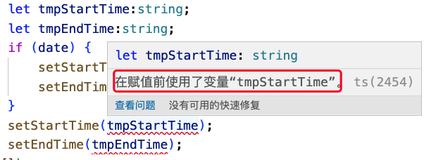

### ts中提示：在赋值前使用了变量“tmpEndTime”

可以先看下代码块:

```ts
let tmpStartTime:string;
let tmpEndTime:string;
if (date) {
    setStartTime(dateString[0]);
    setEndTime(dateString[1]);
}
setStartTime(tmpStartTime);
setEndTime(tmpEndTime);
```

在react中，由于不建议在条件语句中设置状态，我就定义了个临时变量来接收数据，在数据都处理完成后在进行状态的更改。结果我在设置状态时使用到临时变量的时候，给我提示异常了：



原来是ts在2.7之后，在严格模式下，需要在变量声明的时候，都要初始化一个值，否则就会报上面的异常。