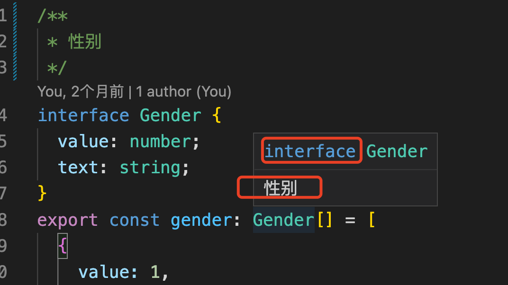

### 1. 简单了解ts

前端开发者，应该都或多或少的了解一些ts，或者从一些文档上看到过，ts是js的超集，且现在的前端工程中，都非常推荐使用ts。

这是一个大概的、模糊的印象，那么为什么现在的前端工程推崇使用ts呢？js灵活、方便，入门门槛较低，很多其他语言的开发者，只要简单的了解下js，先不说开发出质量很高的js程序，但是让js程序跑起来是没有任何问题的。再说了，js不就是写一些和浏览器的交互么，再就是加一些表单的校验。相信很多的服务端开发者尤其是资深的、经验丰富的服务端开发者都是这样的印象。

但是随着js标准的迭代升级，它的能力，已经远远不只是写一些和浏览器的简单交互、做个提示alert了，这只是它众多强大功能的一个非常小的几乎可以忽略不计的功能了。

js，由于没有类型的限制，代码写起来非常的灵活，得到了很多开发者的喜爱。但也正是这种灵活性，导致了开发出来的js代码质量参差不齐，维护成本较高，运行时错误偏多，有时还非常的棘手、不好解决。

基于js的这些现状，ts作为js的超集，增强了类型系统，在一定程度上弥补了js的缺陷。

初用ts的开发者，应该会有一些不习惯，不习惯ts的类型系统，是因为ts给开发者的限制太多了，类型给的不对，代码会提示异常；声明的变量，不能被任意使用了----当然了，只是被提示，如果不去理会它，通过ts的配置，还是可以正常去使用的，只不过就又像js一样，发挥不出来ts的类型优势了。


### 2. 怎么在项目中合理的使用ts呢？

#### 2.1 合理使用类型注释

1. 使用/** */的注释方式给ts代码做类型注释

使用/** */的方式做类型注解，当鼠标经过使用该类型的地方时，IDE会自动提示该类型的注解

```ts
/**
 * 性别
 */
interface Gender {
  value: number;
  text: string;
}
```

通过/** */为Gender类型做了注解，当鼠标经过使用Gender类型的地方，出现了注解中的内容



https://juejin.cn/post/7058868160706904078