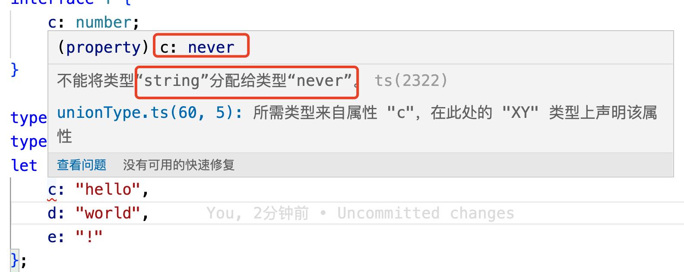

<!-- START doctoc generated TOC please keep comment here to allow auto update -->
<!-- DON'T EDIT THIS SECTION, INSTEAD RE-RUN doctoc TO UPDATE -->
**Table of Contents**  *generated with [DocToc](https://github.com/thlorenz/doctoc)*

- [1. 基础类型](#1-%E5%9F%BA%E7%A1%80%E7%B1%BB%E5%9E%8B)
- [2. 布尔值](#2-%E5%B8%83%E5%B0%94%E5%80%BC)
- [3. 数字类型](#3-%E6%95%B0%E5%AD%97%E7%B1%BB%E5%9E%8B)
- [4. 字符串](#4-%E5%AD%97%E7%AC%A6%E4%B8%B2)
- [5. 数组](#5-%E6%95%B0%E7%BB%84)
- [6. 元祖 Tuple](#6-%E5%85%83%E7%A5%96-tuple)
- [7. 枚举](#7-%E6%9E%9A%E4%B8%BE)
  - [7.1 数字枚举](#71-%E6%95%B0%E5%AD%97%E6%9E%9A%E4%B8%BE)
  - [7.2 字符串枚举](#72-%E5%AD%97%E7%AC%A6%E4%B8%B2%E6%9E%9A%E4%B8%BE)
  - [7.3 异构枚举](#73-%E5%BC%82%E6%9E%84%E6%9E%9A%E4%B8%BE)
- [8. any](#8-any)
- [10. unknown](#10-unknown)
- [11. void](#11-void)
- [12. undefined、null](#12-undefinednull)
- [13. never](#13-never)
- [14. Object](#14-object)
- [15. 类型断言](#15-%E7%B1%BB%E5%9E%8B%E6%96%AD%E8%A8%80)
- [16. let](#16-let)
- [17. 联合类型](#17-%E8%81%94%E5%90%88%E7%B1%BB%E5%9E%8B)
  - [17.1 简单了解联合类型](#171-%E7%AE%80%E5%8D%95%E4%BA%86%E8%A7%A3%E8%81%94%E5%90%88%E7%B1%BB%E5%9E%8B)
  - [17.2 可辨识联合类型](#172-%E5%8F%AF%E8%BE%A8%E8%AF%86%E8%81%94%E5%90%88%E7%B1%BB%E5%9E%8B)
- [18. 交叉类型](#18-%E4%BA%A4%E5%8F%89%E7%B1%BB%E5%9E%8B)
  - [18.1 同名基础类型属性的合并](#181-%E5%90%8C%E5%90%8D%E5%9F%BA%E7%A1%80%E7%B1%BB%E5%9E%8B%E5%B1%9E%E6%80%A7%E7%9A%84%E5%90%88%E5%B9%B6)
  - [18.2 同名非基础类型的合并](#182-%E5%90%8C%E5%90%8D%E9%9D%9E%E5%9F%BA%E7%A1%80%E7%B1%BB%E5%9E%8B%E7%9A%84%E5%90%88%E5%B9%B6)

<!-- END doctoc generated TOC please keep comment here to allow auto update -->

### 1. 基础类型

Typescript能够处理最简单的数据单元：数字、字符串、结构体、布尔值等。Typescript与Javascript的数据类型基本相同，还增加了实用的枚举类型。

### 2. 布尔值

布尔值应该说是任何开发语言中都是最简单、最常用的数据类型了，它只有两个值：true、false。Javascript和Typescript都叫做boolean类型（布尔leixing），其他的开发语言也叫boolean。

```ts
let isFlag: boolean = false;
```

### 3. 数字类型

Typescript和Javascript一样，所有的数字类型都是浮点型，这些浮点数据类型是number。它支持十进制、十六进制，从ES6(ES2015)开始支持二进制和八进制。

这种数据类型没有什么特殊的，直接放个例子吧：

```ts
let shi:number = 6;
let shil:number = 0xf0;
let er: number = 0O01010;
let ba:number = 766543;
```

### 4. 字符串

同其他开发语言，尤其是js一样，使用string标识字符串数据类型，也是用双引号(")或者单引号(')标识。

```ts
let uesrName: string = "Nicholas"; // 注意ts中，不要使用name作为变量，name是已经被使用的了
```

字符串还有一种模板字符串，模板字符串用反引号——数字键1前面的那个键，并且以${expression}的方式被引用:

```ts
let uesrName: string = "Nicholas";
console.log(`Hello ${uesrName}`); // Hello Nicholas
```

### 5. 数组

Ts中有两种定义数组的形式：

1. 在元素类型后面添加上[]标识是该类型的数组

```ts
let numArr: number[] = [1, 2, 3];
console.log(numArr); // [ 1, 2, 3 ]
```

2. 使用数组泛型

```ts
let list: Array<number> = [4, 5, 6];
console.log(list); //[ 4, 5, 6 ]
```

两种方式创建数组都是可行的，是等效的，但是好像使用前一种方式创建数组的方式较多，后面一种通过泛型数组创建数组的方式，也有见到用的，只不过较少。

### 6. 元祖 Tuple

元祖类型允许表示一个已知元素数量和类型的数组,各元素的类型不必相同，如下：

```ts
let s: [string, number];
s = ["hello", 456];
console.log(s); //[ 'hello', 456 ]

let ss: [string, number] = ["hello", 789];
console.log(ss); // [ 'hello', 789 ]
```

> 元祖是一种特殊类型的数组，是一种固定了元素数量和类型的数组，所以，我觉着也可以这么说，元祖就是数组。只不过它比较特殊，就是创建一种特殊方式的数组，所以也就可以通过创建数组的方式创建元祖。

```ts
let tuple:[string,number] = ["hello", 12];
```
### 7. 枚举

枚举，可以定义一些带有名字的常量。使用枚举可以清洗的表达意图或者创建一组有区别的常量。

Ts支持创建基于数字和字符串的枚举。

#### 7.1 数字枚举

```ts
enum Direction {
    NORTH,
    SOURTH,
    EAST,
    WEST
};

let dir:Direction = Direction.EAST;
console.log(dir); // 2
```

默认情况下，枚举的第一项的初始值为0，各项的值从0开始自增。如案例，NORTH的值为0，SOURTH的值为1，EAST值为2等。

除了可以使用默认的初始值外，也可以为指定的项设置初始值，如可以为EAST设置初始值10，那么它后面的WEST的值就是自增1即11.

```ts
enum Direction {
    NORTH,
    SOURTH,
    EAST = 10,
    WEST
};

console.log(Direction.EAST); // 10
console.log(Direction.WEST); // 11
```

#### 7.2 字符串枚举

字符串枚举，和数字枚举类似。字符串枚举，每个成员变量的都必须要显示初始化值，且值是字符串类型的。

成员变量赋值，必须是字符串字面量(也就是说不能是变量，常量也不行)，也可以是其他的成员变量,但是不能是其他的枚举的成员变量，只能是同一个枚举种的其他成员变量。

> 说明一下，数字枚举和字符串枚举，指的是枚举的值是数字类型，还是字符串类型。如果枚举的项的值是数字类型，的，那这个枚举就是基于数字类型的枚举；同理，如果枚举项的值是字符串类型的，那么这个枚举就是基于字符串类型的枚举。都是针对值的类型来做区分的。

```ts
enum Direction {
    NORTH = "NORTH",
    SOURTH = "SOURTH",
    EAST = "EAST",
    WEST = EAST // 其他的成员变量
}
console.log(Direction.EAST);
```

#### 7.3 异构枚举

异构枚举，就是说成员变量，既有数字类型值，也有字符串类型值的枚举，就叫做异构枚举。

```ts
enum Direction {
    NORTH = "NORTH",
    SOURTH = "SOURTH",
    EAST = "EAST",
    WEST = 6
}
```

案例中枚举，既有字符串类型的成员变量，也有数字类型的成员变量，那么案例中的枚举Direction就是异构枚举。

### 8. any

有些场景，我们在编写代码的时候，还不确认是什么数据类型的时候，就可以使用any来标记这些数据类型。

其实，在ts中，任何类型，都可以被归为any类型。这让any类型称为了类型系统的顶级类型，也被称作是全局超级类型。

```ts
let vb: any = 4;  // 注意使用let不要使用const
vb = "hello";
console.log(vb); // hello
```

当一个数组中只知道部分元素的数据类型时，也可以使用any。如一个数组中包含了不同的数据类型：

```ts
let arrList: any[] = [1, "hello", false];
console.log(arrList[1]); // hello
```

any类型，看起来和object有点类似，事实上确实也有些相似的，就是我们可以给any和object类型的变量赋任意值，但是在使用时就有区别了。any类型的变量更加灵活，而object是只能给它赋任意值，但是它在使用的时候就不能随意调用方法了。

> 这里有个细节以前没有注意，就是Object的O需要大写

```ts
// 这种方式可以直接编译，正常执行
let n1: any = 5.467;
console.log(n1.toFixed(2));  // 5.47

// 这种方式就不行了，因为Object类型上没有toFixed方法，结果在编译阶段就报错了
let obj: Object = 5.467;
console.log(obj.toFixed(2));
```
any类型值，可以复制给任何类型的变量。

```ts
let value:any = "hello";
let nums:number = value;
console.log(nums);
let str:string = value;
let isFlag:boolean = value;
```

如案例，声明的any类型的value，可以将其赋值给number类型的变量、可以赋值给string、boolean类型的变量。

any类型，是ts中类型系统的一个逃生舱，作为一个开发者，这给我们在开发过程中，给了我们很大的自由。但是正是由于太大的编码自由度，会让我们经常会编写出一些类型正确但是运行异常的代码。因为使用了any类型，就相当于是放弃了ts提供的大量的类型保护机制。为了解决使用any带来的问题，ts3.0版本引入了unknown类型。


### 10. unknown

unknonw，是ts类型系统中另外一种顶级类型(另一种顶级类型是any)。

<font color="#f20">unknonw类型和any类型不同的一点是，unknonw类型值，只能赋值给any或者unknonw类型的变量。</font>

```ts
let uk:unknown = "world";
let nuk:any = uk;
let uk2:unknown = uk;
let uk3:string = uk; // 这里将unknown类型值赋值给了string类型变量，会报错
```

案例中，可以将unknonw类型值赋值给any和unknown类型变量，但是不能赋值给一个string类型变量，会提示“不能将类型“unknown”分配给类型‘string’”


> ts类型系统中，共有2种顶级类型，一种是any，一种是unknonw.


### 11. void

> 注意void为小写

可以简单理解为Void为any的反类型，一般用在函数的返回值类型声明。

```ts
function getTotal(a: number, b: number): void {
    console.log(a + b);
}

getTotal(2,3);
```

为一个变量声明为void类型没有实际的作用，因为给变量声明了void类型时，就只能给给它赋值undefined和null。

```ts
let va:void = null;
let vc:void = undefined;
let vd:void = false; // 不可以，不能为一个boolean类型的值声明为void类型
```

### 12. undefined、null

这两种数据类型，仅仅标识两个特殊的值存在，分别为undefined和null。

### 13. never

never表示永不存在的值的类型，一般情况下，never类型是那些总会抛出异常或根本就不会有返回值的函数表达式或箭头函数表达式的返回值类型。

### 14. Object

### 15. 类型断言


### 16. let

在ts中尽量使用let来代替var吧。

### 17. 联合类型

#### 17.1 简单了解联合类型

联合类型，通常与null或undefined一起使用。联合类型的类型之间，使用|分隔。

```ts
const sayHello = (name: string | number | undefined) => {
    console.log(name);
}
```

sayHello函数接收一个name参数，那么参数可以是string、number或者undefined类型，是其中的任意一个类型即可。

**字面量类型**

有的时候，我们会看到下面的一些用法：

```ts
let num: 1 | 2 = 1;
type EventNames = "click" | "scroll" | "mouseover";
```

案例中的1、2和click、scroll、mouseover被称为字面量类型，用来约束只能是提供的几个类型中的一个，如num只能取值为1或者2，EventName只能取值为click、scroll或者mouseover。

```ts
let num:1 | 2 = 1;
num = 2;
```

后来重新给num赋值了，赋值为2是合法的。

简单点说，联合类型，就是可以是这个类型，也可以是那个类型，只要是固定的类型中的一个类型就可以。

#### 17.2 可辨识联合类型

Typescript的可辨识联合(Discriminated Unions)类型，也称为代数数据类型或者标签联合类型。它包含了3个要点：可辨识、联合类型和类型守卫。

这种类型的本质，是结合联合类型和字面量类型的一种类型保护方法。如果一个类型是多个类型的联合类型，且多个类型含有一个公共属性，那么就可以利用这个公共属性，来创建不同的类型保护区块。

1. 可辨识

可辨识要求联合类型中每个类型中都有一个单例类型属性，如：

```ts
enum CarTransmission {
    Automatic = 200,
    Manual = 300
}

interface Motorcycle {
    vType: 'motorcycle';
    make: number;
}

interface Car {
    vType: 'car';
    transmission: CarTransmission;
}

interface Trunk {
    vType: 'trunk';
    capacity: number
}
```

demo中,定义了Motorcyle、Car和Trunk3个接口，这些接口中都包含一个vType属性，该属性被称为可辨识的属性，其他的属性则只是和特定接口相关。

2. 联合类型

针对上面的demo定义的3个接口，有一个可辨识的vType属性，，那么可以基于此创建一个联合类型：

```ts
type Vehicle = Motorcycle | Car | Trunk;
```
这样，我们定义了一个联合类型的别名，类型名为Vehicle，Vehicle类型的变量，可以表示不同类型的交通工具、车辆。

3. 类型守卫

我觉着我们应该首先明确一下什么是类型守卫。

看了很多资料，发现都解释的很熟面，不好理解。

我的一个简单的理解，有2点：

a. 定义变量的时候定义好类型约束,定义函数时使用类型谓词 ----- 需要补充：typescript中的is、as 类型谓词


```ts

```

b. 在函数内部实现的时候，如果有联合类型的变量，分别针对不同的类型做针对性的逻辑处理

```ts
type Vehicle = Motorcycle | Car | Trunk;

const EVALUATION_FACTOR = Math.PI;

function evaluatePrice(vehicle: Vehicle) {
    return vehicle.capacity * EVALUATION_FACTOR;
}

const myTrunk: Trunk = {
    vType: 'trunk',
    capacity: 9.5
};
evaluatePrice(myTrunk);
```

evaluatePrice函数中会报错，会提示； 类型“Motorcycle”上不存在属性“capacity”


调整一下evalutePrice函数的实现，报错即可解除：

```ts
function evaluatePrice(vehicle: Vehicle) {
    switch (vehicle.vType) {
        case "car":
            return vehicle.transmission * EVALUATION_FACTOR;
        case "motorcycle":
            return vehicle.make * EVALUATION_FACTOR;
        case "trunk":
            return vehicle.capacity * EVALUATION_FACTOR;
    }
}
```

### 18. 交叉类型

交叉类型，是指将多个类型合并为一个类型。通过&运算符可以实现将现有的多个类型合并为一个类型，合并的新类型包含了所需类型的所有特性。

```ts
type PartialPointX = { x: number };
type Point = PartialPointX & { y: number };
let point: Point = {
    x: 10,
    y: 12
};
```

案例中，先定义了一个PartialPointX类型，只有number类型的x属性，然后通过&运算符创建了一个新的联合类型，表示一个拥有x和y两个坐标的Point类型。

#### 18.1 同名基础类型属性的合并

在多个类型合并的过程中，可能会出现某些类型的成员属性同名，但是类型又不相同。

```ts
interface X {
    c: string;
    d: string;
}

interface Y {
    c: number;
    e: string;
}

type XY = X & Y;
let p: XY = {
    c: "hello",
    d: "world",
    e: "!"
};
```

案例中，定义了两个接口X和Y，然后定义了交叉类型XY，并且定义了一个交叉类型的实例p。按说是正常的，没有什么问题。

但是这里面报错了：



c变成never类型了，这是为什么呢？c不是number和string类型吗，怎么在交叉类型之后变成了never了呢？

因为c是number类型或者string，那么交叉类型，就需要同时满足number和string，那么一个变量同时满足number和string，是不可能的，也就是出现了never。

所以说，同名的基础类型交叉类型，可能会出现never类型。

#### 18.2 同名非基础类型的合并

上面我们了解到了，同名的基础类型交叉合并后，变成了never类型。那么同名的非基础类型合并后，会是什么情况呢？

可以正常合并。