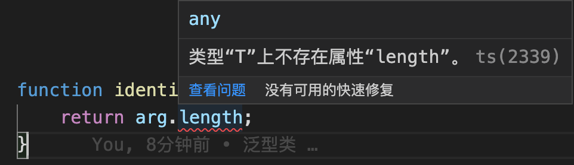

<!-- START doctoc generated TOC please keep comment here to allow auto update -->
<!-- DON'T EDIT THIS SECTION, INSTEAD RE-RUN doctoc TO UPDATE -->
**Table of Contents**  *generated with [DocToc](https://github.com/thlorenz/doctoc)*

- [1.泛型](#1%E6%B3%9B%E5%9E%8B)
- [2.泛型接口](#2%E6%B3%9B%E5%9E%8B%E6%8E%A5%E5%8F%A3)
- [3.泛型类](#3%E6%B3%9B%E5%9E%8B%E7%B1%BB)
- [4.泛型约束](#4%E6%B3%9B%E5%9E%8B%E7%BA%A6%E6%9D%9F)
  - [4.1确保属性存在](#41%E7%A1%AE%E4%BF%9D%E5%B1%9E%E6%80%A7%E5%AD%98%E5%9C%A8)
  - [4.2检查对象上的键是否存在](#42%E6%A3%80%E6%9F%A5%E5%AF%B9%E8%B1%A1%E4%B8%8A%E7%9A%84%E9%94%AE%E6%98%AF%E5%90%A6%E5%AD%98%E5%9C%A8)
- [5.泛型参数默认类型](#5%E6%B3%9B%E5%9E%8B%E5%8F%82%E6%95%B0%E9%BB%98%E8%AE%A4%E7%B1%BB%E5%9E%8B)
- [6.泛型条件类型](#6%E6%B3%9B%E5%9E%8B%E6%9D%A1%E4%BB%B6%E7%B1%BB%E5%9E%8B)
- [7.泛型工具类型](#7%E6%B3%9B%E5%9E%8B%E5%B7%A5%E5%85%B7%E7%B1%BB%E5%9E%8B)
  - [7.1 Partial](#71-partial)
  - [7.2 Record](#72-record)
  - [7.3 Pick](#73-pick)
  - [7.4 Exclude](#74-exclude)
  - [7.5 ReturnType](#75-returntype)
- [8. 使用泛型创建对象](#8-%E4%BD%BF%E7%94%A8%E6%B3%9B%E5%9E%8B%E5%88%9B%E5%BB%BA%E5%AF%B9%E8%B1%A1)
  - [8.1 构造签名](#81-%E6%9E%84%E9%80%A0%E7%AD%BE%E5%90%8D)
  - [8.2 构造函数类型](#82-%E6%9E%84%E9%80%A0%E5%87%BD%E6%95%B0%E7%B1%BB%E5%9E%8B)
  - [8.3 构造函数类型的应用](#83-%E6%9E%84%E9%80%A0%E5%87%BD%E6%95%B0%E7%B1%BB%E5%9E%8B%E7%9A%84%E5%BA%94%E7%94%A8)
  - [8.4 使用泛型创建对象](#84-%E4%BD%BF%E7%94%A8%E6%B3%9B%E5%9E%8B%E5%88%9B%E5%BB%BA%E5%AF%B9%E8%B1%A1)

<!-- END doctoc generated TOC please keep comment here to allow auto update -->

### 1.泛型

#### 1.1 了解泛型
泛型的学习，应该主要关注以下几个方面：

1. 泛型接口

2. 泛型类

3. 泛型约束

4. 泛型参数默认类型

5. 泛型条件类型

6. 泛型工具类

7. 泛型应用 --- 使用泛型创建对象


泛型的目的，不光可以满足当前的数据类型需求，还要能够满足未来的数据类型需求，并能提供一共的灵活性以及类型约束的需要。

总之，泛型既能满足我们当前对类型约束的需要，还能够满足未来的类型约束诉求。

```ts
function identity(value:number):number{
    return value;
}
```
我们看这样一个案例，一个ts函数，接收一个number类型参数，并输出。这个函数能够满足固定数据类型的诉求，但是如果我又想传递一个string类型的数据或者array类型的数据，那么这个函数是满足不了我的需求的。难道我要重新写2个方法去？

ts给我们提供了泛型的概念，可以满足我的需求，具体方式如下：

```ts
// 定义一个泛型
function identity<T>(value:T):T{
    return value;
}
// 泛型使用案例
console.log(identity("Nicholas Zakas"));
```

刚接触Ts时，会对<T>的这种语法感到陌生和别扭，但是熟悉一下就好了，就是一种语法，多看几眼就可以了。可以把它理解为一个类型变量，在函数调用时传递了给了函数什么类型，这个T就表示了什么类型，比如案例中传入了一个string类型的"Nicholas Zakas"那这个案例中的T就表示string。

> 一个常识，或者说小小的规约吧，就是在TS中，大家经常看到的T表示Type，V表示Value，E表示element。但是这都是一种习惯的约定，并不是技术标准，我们在编码中不使用这几个变量没有任何的问题。

比如上述案例中，我可以随意使用一个变量Y来代替T：

```ts
// 定义一个泛型
function identity<Y>(value:Y):Y{
    return value;
}
// 泛型使用案例
console.log(identity(16));
```

使用其他的任意字母代替了T是完全没有任何问题的。

#### 1.2 多类型变量泛型

前面的案例定义了一个类型变量，其实是可以定义多个类型变量的。

```ts
function identity<T,U>(value:T,message:U):T{
    return value; // 这里可以正常的返回value，但是返回message就不行了，因为类型不同了
}
console.log(identity(1,"获取成功")); // 1
```

```ts
function identity<T,U>(value:T,message:U):[T,U]{
    return [value,message];
}
identity(12,"Nicholas Zakas");
```

泛型中的类型变量，不是由定义中决定的变量值，而是由调用时决定的变量类型值，定义时只是定义了类型约束。

通过泛型约定的函数，在函数调用的时候，函数可以不添加类型限定，编译器可以自动解析。

```ts
function identity<T,U>(value:T,message:U):[T,U]{
    return [value,message];
}
console.log(identity(12,"Nicholas Zakas")); // 函数调用时没有添加类型限定
console.log(identity<string,number>("hello",16)); // 函数调用时添加了类型限定
```

### 2.泛型接口

上面的案例，我们可以通过泛型限定函数，函数也可以返回一个固定类型的值，也可以返回一个数组，但是如果期望返回一个数组，怎么实现呢？现在好像满足不了需求。

```ts
// 定义泛型对象类型接口
interface IDentities<V,M>{
    value: V,
    message: M
}

function identity<T,U>(key:T,msg:U):IDentities<T,U>{
    // 声明一个已定义的接口类型的字面量对象，属性名要和接口定义的属性名相同
    let identities:IDentities<T,U> = {
        value: key, // 字面量属性名value和message要和接口IDentities定义的属性名相同
        message: msg
    };
    return identities;
}

console.log(identity(18,"Nicholas Zakas")); // { value: 18, message: 'Nicholas Zakas' }
```

### 3.泛型类

泛型除了可以约束函数、接口的类型外，也可以约束class(类)的类型。

泛型约束类方式也不复杂，只需要在类名后面使用<T,...>语法定义多个类型即可。

```ts
interface People<U>{
    value:U,
    getIdentity:() => U // 定义了一个变量，为函数类型，其实就是定义了一个函数，只是没有实现
}

class Student<T> implements People<T>{
    value: T;
    constructor(value:T){
        this.value = value;
    }

    getIdentity():T{
        return this.value;
    }
}

const stu = new Student("Hanmeimei");
console.log(stu); // Student { value: 'Hanmeimei' }
console.log(stu.getIdentity()); // Hanmeimei

class Police<T>{
    key:T;
    constructor(key:T){
        this.key = key;
    }
    getKey():T{
        return this.key;
    }
}
const police = new Police("最可爱的人");
console.log(police.getKey()); // 最可爱的人
```

**什么情况下会使用泛型呢？**

一般情况下会参考2个标准：

1. 当函数、接口或类将处理多种数据类型时；

2. 当函数、接口或类在多个地方使用同一种数据类型时；

在项目的早期可能没有办法知道我们的函数、接口或类是不是处理多种数据类型，或者是不是还会有别的地方使用当前的数据类型，个人觉着在项目初期可以不用太纠结是否都使用泛型来定义、约束我们的函数、接口或类，可以在有类似的需求时进行代码迭代、优化就可以了，没有必要前期过度设计。
### 4.泛型约束

泛型约束是什么呢？在开发中，我们可能会希望限制每个类型变量接收的类型数量，这可以通过类型约束来实现。
#### 4.1确保属性存在

有些时候，我们期望某类型变量对应的类型上存在某些属性。这个时候，除非我们显示的定义某种类型如number、string或者array，否则我们不知道这些类型变量对应的类型上都有什么属性，编译器也不会知道它们的存在。

比如开发中，我们经常会获取某个数组或者字符串的长度，就是获取这个类型实例的length属性：

```ts
function identity<T>(arg:T):T{
    return arg.length;
}
```
我定义这个函数，是有问题的，因为我不知道、编译器也不知道类型T上有没有length属性：



所以在编译阶段就报错了，阻塞了代码的向下继续执行了。

这个时候，我们可以让类型变量继承一个函数我们所需要的属性的接口。

```ts
interface ILength{
    length: number
}

function identity<T extends ILength>(arg:T):T{
    console.log(arg.length);
    return arg;
}

console.log(identity("hello"));
```
这样就约束了传入的参数要有length属性，否则编译器会报错。如果传入一个false或者数字的话，是直接报错的，因为boolean和nunber是没有length属性的。

T extends ILength就是告诉编译器，我已经实现了可以支持任何已经实现ILength接口的类型。

#### 4.2检查对象上的键是否存在

### 5.泛型参数默认类型

### 6.泛型条件类型

### 7.泛型工具类型

#### 7.1 Partial

#### 7.2 Record

#### 7.3 Pick

#### 7.4 Exclude

#### 7.5 ReturnType

### 8. 使用泛型创建对象

#### 8.1 构造签名 

#### 8.2 构造函数类型

#### 8.3 构造函数类型的应用

#### 8.4 使用泛型创建对象