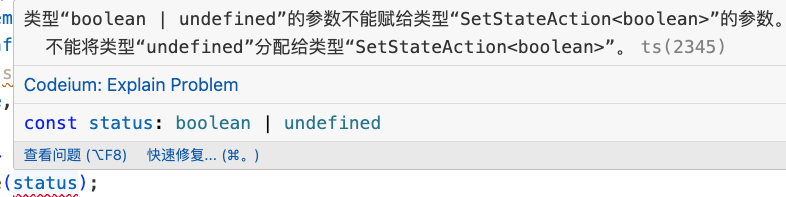

### 类型“boolean | undefined”的参数不能赋给类型“SetStateAction<boolean>”的参数

同时也在报另外的一个信息:不能将类型“undefined”分配给类型“SetStateAction<boolean>”

看代码:

```ts
interface IProps {
    status?: boolean;
}
const CollecitonItem: FC<IProps> = (props) => {
    const [selImg, setSelImg] = useState<string>("");
    const [isManage, setIsManage] = useState<boolean>(false);

    useEffect(() => {
        setIsManage(status); // 这里报出了问题
    }, [status])
    // ……
```



问题原因是isManage是一个boolean类型的,在通过setState进行赋值的时候,值status是一个可选参数,所以值可能是undefined,就给出了报出来的异常.

解决方案:

1. 将可选参数变为必选参数,即去掉类型约束的问号;

```ts
interface IProps {
    status: boolean;
}
```

2. 使用类型断言:

```ts
    useEffect(() => {
        setIsManage(status as boolean);
    }, [status])
```

两种方案都可以,可以根据实际情况选择合适的方案.