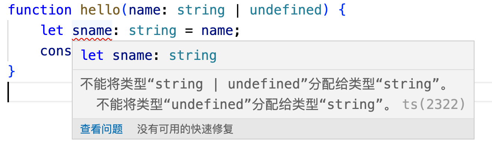

### Ts中的非空断言操作符

!，是ts中的运算符，被称为非空断言操作符，是ts中有的，js中没有。

看一个案例：

```ts
function hello(name: string | undefined) {
    let sname: string = name;
    console.log(sname);
}
```

乍看这么几行代码，是没有什么问题，但是我们把代码放到IDE中，就会提示异常信息了：
不能将类型“string | undefined”分配给类型“string”。
不能将类型“undefined”分配给类型“string”。ts(2322)



看到报错信息后，我们回过头来分析，形参name是一个string或者undefined联合类型的变量，而sname是一个在函数内部定义的string类型的实参，在函数定义的时候，我们没有办法确定name到底是一个string类型的值，还是一个undefined类型值。那么直接将一个可能是string类型、也可能是undefined类型的值赋值给一个string类型的变量，没有通过ts的类型判断，编译器就给报错了。

那么怎么解决这个报错呢？简单来说，就是将string类型的name赋值给sname就可以了。所以有个简单的处理办法：

```ts
function hello(name: string | undefined) {
    let sname: string;
    if (name) {
        sname = name;
    }
}
```

我们给name值做一个类型判断，当只有name的类型值是string类型的时候，才把该值赋值给sname，那么就不会报错了。

实际上，确实如此。有什么问题，我解决什么问题，把问题解决了，错误也就没有了。