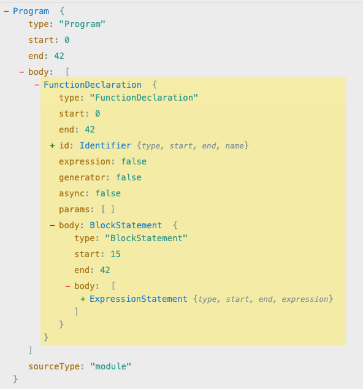

### AST

AST,抽象语法树.

**抽象语法树是什么?**

- 抽象语法树是源代码结构的一种抽象表示;

- 它以树状的结构表现编程语言的语法结构,树上的每个节点都表示源代码中的一种结构;

- 每个包含type属性的数据结构,都是一个AST节点;

以下是一个简单空函数的AST语法树:

```js
function test(){
	alert("Hello World!");
}
```



语法转换过程需要借助解析器来实现,常用的解析器有多种,具体可以参考: [ESLint解析器](../架构与设计/eslint解析器.md)

**抽象语法树有什么作用?有哪些用途?**

- 代码语法检查

- 代码风格检查

- 代码格式优化

- 代码显示高亮

- 代码错误提示

- 代码自动补全

- 代码的多端适配

- 自定义代码结构

- ……

webpack、eslint等工具的原理都是通过javascript解析器将代码转换为AST(抽象语法树),通过操作这棵树,实现代码的精准定位、语句赋值、语句运算等,实现对代码的分析、优化、变更等操作.