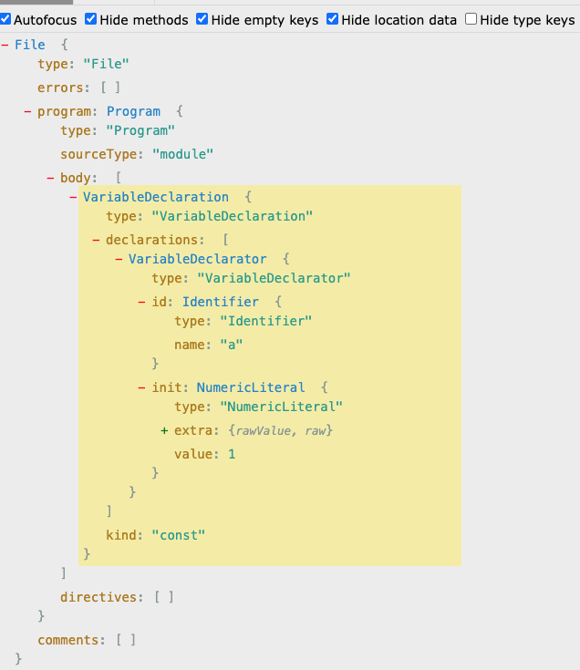

参考链接:https://juejin.cn/post/7179481462050127931#heading-7

### AST

AST,抽象语法树.

**抽象语法树是什么?**

- 抽象语法树是源代码结构的一种抽象表示;

- 它以树状的结构表现编程语言的语法结构,树上的每个节点都表示源代码中的一种结构;

- 每个包含type属性的数据结构,都是一个AST节点;

以下是一个简单空函数的AST语法树:

```js
function test(){
	alert("Hello World!");
}
```


语法转换过程需要借助解析器来实现,常用的解析器有多种,具体可以参考: [ESLint解析器](../架构与设计/eslint解析器.md)

**抽象语法树有什么作用?有哪些用途?**

- 代码语法检查

- 代码风格检查

- 代码格式优化

- 代码显示高亮

- 代码错误提示

- 代码自动补全

- 代码的多端适配

- 自定义代码结构

- ……

webpack、eslint等工具的原理都是通过javascript解析器将代码转换为AST(抽象语法树),通过操作这棵树,实现代码的精准定位、语句赋值、语句运算等,实现对代码的分析、优化、变更等操作.

### javascript解析器

Javascript解析器,就是把javascript语法解析成AST语法树.

js很大的使用场景是在浏览器上,浏览器就是把js源码通过解析器转换成AST,然后再进一步转换为字节码或者直接生成机器码,最后进行渲染和执行.

一般来说,每个js引擎都会有自己的抽象语法树格式,常见的js引擎有Chrome的V8引擎、firefox的Spider Monkey、Safari的JSC(JavaScript Core)等等.

Javascript解析器通常包含4个部分:

- 词法解析器(Lexical Analyser)

- 语法解析器(Syntax Parser)

- 字节码生成器(Bytecode generator)

- 字节码解释器(Bytecode interpreter)

#### 词法解析器

词法分析器首先扫描代码,通过switch case语法把源码转换为一个个的小语法单元.JS代码的语法单元大体上有以下这些:

- 空白:js中连续的空格、换行、缩进等这些如果不在一个字符串里面,则它们就没有实际的逻辑意义,于是就把这些连续的空白符直接组合在一起作为一个整体的语法单元

- 注释:块注释、行注释、文件注释还是函数注释,虽然它们对阅读代码的人来说有很重要的意义,但是它们对于计算机来说并没有任何价值,计算机只需要知道它们是个注释、不影响逻辑的一个部分就行了,所以也将注释作为一个不可拆分的语法单元

- 字符串:对于机器而言,字符串就是用于展示或参与计算的内容,它们已经是最小的词法单元了,没有再继续拆分分析的必要了,就作为一个语法单元;

- 数字:js这门语言里有二进制、八进制、十进制、十六进制、科学计数法等表示方法,数字是一个可以表示完整意义的最小语法单元

- 标识符:没有被引号引起来的连续字符串,可包含字母、数字、_、$等(开头不能是数字),标识符可能是一个变量,也可能是如boolean类型的true、false,也可能是语言系统本身预留的一些关键字、保留字,但是在词法分析阶段并不关心这些,关心的是能把这个标识符和别的字符串、标识符区分开即可

- 运算符:+、-、*、/、>、<等

- 括号:主要用来标识运算的优先级、函数的调用.在分词阶段并不关心括号标识什么逻辑意义,仅仅把它当作一种基本的语法单元

参考一段@babel/parse的源码实现案例:

```ts
  getTokenFromCode(code: number): void {
    switch (code) {
      case charCodes.dot:
        this.readToken_dot();
        return;
      // Punctuation tokens.
      case charCodes.leftParenthesis:
        ++this.state.pos;
        this.finishToken(tt.parenL);
        return;
      case charCodes.rightParenthesis:
        ++this.state.pos;
        this.finishToken(tt.parenR);
        return;
      case charCodes.semicolon:
        ++this.state.pos;
        this.finishToken(tt.semi);
        return;
      case charCodes.comma:
        ++this.state.pos;
        this.finishToken(tt.comma);
        return;
      // 省略了很多case ……
      case charCodes.backslash:
        this.readWord();
        return;

      default:
        if (isIdentifierStart(code)) {
          this.readWord(code);
          return;
        }
    }

  readToken_dot(): void {
    const next = this.input.charCodeAt(this.state.pos + 1);
    if (next >= charCodes.digit0 && next <= charCodes.digit9) {
      this.readNumber(true);
      return;
    }

    if (
      next === charCodes.dot &&
      this.input.charCodeAt(this.state.pos + 2) === charCodes.dot
    ) {
      this.state.pos += 3;
      this.finishToken(tt.ellipsis);
    } else {
      ++this.state.pos;
      this.finishToken(tt.dot);
    }
  }
```

#### 语法解析器

将上一步中词法解析生成的数组,根据语法规则,转换为抽象语法树(AST)

下面可以参考戏@babel/parser在变量声明时的实现案例:

```ts
    parseVarStatement(
      node: N.VariableDeclaration,
      kind: "var" | "let" | "const" | "using",
      allowMissingInitializer: boolean = false,
    ) {
      const { isAmbientContext } = this.state;
      const declaration = super.parseVarStatement(
        node,
        kind,
        allowMissingInitializer || isAmbientContext,
      );

      if (!isAmbientContext) return declaration;

      for (const { id, init } of declaration.declarations) {
        // Empty initializer is the easy case that we want.
        if (!init) continue;

        // var and let aren't ever allowed initializers.
        if (kind !== "const" || !!id.typeAnnotation) {
          this.raise(TSErrors.InitializerNotAllowedInAmbientContext, init);
        } else if (
          !isValidAmbientConstInitializer(init, this.hasPlugin("estree"))
        ) {
          this.raise(
            TSErrors.ConstInitiailizerMustBeStringOrNumericLiteralOrLiteralEnumReference,
            init,
          );
        }
      }

      return declaration;
    }
```

如声明一个常量const a = 1;可转换为如下的AST:



#### 字节码生成器

字节码生成器的作用,就是将AST转换为js引擎可以执行的二进制代码.目前,没有统一的js字节码的格式标准,每种js引擎都有自己的字节码格式.简单的做法,就是将语义单位翻译成对应的二进制指令.

#### 字节码解释器

字节码解释器的作用就是读取并执行字节码.

### 常用/常见的解析器

1. [esprima](https://esprima.org/)

这是第一个使用js实现的符合EsTree规范的js解析器,后续的多个解析器都受它的影响.

> 关于EsTree规范,可参考:[EsTree](https://github.com/estree/estree)

2. [acorn](https://github.com/acornjs/acorn)

acorn是一个和esprima类似的解析器,目前webpack的AST解析器用的是acorn.

3. [@babel/parser(babylon)](https://github.com/babel/babel/tree/master/packages/babel-parser)

babel官方的解析器,最初fork于acorn,后来自主开发了,其构建的插件体系非常庞大;

4. [uglify-js](https://github.com/mishoo/UglifyJS)

主要用于混淆和压缩代码,uglify-js自己实现了一套AST规范,因为它是自己实现的AST规范,是私有的,并不是符合EsTree标准规范的AST解析器,所以ES6之后新语法的AST它都不支持,所以它没有办法压缩最新的es6代码.如果需要压缩的时候,需要先将代码转换为es5,然后再进行压缩.

5. [esbuild](https://github.com/evanw/esbuild/)

esbuild是用go实现的下一代的web打包工具,它拥有目前最快的打包和压缩记录,snowpack和vite使用它作为打包工具.为了追求卓越的性能,目前没有将AST暴露出来,也没有办法修改AST,无法用做解析对应的js.

### babel

可以先了解一下babel提下的工具库,对babel有一个大概的了解,然后再去深入研究babel本身.

- [@babel/parser](https://github.com/babel/babel/tree/main/packages/babel-parser):可以把js源码转换为AST

- [@babel/traverse](https://www.npmjs.com/package/babel-traverse):用于对AST的遍历,维护整棵树的状态,并且负责替换、移除和添加节点

- [@babel/generate](https://github.com/babel/babel/tree/master/packages/@babel/generate):可以把AST生成源码,同时生成sourcemap

- [@babel/types](https://github.com/babel/babel/tree/master/packages/babel-types):用于AST节点的Lodash式工具库,它包含了构造、验证以及变换AST节点的方法,对编写处理AST逻辑非常有用

- [@babel/template](https://www.npmjs.com/package/@babel/template):可以简化AST的创建逻辑

- [@babel/code-frame](https://www.npmjs.com/package/@babel/code-frame):可以打印代码位置

- [@babel/core](https://www.npmjs.com/package/@babel/core):Babel的编译器,核心API都在这里,如常见的transform、parse,并实现了插件功能

- [babylon](https://www.npmjs.com/package/babylon):Babel的解析器,以前叫babel parser,基于acorn扩展而来,扩展了很多语法,可以支持es2020、jsx、typescript等语法

- [babel-types-api](https://babeljs.io/docs/babel-types)

- [babel插件手册](https://github.com/brigand/babel-plugin-handbook/blob/master/translations/zh-Hans/README.md#asts)

#### visitor

#### path

- node:当前AST节点

- parent:父AST节点

- parentPath:父AST节点的路径

- scope: 作用域
