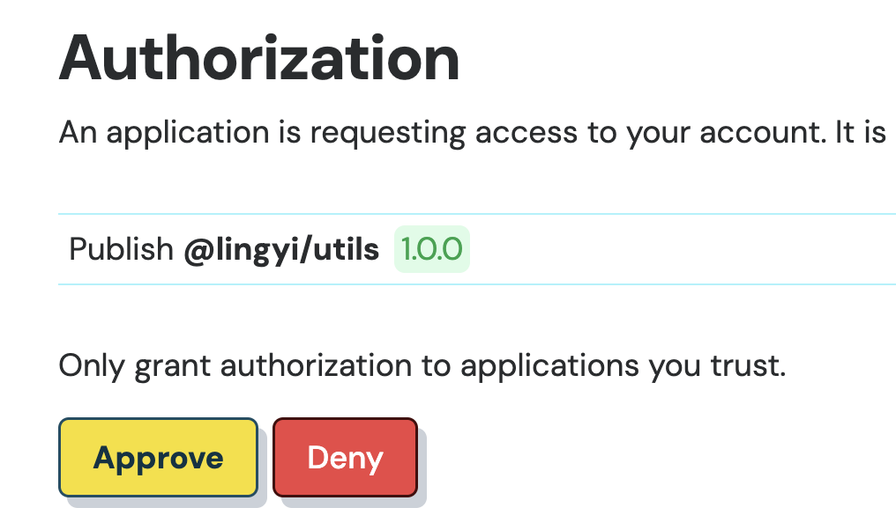
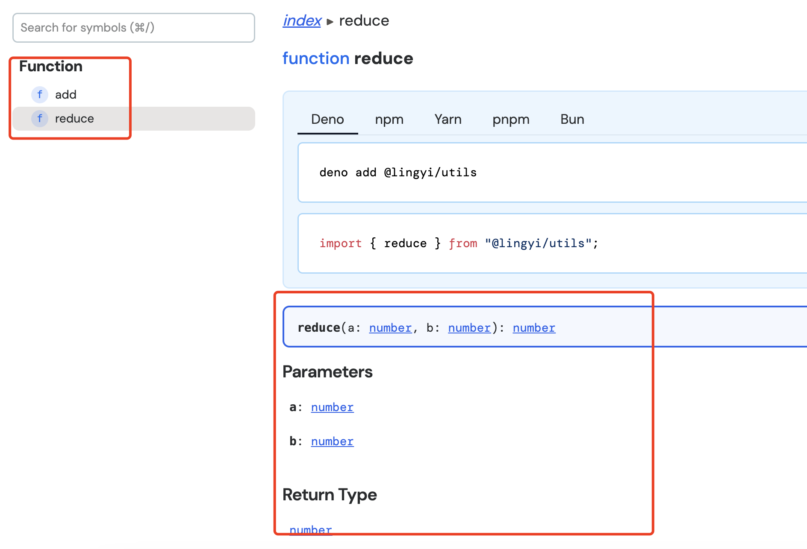

### JSR简介

文档:[https://jsr.io/](https://jsr.io/)

JSR,全名Javascript Registry,由Deno推出的javascript注册表.有着很高的兼容性,可以与任何一个javascript的包管理器一起使用,如npm、yarn、pnpm,也可以在任何具有node_modules文件夹的项目中使用,支持deno、node、Bun等众多运行时.

与npm不同的是,jsr原生typescript支持,可直接发包无需转译成js代码,deno环境可直接使用,如果是在node.js中运行,则会将代码转译成.d.ts文件.

JSR仅支持ESM,随着ESM规范多年发展已经逐渐成熟,并广为使用,CommonJS逐渐被取代,非常多的npm包也在向ESM迁移,如ECharts v5.5,AdonisJS v6等.

### JSR的用法

JSR可以与任何一个npm包管理器一起使用,如npm、pnpm、yarn,也可以在deno项目中使用

安装JSR模块,JSR模块有多种安装方式,可以使用各种npm的包管理器,也可以使用deno,Bun

```bash
# deno
deno add @emish89/smile2emoji

# npm
npx jsr add @emish89/smile2emoji

# yarn
yarn dlx jsr ad @emish89/smile2emoji

# pnpm
pnpm dlx jsr add @emish89/smile2emoji

# Bun
bunx jsr add @emish89/smile2emoji
```

代码中引入JSR包

```js
import * as mod from "@emish89/smile2emoji";
```

```js
import { debounce } from "@yuci/utils";

useEffect(() => {
    window.addEventListener("scroll", debounce(scroll, 50));
    return () => {
        window.removeEventListener("scroll", debounce(scroll, 50))
    }
},[]);
```

Deno原生支持JSR,可以不需要安装,直接使用jsr:说明符即可使用.

```js
import { capitalizeFirstLetter } from "jsr:@yuci/utils";
capitalizeFirstLetter('yuci');
```

### 发包到JSR

在官网([https://jsr.io](https://jsr.io))登录,点击publish a package进行发布即可,根据要求填写相应信息即可.

#### 1. 创建项目

可以通过npm init或者deno init来初始化项目.

```bash
[xxxxx jsr]$ deno init
✅ Project initialized

Run these commands to get started

  # Run the program
  deno run main.ts

  # Run the program and watch for file changes
  deno task dev

  # Run the tests
  deno test
```

通过deno init初始化的项目结构,如下图:


通过deno init来初始化的项目,只有3个文件,比较简单.

通过npm init初始化的项目,就是只简单的创建了一个package.json文件来管理项目信息和依赖包,除此之外没有什么实质性的内容.

项目初始化之后在项目的根目录下新建jsr.json文件,包含name、version、exports等一些表示项目信息的字段.

如果是通过deno init初始化的项目,则也在项目根目录下新建一个deno.json文件,内容和jsr.json相同.

> 接下来如无特别说明则项目都以deno init初始化的项目为例

```json
{
    "name": "@lingyi/utils",
    "version": "1.0.0",
    "exports": "./main.ts"
}
```

#### 2. 开发

```ts
// main.ts
function add(a: number, b: number): number {
  return a + b;
}

export default add;
```

#### 3. 发布

有多种发布方式,可以通过deno、npx、pnpx等方式,我们以

```bash
# deno
deno publish

# npx
npx jsr publish

# pnpm
pnpx jsr publish
```

deno发布组件的时候,读取的是deno.json配置文件,通过其他发布工具发包的时候,读取的时候jsr.json配置文件.

在执行publis指令的时候,会自动打开jsr网站进入认证、授权页面,确认下是我们自己发布的组件、模块,点击“Approve”通过即可,如果不是我们自己发布的组件,或者组件还需要再修改,点击“Deny”拒绝即可.



JSR组件,对数据类型的要求稍微有点严格,函数需要有显示声明返回值,这是为了在node环境下生成正确的类型定义.

由于deno可以直接执行ts代码,所以jsr组件是ts源码格式的.

JSR组件发布成功后,会自动生成一些api等说明性的文档.




#### 4. 自动发布
