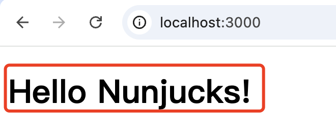
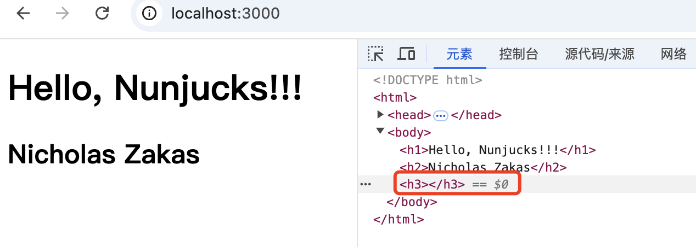

demo: expressserver

### Nunjucks模板在nodejs项目中的简单使用

### 1. 简介

Nunjucks是一个功能丰富且强大、以.njk为扩展名的模板引擎，用于在Node.js服务器端渲染HTML和其他文本格式的模板。它类似于Python的Jinja2模板引擎，但是被设计用于JavaScript环境，特别是Express和Koa这样的Web框架.Nunjucks的高性能、模板语法丰富、可扩展、自动转移、异步加载等特点,使得它在Node.js项目中有着广泛的应用.

> 关于扩展名,从技术角度上可以使用任意扩展名来命名Nunjucks模板文件,但是更加推荐和最优秀的实践是使用.njk来作为扩展名.

### 2. 快速上手

#### 2.1 模板引擎安装

```bash
npm install nunjucks
```

#### 2.2 搭建node.js项目,配置nunjucks模板引擎

node.js项目的搭建,以express为例,具体可以参考[https://www.expressjs.com.cn/starter/generator.html](https://www.expressjs.com.cn/starter/generator.html).

```bash
# 创建express项目
npx express-generator

# 如果是较老的node版本,也可以使用下面的指令分步骤搭建
npm install -g express-generator

express
```

配置项目启动指令

```json
"scripts": {
    "dev": "nodemon ./bin/www"
}
```

express项目中配置nunjucks模板

```js
// 导入nunjucks模板
const nunjucks = require('nunjucks');

// 模板引擎配置
nunjucks.configure('views', {
  autoescape: true,
  express: app,
  watch: true
})
app.set("view engine", "njk");
```

新建简单模板index.njk

```html
<!DOCTYPE html>
<html>
  <head>
    <title>{{title}}</title>
    <link rel='stylesheet' href='/css/style.css' />
  </head>
  <body>
    <h1>{{title}}</h1>
  </body>
</html>
```

controller渲染模板,并设置一个简答的测试数据

```js
router.get('/', function(req, res, next) {
  res.render('index', { title: 'Hello Nunjucks!' });
});
```

启动项目

```bash
npm dev
```



至此,已经完成了在一个nodejs项目中nunjucks模板引擎的配置.

### 3. 常用模板功能

#### 3.1 数据展示

在Nunjucks模板中,通过双大括号({{}})的方式来展示变量.

```html
<h1>{{data.title}}</h1>
```

模板会从controller中传递过来数据中,获取到title的值,并展示到页面中.

模板中渲染变量数据的时候,像js一样,可以使用点操作符,也可以使用中括号操作符.

```html
<h2>{{data["userName"]}}</h2>
```

如果变量值为undefined或者null时则不展示,但包裹该元素的DOM元素会被渲染.



> 如果当变量值为undefined或者null时不希望展示包裹该变量的DOM元素,可以通过if语句来实现.下面会有介绍,也可以简单看下面的demo.

```html

    <h2>{{data.userName}}</h2>

```

#### 3.2 过滤器

过滤器,就是可以执行的函数,和js函数类型,只是执行方式略有不同.js中,函数通过点操作符来调用,在Nunjucks模板中,通过管道操作符(|)来调用.

```html
<!--原数据: foo: ["Apple","Potato","Tomato","Banana"] -->
<p>{{foo | join("-")}}</p>
```

模板中,会将数组变量foo转换为字符串,并以-分隔的方式输出到页面中.

#### 3.3 表达式

在Nunjucks中,可以像js一样使用表达式.同样它和js也类似,拥有运算表达是、比较表达是、逻辑表达式、条件判断表达式、函数调用表达式和正则表达式.虽然Nunjucks拥有如此强大的能力,但是为了性能和安全性考虑,有些表达式尽量减少使用,如运算表达式.我们可以重点关注模板渲染中最常用的if表达式、逻辑表达式和比较表达式.

Nunjucks模板中,表达式书写在中.

##### 3.3.1 if表达式

if表达式,就是我们常用的条件判断语句,在Nunjucks模板中,if表达式的书写方式和js中的if语句类似.

if表达式语法格式:

```javascript

    <p>条件分支</p>

    <p>条件分支2</p>

    <p>条件分支3</p>

```

##### 3.3.2 逻辑表达式

逻辑表达式,有and、or、not3个操作符,可以使用小括号进行分组.

```js

    <p>vip并展示了</p>

    <p>vip或者被标识</p>

    <p>vip且没有被标识</p>

```

##### 3.3.3 比较表达式

Nunjucks模板中的比较表达式操作符有:

- == 等于

- ===  全等于

- != 不等于

- !== 不全等于

- < 小于

- <= 小于等于

- \> 大于

- \>= 大于等于

基本用法和js基本一致,不再赘述.

#### 3.4 for循环

Nunjucks模板中可以通过for循环来遍历数据进行展示.遍历对象可以是数组和对象.

for便利语法:

```js

    <li id={{item.id}}>{{item.name}}</li>

```

```js
<ul>

    <li id={{city.id}}>{{city.name}}</li>

</ul>
```

#### 3.5 宏(macro)

宏(macro)可以用来定义可重复使用的模块,类似编程语言中的函数.其语法格式和使用方式,可参考如下案例:

定义宏:

```js

    <div>
        <p>城市id:{{id}}</p>
        <p>城市名:{{name}}</p>
    </div>

```

宏的应用:
```js
{{city(cities[0].id, cities[0].name)}}


    {{city(cityItem.id,cityItem.name)}}

```

#### 3.6 set

#### 3.7 include

#### 3.8 import

### 4 小结


逻辑非 not

```js

    <p>来来来</p>

```