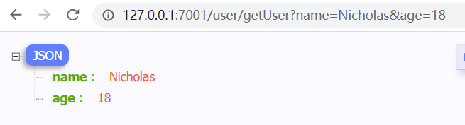
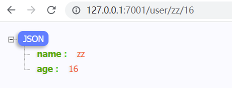
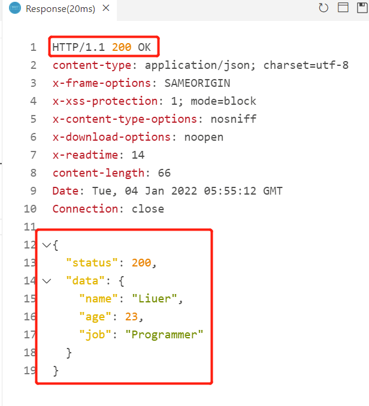
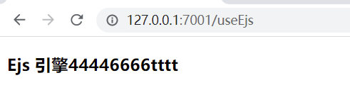

### 1. Egg基本介绍

Egg遵循“约定优于配置”的原则，适合团队开发。当然了，个人开发也可以用。

### 2. 项目创建

以npm为例

```bash
# 可以通过create指令
npm create egg --type=simple

# 也可以通过init指令
npm init egg --type=simple
```

使用npm创建egg项目的两种方式，都可以，创建出来的项目，是完全相同的。

运行项目：

根据项目创建完成后的提示信息

```bash
- cd D:\EggPro\egg1
- npm install
- npm start / npm run dev / npm test
```

也可以使用yarn来创建项目

```bash
yarn create egg --type=simple
```

使用yarn和npm没有太大的区别，我习惯使用npm，后面的案例，都以npm为例，不再单说yarn了。

### 3. egg和express/koa的区别

| 特征对比                    | Egg.js                                 | Express/Koa              |
| --------------------------- | -------------------------------------- | ------------------------ |
| 代码规范性：（MVC开发模式） | 符合MVC模式：Controller、Service、View | 灵活编码，没有明确的规范 |
| 学习成本                    | 中                                     | 易                       |
| 创建机制/扩展机制           | 有                                     | 无                       |
| 多线程管理                  | 有                                     | 无                       |
| HttpClient集成              | 有                                     | 无                       |

### 4.案例编写

```js
// controller
  async newsList() {
    const { ctx } = this;
    ctx.body = "新闻消息";
  }
```

eggjs中，controller部分的所有方法，都要写成异步的，即通过async修饰

### 5.代码/目录结构分析

#### 5.1 controller

controller，一般有3个作用：

1. RESTFul API：接收客户端用户请求参数，并将处理的结果返回给用户；
2. 根据URL请求，渲染HTML页面
3. 代理服务器：将接收到的用户请求转发到另外一个服务器，并将另一个服务器处理后的数据返回给终端用户

controller文件中class的命名，一般都会标识contoller，如UserController

```js
"use strict"; // 开启严格模式
const Controller = require("egg").Controller; // 从egg获取到Controller

// class命名，标识xxxController，表示这是一个controller，并从egg的Controller中继承
class UserController extends Controller {
    // controller中的所有方法，都要是异步的，即async修饰
    async index() {
        const { ctx } = this;
        // 根据url请求，渲染页面内容
        ctx.body = "<h1>个人中心</h1>"
    }

    async list() {
        const { ctx } = this;
        ctx.body = "<h2>用户列表333</h2>";
    }
}

module.exports = UserController;
```

写好了controller后，还要注册下路由，以便让客户端的请求找到响应的controller处理

```js
// router.js
// 所有的js文件，都开启严格模式
'use strict';

/**
 * @param {Egg.Application} app - egg application
 */
module.exports = app => {
  const { router, controller } = app;
  router.get('/', controller.home.index); // controller.home表示controller目录中的home文件
  router.get("/news", controller.home.newsList);
  router.get("/profile", controller.user.index); // controller.user表示controller目录下的user文件
  router.get("/user/userList", controller.user.list);
};
```

#### 5.2 service

service是对业务逻辑层的一个封装，其实controller也是对业务逻辑层的一部分封装，有了service层后，进一步细化。

service：所有和数据库相关的操作都在service层

优势：

- 保证了controller的逻辑更加简单
- 独立性：一个service中封装的方法可以被多个controller调用
- 写测试用例简单

service在app目录下，且必须在app目录下

service不展示数据，只返回数据，返回数据给controller使用

service是和数据库做交互，所有的操作都是异步的

```js
// app/service/user.js
"use strict";

const Service = require("egg").Service;

class UserService extends Service {
    async getUser(id) {
        return {
            id: id,
            name: "王二",
            age: 16
        }
    }
}

module.exports = UserService;
```

service中的方法提供好了，下面看controller中对service中方法的调用

```js
// app/controller/user.js
async getUser() {
    const { ctx } = this;
    // console.log(ctx);
    const id = ctx.query.id;
    const res = await ctx.service.user.getUser(id);
    // 上面获取service的方法，也可以通过结构来获取到user，然后通过user来调用里面的方法
    // const { user } = ctx.service;
    // const res = await user.getUser(id);
    ctx.body = res;
}
```

egg中，controller、service都不需要导入，而是都挂载到了ctx上下文中，可以直接从上下文中去获取

### 6. 单元测试

egg.js推荐使用Mocha单元测试框架，同时支持在Nodejs和浏览器环境中，功能非常强大。

为了能够让开发者专注于测试本身而不是耗时在测试框架选择、测试脚本的运行方式上，egg.js框架对单元测试做了一些约定。

#### 6.1 测试目录结构

约定test目录为所有测试脚本的存放目录，测试中所用到的fixtures和相关的辅助脚本，都应该放在test目录下。

测试脚本文件统一按照${filename}.test.js命名，必须以.test.js作为文件的扩展名，或者称为后缀

```mark
test
├─app
|  ├─service
|  |    └user.test.js
|  ├─controller
|  |     ├─home.test.js
|  |     └user.test.js
```

#### 6.2 测试运行工具

egg统一使用egg-bin来运行测试脚本，egg已经将Mocha、co-mocha、power-asset、nyc等模块引入到了测试脚本中，可以让我们开发者将精力聚焦在测试代码上，而不是测试工具本身。

当然了，也需要我们做一些简单的配置，就是在package.json中配置好scripts.test。如果我们使用的是脚手架工具搭建的项目，这个配置都可以省略了

```json
  "scripts": {
    "test": "npm run lint -- --fix && npm run test-local"
  },
```

之后我们运行指令npm test或者npm run test就可以了

```bash
PS D:\xxx> npm test

> egg1@1.0.0 test D:\xxx
> npm run lint -- --fix && npm run test-local


> egg1@1.0.0 lint D:\xxx
> eslint . "--fix"


> egg1@1.0.0 test-local D:\xxx
> egg-bin test


  test/app/controller/home.test.js
    √ should assert
    √ should GET /

  单元测试 app/controller/user.js
    √ user.js
    √ user.js addUsers (2008ms)


  4 passing (4s)
```

#### 6.3 准备测试

为了能够让开发者专注于测试本身，egg封装了一个测试mock辅助模块：egg-mock，egg-mock可以帮助我们快速的创建一个app的单元测试，并且还能快速创建一个ctx来测试它的属性、方法和service等。

**app**

在进行测试之前，首先需要获取到当前应用app，通过app来获取当前应用被测试的Controller、Service、Middleware等应用层代码

```js
'use strict';

const { app } = require('egg-mock/bootstrap');

describe('单元测试 app/controller/user.js', () => {
    it('user.js', () => {
        return app.httpRequest()
            .get('/user/userList')
            .expect(200)
            .expect('<h2>用户列表333</h2>');
    });

    // 测试一个异步方法
    it('user.js addUsers', async () => {
        return app.httpRequest()
            .get('/user/addUser')
            .expect(200)
            .expect('<h4>Nicholas Zakas添加成功</h4>');
    });
});
```

> egg中的所有代码，都要求开启严格模式:'use strict';

### 7. 网络请求

#### 7.1 get请求

使用简单，请求参数都是明文的，会在url中显示出来，所以安全性相对较差。

不适合大文件的传输

get方式请求，一般可以直接获取url中的参数，url中的参数以？和path相隔，参数与参数之间铜鼓&连接

get方式请求，有两种传参模式：自由传参模式和严格传参模式

**自由传参模式**

自由传参模式，指参数个数不做限制

```js
  async getUser() {
    const { ctx } = this;
    ctx.body = ctx.query;
  }
```



**严格传参模式**

严格模式，就是固定个数的参数，需要在注册路由的时候确定参数，多传、少传了都不行

固定路由传参模式，通过ctx.params来获取参数，如ctx.params.name获取name属性值

```js
  // 严格传参模式
  // http://127.0.0.1:7001/user/zz  这样的路由样式
  async getUserProfile() {
    const { ctx } = this;
    ctx.body = {
      name: ctx.params.name
    };
  }
```

固定传参模式，也可以传递多个参数

```js
// 严格传参模式
// http://127.0.0.1:7001/user/zz/16  这样的路由样式
async getUserProfile() {
    const { ctx } = this;
    const { name, age } = ctx.params;
    ctx.body = { // 接收多个参数
        name: name,
        age: age
    };
}
```

严格传参模式下的路由注册

```js
// router.js
  // 严格传参模式路由注册，传递多个参数
  router.get("/user/:name/:age", controller.user.getUserProfile);
```



**路由注册**

无论是自由传参模式，还是严格传参模式，都需注册路由：

```js
  // 自由传参模式路由注册
  router.get("/user/getUser", controller.user.getUser);
  // 严格传参模式路由注册
  router.get("/user/:name", controller.user.getUserProfile);
```

#### 7.2 post请求和参数处理

post请求，不能用在URL中的请求中，在现在的API开发中使用较多，做背后的请求处理。

POST请求的参数获取，通过ctx.request.body

```js
  async addStu() {
    const { ctx } = this;
    ctx.body = {
      status: 200,
      data: ctx.request.body // 通过ctx.request.body获取post请求方式的请求参数
    };
  }
```

路由注册：

```js
// router.js
router.post("/addStudent", controller.user.addStu);
```

**效果测试**

我当前仅仅是在做一个post的请求测试，可以使用postman来测试效果，也可以通过在vscode中安装REST Client插件来实现。

REST Client插件，就是一个类似postman的网络请求调试工具

在项目的根目录下创建一个以.http为扩展名的文件：

```http
# 文件名：test.http
POST http://127.0.0.1:7001/addStudent
# Content-Type: application/x-www-form-urlencoded
# Content-Type 还可以是JSON格式，在传递参数时就需要是json格式
Content-Type: application/json

# 表单格式的传参方式
# name=wangwu

# json格式的传参方式
{
    "name": "Liuer",
    "age": 23,
    "job": "Programmer"
}
```

post请求时，需要注意请求类型，常用的有application/x-www-form-urlencoded和application/json

代码编写完成后，右键选择“Send Request”指令，发送一个HTTP请求



出现这个结果，表示请求发送成功，请求参数也正常的获取了

在egg的开发中，首次发送http请求的时候，可能会返回一个403，禁止请求。这是egg给我们开启了CSRF的安全校验，如果是在开发环境，可以通过配置的方式，取消csrf的校验

```js
// config/config.default.js
  // CSRF
  config.security = {
    csrf: {
      enable: false
    }
  };
```

在config/config.default.js中添加上这几行代码，就可以了。

### 8. EJS模板引擎

官网：https://ejs.co/

国内翻译过的中文文档：https://ejs.bootcss.com/

EJS是一个模板渲染引擎，可以做服务渲染。

有一些事情，是前后端分离的开发模式SPA方案实现不了，或者是当前是实现不了的，比如单点登录，就需要服务端渲染的方案才可以实现，SPA的方案是实现不了的，起码是现阶段是实现不了的。

ejs有针对egg的模板npm库

使用ejs，首先需要安装它。 

```bash
npm install egg-view-ejs --save
```

安装完成后，还需要做一些插件的配置

```js
// config/plugin.js
// 下面两种配置方式都可以

// module.exports = {
//   ejs: {
//     enable: true,
//     package: "egg-view-ejs"
//   }
// };


exports.ejs = {
  enable: true,
  package: "egg-view-ejs"
}
```

config.default.js

```js
// config.default.js  新增一个配置
// ejs模板引擎配置
config.view = {
    mapping: {
        ".html": "ejs"
    }
};

// 如果有关于ejs的一些细节的配置，可以再加上下面的配置
config.ejs = {

};
```

因为ejs是模板引擎，是负责页面展示的；而controller就是负责将数据展示到页面中的，所以需要在controller中使用ejs模板引擎

```js
// app/controller/home.js
  async useEjs(){
    const {ctx} = this;
    // 因为render方法返回的是一个promise，所以需要使用await去接收一下
    // render方法的第一个参数表示要使用的模板
    // html模板，根据egg约定，要放在app/view目录下
    await ctx.render("home.html");
  }
```

```markdown
app
├─router.js
├─view
|  └home.html
├─service
|    └user.js
├─public
├─controller
|     ├─home.js
|     └user.js
```



