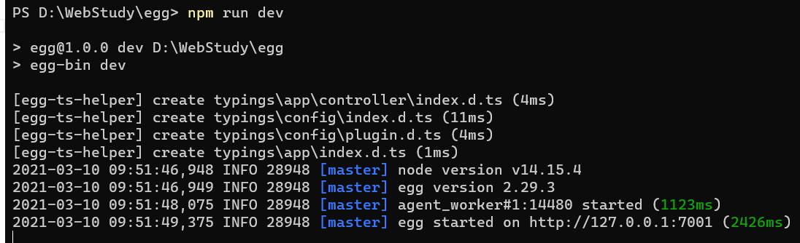
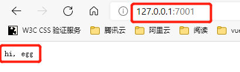
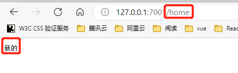
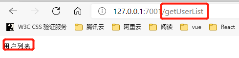
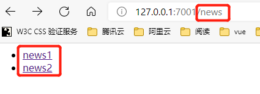

### 开始一个项目

学习一门语言、一个框架，最有效、最快的办法就是快速搭建一个项目，边代码实践边看文档学习。

### 环境支持

1. 操作系统：Mac、Linux、Windows
2. 运行环境：Nodejs 8.x以上的稳定版本

### 项目初始化

框架给我们做好了项目初始化工具，只需要两行简单的npm指令就可以了。

```bash
mkdir eggProject && cd eggProject 创建一个egg项目的目录并进入该目录
npm init egg --type=simple  快速初始化一个简单模板的egg项目
npm install/npm i  安装项目依赖
```

到此为止，一个egg项目就创建好了，且已经安装好了依赖，接下来启动运行命令就可以运行了。

上面创建项目的时候，直接选用了simple的模板类型，其实还有其他的几种模板类型，我们可以通过egg-init命令来创建项目，以此方式创建项目的时候，我们可以根据需要选择需要的模板类型：

```bash
PS D:\> egg-init dest # dest为项目名称
[egg-init] use registry: https://registry.npmjs.org
[egg-init] target dir is D:\personProject\dest
[egg-init] fetching npm info of egg-init-config
? Please select a boilerplate type
  ──────────────
  simple - Simple egg app boilerplate
  microservice - Microservice app boilerplate based on egg
  sequelize - egg app with sequelize
  ts - Simple egg && typescript app boilerplate
  empty - Empty egg app boilerplate
  plugin - egg plugin boilerplate
```

在基于egg框架创建项目的时候，有一篇文章分析的很好，[npm init egg --type=simple到底做了什么](https://zhuanlan.zhihu.com/p/160134555)，可以去看看。

### 启动项目

```bash
npm run dev  启动项目
```

项目启动后，默认占用端口7001，启动状态可参考下图：


### Demo

先不用理会demo的合理性，也先不理会controller、router个service什么概念，具体是怎么样的调用方法，先根据工具给我们生成好的项目目录结构以及文档写些示例代码，迅速让demo运行起来。

1. 编写controller

```javascript
// /app/controller/home.js

'use strict';

const Controller = require('egg').Controller;

class HomeController extends Controller {
  async index() {
    const { ctx } = this;
    ctx.body = 'hi, egg';
  }

  async home(){
    const {ctx} = this;
    ctx.body = "新的";
  }

  async userList() {
    const {ctx} = this;
    ctx.body = "用户列表";
  }
}

module.exports = HomeController;
```

2. 配置路由

```javascript
//  /app/router.js
'use strict';

/**
 * @param {Egg.Application} app - egg application
 */
module.exports = app => {
  const { router, controller } = app;
  router.get('/', controller.home.index);
  router.get("/home",controller.home.home);
  router.get("/getUserList",controller.home.userList);
};
```

demo中给出了3个示例，有3个路由，我们访问路由，controller给我们返回一些响应数据。我们请求不同的路由，得到了预期的返回的数据，效果如下：

访问项目默认的demo



访问自定义的router为/home的页面



访问自定义router为/getUserList的页面



### 静态资源

Egg内置了static插件，但是线上环境的静态资源建议部署到CDN，一般情况下，用不到该插件。

还有一种情况，就是我们大多数情况是希望egg给我们提供基础的数据接口服务，通过node的能力做数据处理，页面展示的部分一般会单独起Vue或者React项目，静态资源就跟着到了Vue或者React项目中了。

我一般不会在egg中通过一些模板引擎做数据的展示，如果在有必要的情况下，可以使用模板引擎，常用的模板引擎有ejs、pug、Nunjucks等，对应的静态资源static插件默认映射到/app/public/目录下面。

### 模板渲染

这部分，简单了解下知道有这么个模板引擎可以用就可以了，一般用不到，因为做数据渲染的时候，我们有Vue和React。

这里以nunjucks模板引擎为例，作为一个demo。

1. 安装模板引擎nunjuncks

```bash
npm install egg-view-numjucks --save
```

2. 配置插件

```javascript
// config/plugin.js  注意是项目根目录下的config目录
// 可以这样配置
module.exports = {
  nunjucks: {
    enable: true,
    package: "egg-view-nunjucks"
  }
};

// 也可以这样配置
const nunjucks = {
  enable: true,
  package: 'egg-view-nunjucks'
};
module.exports = { nunjucks };
```

上面两种配置方法都可以，技术实现上都没有问题，只是node中两种模块的导出方式，node模块系统知识可参考: [node中modules模块系统](../../node/module.md)

然后配置模板引擎

```javascript
// config/config.default.js  注意是项目根目录下的config目录
'use strict';

/**
 * @param {Egg.EggAppInfo} appInfo app info
 */
module.exports = appInfo => {
  /**
   * built-in config
   * @type {Egg.EggAppConfig}
   **/
  const config = exports = {};

  // use for cookie sign key, should change to your own and keep security
  config.keys = appInfo.name + '_1615340186645_4016';

  // add your middleware config here
  config.middleware = [];

  // add your user config here
  const userConfig = {
    // myAppName: 'egg',
  };

  // view  这里是新增的模板的配置，上面的细初始化项目自动生成的
  const view = {
    defaultViewEngine: 'nunjucks',
    mapping: {
      '.tpl': 'nunjucks'
    }
  };
  return {
    ...config,
    ...userConfig,
    view  // 新增的，需要返回
  };
};
```

3. 编写模板，渲染数据

模板引擎，一般放在app/view目录下，也可以通过配置为其他目录

```html
<html>
    <head>
        <title>Hacker news</title>
        <link rel="stylesheet" href="/public/css/news.css" />
    </head>
    <body>
        <ul class="news-view view">
            
                <li class="item">
                    <a href="{{ item.url }}" target="{{item.openType}}">{{item.title}}</a>
                </li>
            
        </ul>
    </body>
</html>
```

4. 编写controller和router

```javascript
// app/controller/news.js
const Controller = require("egg").Controller;

class NewsController extends Controller {
    async list() {
        const dataList = {
            list: [
                {
                    id: 1, title: "news1", url: "https://www.163.com", openType: "_blank"
                },
                {
                    id: 2, title: "news2", url: "https://www.mop.com", openType: "_blank"
                }
            ]
        };
        await this.ctx.render('news/list.tpl', dataList);
    }
}

module.exports = NewsController;

// app/router.js

'use strict';

/**
 * @param {Egg.Application} app - egg application
 */
module.exports = app => {
  const { router, controller } = app;
  router.get('/', controller.home.index);
  router.get("/home",controller.home.home);
  router.get("/getUserList",controller.home.userList);

  // news
  router.get("/news", controller.news.list);
};
```

到这里，就已经可以启动服务来看下效果了。

复习下服务启动方式：

```bash
npm run dev  // 默认启动7001端口
```

浏览器预览效果：



5. 编写service

作为一个demo来说，到这里已经可以把这个项目运行起来就可以了。但是作为一个初次接触egg的人来说，开始的入门很重要，可以帮我们快速入门，所以就写的详细点。

在上面的demo中，我们在controller中直接生产了数据，然后渲染到了view中，而在实际的项目中，controller是不会生产数据也不会有复杂的业务逻辑的，一般复杂的业务逻辑会在分出一个独立的service层中的。

> 代码编写好了，但是项目跑不起来，主要原因是示例代码使用的serve是国外的服务器，不能正常访问，但是有一些issues可供参考：[ConnectionTimeoutError: Connect timeout for 5000ms #633](https://github.com/eggjs/egg/issues/633)

> 由于使用的官方的例子，代码应该是没问题了，就是api访问不了，报的是网络问题。先不管他了。把代码贴上，之后有时间了替换个demo：

新建service

service在app下的service目录

```javascript
app/service/news.js
const Service = require("egg").Service;

class NewsService extends Service {
    async list(page = 1) {
        const { serverURL, pageSize } = this.config.newsConfig;
        const { data: idList } = await this.ctx.curl(`${serverURL}/topstories.json`, {
            data: {
                orderBy: '"$key"',
                startAt: `"${pageSize * (page - 1)}"`,
                endAt: `"${pageSize * page - 1}"`
            },
            dataType: 'json'
        });

        const newsList = await Promise.all(
            Object.keys(idList).map(key => {
                const url = `${serverURL}/item/${idList[key]}.json`;
                return this.ctx.curl(url, { dataType: 'json' });
            })
        );
        return newsList.map(res => res.data);
    }
}

module.exports = NewsService;
```

controller需要跟着做部分的修改，主要是把controller中生产数据的部分，修改了，因为现在的数据是通过service拉取的：

```javascript
const Controller = require("egg").Controller;

class NewsController extends Controller {
    async list() {
        const ctx = this.ctx;
        const page = ctx.query.page || 1;
        const newsList = await ctx.service.news.list(page);
        await ctx.render("news/list.tpl", { list: newsList });
    }
}

module.exports = NewsController;
```

再添加一个拉取远程数据的配置,修改config/config.default.js

```javascript
  // ……
  // 抓取news的配置
  const newsConfig = {
    pageSize: 5,
    serverURL: 'https://hacker-news.firebaseio.com/v0'
  };
  return {
    ...config,
    ...userConfig,
    view,
    newsConfig
  };
};
```