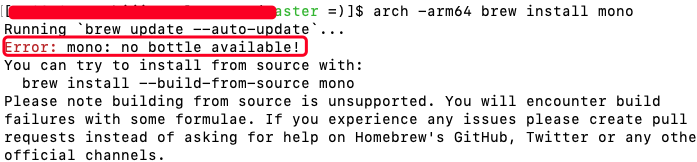
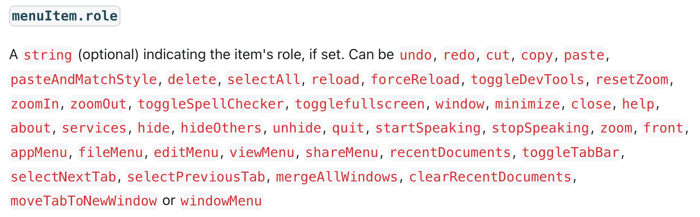
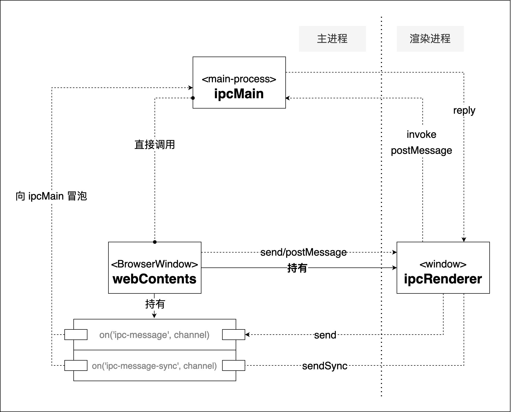

<!-- START doctoc generated TOC please keep comment here to allow auto update -->
<!-- DON'T EDIT THIS SECTION, INSTEAD RE-RUN doctoc TO UPDATE -->
**Table of Contents**  *generated with [DocToc](https://github.com/thlorenz/doctoc)*

- [1. 简单认识Electron](#1-%E7%AE%80%E5%8D%95%E8%AE%A4%E8%AF%86electron)
- [2. 管理窗口的生命周期](#2-%E7%AE%A1%E7%90%86%E7%AA%97%E5%8F%A3%E7%9A%84%E7%94%9F%E5%91%BD%E5%91%A8%E6%9C%9F)
  - [2.1 关闭所有窗口时退出应用程序](#21-%E5%85%B3%E9%97%AD%E6%89%80%E6%9C%89%E7%AA%97%E5%8F%A3%E6%97%B6%E9%80%80%E5%87%BA%E5%BA%94%E7%94%A8%E7%A8%8B%E5%BA%8F)
  - [2.2 如果没有窗口则打开一个新的窗口(MacOs)](#22-%E5%A6%82%E6%9E%9C%E6%B2%A1%E6%9C%89%E7%AA%97%E5%8F%A3%E5%88%99%E6%89%93%E5%BC%80%E4%B8%80%E4%B8%AA%E6%96%B0%E7%9A%84%E7%AA%97%E5%8F%A3macos)
- [3. Electron应用的工作机制](#3-electron%E5%BA%94%E7%94%A8%E7%9A%84%E5%B7%A5%E4%BD%9C%E6%9C%BA%E5%88%B6)
- [4. 打包发布应用程序](#4-%E6%89%93%E5%8C%85%E5%8F%91%E5%B8%83%E5%BA%94%E7%94%A8%E7%A8%8B%E5%BA%8F)
  - [4.1 打包dmg格式应用](#41-%E6%89%93%E5%8C%85dmg%E6%A0%BC%E5%BC%8F%E5%BA%94%E7%94%A8)
  - [4.2 使用electron-forge在mac上打包windows应用](#42-%E4%BD%BF%E7%94%A8electron-forge%E5%9C%A8mac%E4%B8%8A%E6%89%93%E5%8C%85windows%E5%BA%94%E7%94%A8)
- [5. 常用功能](#5-%E5%B8%B8%E7%94%A8%E5%8A%9F%E8%83%BD)
- [6. 通信方式](#6-%E9%80%9A%E4%BF%A1%E6%96%B9%E5%BC%8F)
  - [6.1 BrowserWindow的一些配置](#61-browserwindow%E7%9A%84%E4%B8%80%E4%BA%9B%E9%85%8D%E7%BD%AE)
- [7. 用户窗口(BrowserWindow)常用事件](#7-%E7%94%A8%E6%88%B7%E7%AA%97%E5%8F%A3browserwindow%E5%B8%B8%E7%94%A8%E4%BA%8B%E4%BB%B6)
  - [7.1 new-window 可以监听到新窗口打开页面事件](#71-new-window-%E5%8F%AF%E4%BB%A5%E7%9B%91%E5%90%AC%E5%88%B0%E6%96%B0%E7%AA%97%E5%8F%A3%E6%89%93%E5%BC%80%E9%A1%B5%E9%9D%A2%E4%BA%8B%E4%BB%B6)
- [8. 预加载](#8-%E9%A2%84%E5%8A%A0%E8%BD%BD)

<!-- END doctoc generated TOC please keep comment here to allow auto update -->

### 1. 简单认识Electron

Electron是一个使用javascript、html、css构建桌面应用程序的框架。嵌入Chromium和nodejs到二进制的Electron应用程序，允许使用一套js代码库创建跨平台的桌面应用程序。

Electron应用程序的开发，需要本地有nodejs的支持，但是Electron应用程序的运行，不依赖本地的Nodejs和浏览器。

Electron应用和网页应用程序相比，因为是内置的chromium和Nodejs，所以Electron应用可以避免令人头疼的浏览器的兼容性问题。

**Nodejs**

Electron应用程序的开发以来nodejs，所以在开发Electron应用之前，本地需要先安全nodejs，且建议是最新版本的TLS版本。

Electron应用程序，将nodejs打包到了Electron应用的二进制文件中，所以我们运行Electron应用时的nodejs和我们本地开发环境中的nodejs版本没有任何关系。

### 2. 管理窗口的生命周期

#### 2.1 关闭所有窗口时退出应用程序

在windows和linux中，关闭了所有的窗口后，通常就是退出了一个应用，但是在MacOS中则有不同的表现

```js
// 监听window-all-closed事件
app.on("window-all-closed", () => {
    if(process.platform !== "darwin"){ // 在所有平台中都实现了统一，关闭了所有窗口后，引用程序不会完全退出
        app.quit();
    }
});
```

app.quit():不会完全退出一个应用程序，只是当前窗口关闭

#### 2.2 如果没有窗口则打开一个新的窗口(MacOs)

当linux和windows应用在没有窗口打开时退出了，则应用程序也就退出了，但是MacOs即使在没有任何窗口打开的情况下，程序也会继续运行，且在没有窗口可用的情况下激活新的窗口，虽然这个窗口不一定能被看到。

为了效果的统一，需要实现不同平台下的功能一致，可以通过监听app模块的activate事件，当监听到没有窗口时，则打开一个窗口来实现功能：

```js
// 应为打开窗口需要在应用的ready后才能创建，所以就需要将activate事件在app的ready回调中进行监听
app.whenReady().then(() => {
    createWindow();
    // 当没有窗口可用时打开新的窗口
    app.on("activate", () => {
        if (BrowserWindow.getAllWindows().length === 0) {
            createWindow();
        }
    })
});
```

### 3. Electron应用的工作机制

使用Electron开发桌面应用，就像是定制的一个简易版的chrome浏览器，只是这个浏览器不能随意输入url，只能是去渲染指定的url或者文件。

electron和浏览器类似，Electron应用程序分为主进程和渲染进程。

主进程负责控制应用程序的生命周期、创建和管理应用程序窗口，有着多种控制原生桌面功能的模块，如菜单、对话框以及托盘等；

渲染进程负责完成界面渲染、接收用户输入、响应用户交互等功能；

染进程和渲主进程之间进行交互，通过icpRenderer跟主进程进行数据交互。

**主进程**

主进程通过创建BrowserWindow实例创建页面，每一个BrowserWindow实例都在它自己的渲染进程中运行网页。

当一个BrowserWindow实例销毁的时候，它相关的渲染进程也会终结。

主进程管理着它自己的页面和相关的渲染进程。

**渲染进程**

渲染进程仅仅管理着和它自己相关的页面。一个渲染进程中崩溃了，不会影响到其他的渲染进程。

主进程和渲染进程之间通过GUI操作进行通信，出于安全和资源泄露问题的考虑，限制渲染进程直接调用本地GUI接口的能力。

仅仅从代码上看，主进程的代码看起来更像是nodejs的代码，而渲染进程看起来更像是传统web页面的代码。

```js
// 主进程代码
const { app, BrowserWindow, ipcMain } = require("electron");
const path = require("path");

const createWindow = () => {
    const win = new BrowserWindow({
        width: 1000,
        height: 800,
        minHeight: 400,
        minWidth: 600,
        webPreferences: {
            preload: path.join(__dirname, "preload.js"),
            nodeIntegration: true, // 集合node进程
            contextIsolation: false, // 设置为false后就可以在渲染进程中正常导入electron了
            webviewTag: true // 开启多标签
        }
    });

    win.loadFile("./index.html");
    // 默认最大化显示
    win.maximize();

    // 关闭应用
    ipcMain.on("quit", (event, args) => {
        win.webContents.send("quitMessage", "应用即将退出");
        app.quit();
    })
}

app.whenReady().then(() => {
    // 初始化窗口
    createWindow();
});
```

```html
<!--渲染进程代码-->
<!DOCTYPE html>
<html lang="en">

<head>
    <meta charset="UTF-8">
    <meta http-equiv="X-UA-Compatible" content="IE=edge">
    <meta name="viewport" content="width=device-width, initial-scale=1.0">
    <title>主应用</title>
    <link rel="stylesheet" href="./src/css/main.css">
</head>

<body>
    <div class="main">
        <p>Hello world!</p>
        <button id="send">发送消息</button>
    </div>
    <script>
        const { ipcRenderer } = require("electron");
        const btn = document.querySelector('#send');
        // 渲染进程向主进程发送消息
        btn.addEventListener("click", function () {
            ipcRenderer.send("sendMessage", "我是渲染进程");
        });

        // 渲染进程接收主进程给的响应
        ipcRenderer.on("receiveMessage", (event, args) => {
            console.log("我从主进程接收到的消息:", args);
        })

        const quit = document.querySelector("#quit");
        quit.addEventListener("click", function () {
            ipcRenderer.send("quit", "quit");
        });
        ipcRenderer.on("quitMessage", (event, args) => {
            console.log("接收到的关闭应用的信息:", args);
        })
    </script>
</body>

</html>
```

> webview不拥有渲染进程的权限，这一点与iframe不同，webview和electron应用运行的是不同的进程。webview嵌入的内容和electron应用之间的交互都是异步的，这一点保证了主应用和webview之间的安全。

**一个Electron应用只能有一个主进程，但是可以有多个渲染进程。**

electron应用中，不能在主进程中(可以简单理解不能在main.js)访问、编辑DOM，因为它无法访问渲染器文档上下文，它们存在于不同的进程中。

**主进程和渲染进程的console.log**

主进程的console.log()是打印到终端的，也就是说是打印到服务器上的；

渲染进程中的console.log()是打印到浏览器上的。

**预加载脚本**

预加载脚本在渲染器进程加载之前加载，并有权访问两个渲染器全局(如window和document)和nodejs环境。

预加载脚本，是网页和nodejs之间的桥梁，通过预加载脚本，网页可以借用部分的nodejs能力。

### 4. 打包发布应用程序

Electron支持几种打包工具：

1. electron-forge

2. electron-builder

3. electron-packager

Electron建议使用Electron Forge，因为简单易上手，并使用Electron Forge的import指令设置Forge脚手架。

<font color="#f20">Electron-forge只能打本系统的包，比如mac上就只能打mac应用的包，而不能在mac上打包windows应用的包。这一点electron文档上没有告诉我们，明显的一个坑。</font>这个坑，害我用了1天的时间去调试、解决打包的问题。

```bash
npm install @electron-forge/cli --save-dev
npx electron-forge import
```

安装了electron-forge/cli后，项目的启动脚本就会被指定为electron-forge,package.json中的start指令由electron .变成了electron-forge start，然后添加forge的make指令。

**通过Forge的make指令打包可分发的应用程序**

```bash
npm run make
```

执行了make指令后，会在项目的根目录下创建一个out目录，打包后的应用呢程序就会被打包到这个目录。

在安装了electron-forge/cli后，package.json发生了一些变化，主要是electron-forge/cli的相关依赖和配置，大概的信息如下:

```json
  "devDependencies": {
    "@electron-forge/cli": "^6.0.0-beta.65",
    "@electron-forge/maker-deb": "^6.0.0-beta.65",
    "@electron-forge/maker-rpm": "^6.0.0-beta.65",
    "@electron-forge/maker-squirrel": "^6.0.0-beta.65",
    "@electron-forge/maker-zip": "^6.0.0-beta.65",
    "electron": "^20.0.2"
  },
  "dependencies": {
    "electron-squirrel-startup": "^1.0.0"
  },
  "config": {
    "forge": {
      "packagerConfig": {},
      "makers": [
        {
          "name": "@electron-forge/maker-squirrel",
          "config": {
            "name": "electron"
          }
        },
        {
          "name": "@electron-forge/maker-zip",
          "platforms": [
            "darwin"
          ]
        },
        {
          "name": "@electron-forge/maker-dmg",
          "platforms": [
            "darwin"
          ]
        },
        {
          "name": "@electron-forge/maker-deb",
          "config": {}
        },
        {
          "name": "@electron-forge/maker-rpm",
          "config": {}
        }
      ]
    }
  }
```
从代码中，我们看到了maker-zip、maker-deb、maker-rpm等依赖，配置(config)中有一个makers字段，这个字段是一个数组，配置了需要打包的终端类型，这是打包的核心配置。

**配置应用背景图片**

不应该叫背景图片，应该是应用的logo吧。

#### 4.1 打包dmg格式应用

我们在安装electron-forge/cli的时候，默认的安装了一些依赖，我用的是mac，我这默认安装了maker-zip、maker-rpm、maker-deb等，但是默认只能打包mac系统下的zip格式，在mac系统中，最有好的安装包格式是dmg格式，我们可以在安装一个maker-dmg依赖，然后配置下makers就可以实现

```bash
npm install @electron-forge/maker-dmg --save-dev
```
然后配置makers:

```json
        {
          "name": "@electron-forge/maker-dmg",
          "config": {
            "name": "An+" // 可以是中问,应用名
          },
          "platforms": [
            "darwin"
          ]
        },
```

然后就可以执行npm run make来打包应用了。

**打包生成不同平台的应用**

原本我是以为可以在一个开发平台如mac上可以直接生成各个平台终端的应用，如在mac上可以直接打包生成windows、linux上等各个不同终端的应用，最后了解到，这是不可能的，只能在各类的平台上打开项目的源代码，然后打包生成对应平台的可执行文件。

虽然这是一种解决办法，但是这是一种最低效、最没有技术含量的一种方案。

因为打包生成各平台的可执行应用，需要各种平台的环境支持，那么mac上就不会有windows的环境，同样，windows上也不会有mac上的应用的环境。即便同是mac的Intel芯片的终端和M1芯片的终端的环境都是不同的。

<font color="#f20">这些是存在的现象和问题，但是作为开发人员，公司也不太可能给我们每个人都配置多台设备，那么对于开发有好来说，还是希望能够在一台设备上可以打包成各个终端的不同应用。</font>

> 插播一个小知识：mac平台上Homebrew更新： brew update, brew自己本身更新

#### 4.2 使用electron-forge在mac上打包windows应用

上面已经了解到，mac上是不能直接打包windows应用的，因为需要windows应用的执行环境，所以我们需要在mac系统上安装一些windows应用的执行环境。

mac上需要的windows应用的执行环境有：wine、mono。

在mac上的electron应用中打包windows应用程序，需要先安装这2个依赖。

**wine**

wine，是Wine Is Not an Emulator首字母的缩写，Wine不是一个模拟器。它是一个能够在多个操作系统上运行windows应用的兼容层。wine不像虚拟机或者其他模拟器一样模仿内部的windows逻辑，而是将windows API调用翻译成为动态的POSIX调用，免除了性能和其他一些行为的内存占用，让我们能够让干净的集合windows应用到我们非windows系统的桌面。

总之，wine就是一个兼容层，可以在非windows系统上运行windows应用程序。

wine的安装:

```bash
brew install wine
```

通过brew安装wine正常情况下很少出问题，如果抱异常信息了，更新下brew就可以了。

更新brew的方式：

```bash
brew update # brew update 更新brew自己本身，不是更新通过brew安装的应用
```
> 因为很多源的服务器是国外的，部分情况下可能出现更新速度慢，或者失败的场景，这个是，就想办法解决下网络问题，或者更信下源。

**mono**

一个跨平台的.net运行环境，可以运行在mac、linux等终端上。

安装mono就有点麻烦了，在网上查到了也可以通过brew来安装mono，但是我尝试直接使用brew install mono，结果都失败了，提示需要将Homebrew的安装目录移动到/usr/local目录下(我使用的M1的mac，homebrew默认被安装到了/opt/homebrew,Intel版本的Mac好像是被安装到/usr/local目录下的)，或者是使用‘arch -arm64 brew install 应用名’的方式安装，我进行了尝试后，提示没有mono这个源。



另外一种方式就是下载mono安装文件的方式安装，下载地址：https://www.mono-project.com/download/stable/#download-mac。

这种方式安装成功了。

> wine和mono都安装成功了，但是在通过electron-forge打包windows应用的时候，还是没有成功。

> 使用electron-forge只能在各自的平台上进行对应平台的应用程序，就是说在mac上只能打包mac系统的应用程序，在windows上只能打包windows平台的应用程序，而不能在mac上打包windows平台的应用程序.

### 5. 常用功能

1. 获取设备mac地址

可以通过getmac获取mac

2. 多标签页功能

electron原生本身不提供多标签页功能，但是可以通过其他的一些变通的方式获取来实现多标签页功能。

3. 预定义功能

在electron的菜单中，role属性包含了一些预定义功能，有些功能直接使用role就可以实现，不再需要触发click事件去实现了.具体的role属性，可参考：https://www.electronjs.org/docs/latest/api/menu-item#menuitemrole



```js
    {
        label: '&Edit(E)',
        submenu: [
            {
                label: '剪切',
                role: 'cut'
            },
            {
                label: '复制',
                role: 'copy'
            },
            {
                label: '粘贴',
                role: 'paste'
            }
        ]
    },
```

4. 主菜单

在MacOS中，无论我们设置什么标签，应用菜单的第一个菜单项的标签始终是我们的应用的名字。要想修改的话，只能通过修改应用绑定的Info.plist文件来修改应用的名字。

### 6. 通信方式

在electron应用中，一个应用只能有1个主进程，但是可以多个渲染进程。

渲染进程之间是没有办法直接通信的，而主进程则是一个桥梁、调度器的作用，在渲染进程之间的通信，就需要通过主进程这个调度器去实现。

一般情况下，一个渲染进程，就是管理一个window窗口的进程。

渲染进程可以利用IPC消息和主进程进行通信，这个时候主进程作为调度器来衔接各个渲染进程，主进程本身一般情况下不发送消息，只是在接收到了渲染进程的消息后进行消息的回复。

本质上，渲染进程和实际展示的网页之间，是有一定区别的。

下图为我们梳理了“主进程-渲染进程-窗口”之间的通信方式：



从图中，我们可以清晰的看出来，ipcMain和webContents都在主进程中，它们之间无缝衔接调用，每个webContents管理一个窗口。

在进行消息通信的是，有几点需要注意：

1. ipcRender通常是信息的发起者，ipcMain通常只是信息的接收者，而webContengts则是中间枢纽，代理了部分ipc消息，如send或者sendSync消息可以直接被webContents截获。

2. ipcMain只有在接收到了ipcRender发送过来的消息后，才知道了有这个渲染进程的存在，否则主进程仅仅是一个全局的无状态的服务器；

3. webContents作为既存在于主进程，又可以直接对应到单个window的对象，有效的隔离了ipc消息作用域；

通常情况下，应该尽量使用webContents和ipcRender之间进行通信，只有涉及到全局事件时再通过ipcMain进行调度。

#### 6.1 BrowserWindow的一些配置

1. frame:窗口边框，是否有边框

2. titleBarStyle：菜单栏样式

3. webPreferences:web相关配置

### 7. 用户窗口(BrowserWindow)常用事件

#### 7.1 new-window 可以监听到新窗口打开页面事件

electron应用中，打开新窗口事件，一般情况下都可以通过new-window事件监听到，就是说并不是说所有的新窗口都可以通过new-window事件监听到。经过一些测试场景，可以被监听到的事件有：

1. 通过window.open()方式打开的心链接可以被监听到

2. a标签打开新窗口可以被捕捉到

```html
<a href="https://www.baidu.com" target="_blank">百度</a>
```

new-window不能监听到的事件有：

1. 渲染进程中使用BrowserWindow创建新窗口，new-window事件监听不到

### 8. 预加载

preload是BrowserWindow类的webPreferences参数的一个可选配置项。

预加载，就是在运行页面其他脚本之前预先加载的指定的脚本，文件是个js文件。

加载时机：因为是预加载，所以加载是在窗口创建之后、窗口中的页面加载之前，需要注意这个页面指的是渲染进程，而不是某个具体的页面。我们每new BrowseraWindow，就创建了一个新的渲染进程。

electron5.x版本以后，渲染进程默认是没有办法去调用Node Api的，如果想要在渲染进程中调用Node Api，需要在窗口中指定nodeIntegration属性为true。当然了这个属性，是在BrowserWindow的webPreferences属性中去配置的。

```js
const newWindowOptions = {
    title: "New Tab",
    // show: false,
    titleBarStyle: "hidden",
    titleBarOverlay: {
        color: "#369",
        symbolColor: "#f20",
        height: 34
    },
    focusable: true,
    webPreferences: {
        // 渲染进程可以调用Node API
        nodeIntegration: true,
        nativeWindowOpen: true,
        webSecurity: true,
        contextIsolation: false, // 设置为false后，可以在渲染进程中导入electron模块
        preload: path.join(__dirname, "../preload.js")
    }
};
```