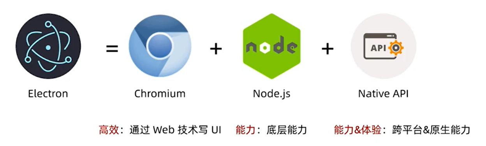

### 1.再认识electron

electron的组成

electron = chromium + nodejs + Native API

可参考如下的图片：

electron的能力和chromium和nodejs密不可分,因为electron的很大一部分的功能就是在chromium和nodejs的基础上实现的。

electron难点：

1. 技术栈较多：C++、多进程、rust

2. 工程化建设

与传统web开发的一些区别

1. 主进程和渲染进程

2. 进程间通信

3. Native能力和原生GUI

4. 释放前端的想象能力

需要进阶掌握的技能点

1. 打包

2. 软件更新

3. 质量监控

4. 保证应用安全

5. 提升用户体验

6. Electron bad part

**都谁在用electron**

**什么时候适合使用electron**

在做一些小范围项目，可快速验证效果的场景下；

一些特定领域，如开发者工具、效率应用工具的时候，可以尝试使用electron

**怎么使用electron**

### 2. Electron进程间通信

**electron应用中进程之间通信的目的/为什么要通信**

事件通知

数据传输

数据共享

**IPC模块通信**

Electron提供了IPC通信模块，主进程的ipcMain和渲染进程的ipcRenderer

ipcMain、ipcRenderer都是EventEmitter对象

**进程间的通信，从渲染进程到主进程**

callback方式

    ipcRenderer.send(channel,...args)   渲染进程向主进程发送一个事件，并可以传递一些数据(参数，非必填，可选)

    ipcMain.on(channel,handler)   主进程监听从从渲染进程发送的事件，并向渲染进程返回一个结果

Promise写法(electron7.0之后，处理请求+响应模式)

    ipcRenderer.invoke(channel,...args);

    ipcMain.handle(channel,handle);

**进程间通信：从主进程到渲染进程**

    webContents.send(channel): 通过具体的窗口向渲染进程发送消息

**页面之间(渲染进程和渲染进程之间)的通信**

    通知事件

        ipcRenderer.sendTo();

    数据共享

        web技术(WebStorage ---- localStorage、sessionStorage、indexDB)

### 3. Native能力及原生UI

BrowserWindow 应用窗口

Tray 托盘

app设置dock.badge

Menu菜单

dialog原生弹窗

TouchBar 苹果触控栏

……

**Electron给我们提供的一些获取系统底层的能力**

clipboard 剪切板

globalShortcut 全局快捷键

desktopCapture 捕获桌面

shell 打开文件、URL

……

**使用Nodejs获取底层的能力**

Electron同时在主进程和渲染进程暴露了Nodejs的所有接口

    fs文件读写能力

    crypto 加密能力

通过npm安装即可导入社区上所有的nodejs库

**使用Nodejs调用原生模块**

可以在electron中通过node调用C++已经实现好的一些功能、应用

ndoe.js add-on

node-ffi(Foreign Functio Interface)

**通过Node调用系统能力**

WinRT: 在windows上可以使用，推荐一个库 https://github.com/NodeRT/NodeRT

Applescript(https://github.com/TooTallNate/node-applescript)

shell(node.js child_process)

**无兼容问题**

electron应用，不要考虑IE，这是一个没有IE的世界，因为electron使用的是chromium内核，已经限制了环境，不需要考虑任何除了Chrome以外的事件

大胆使用Chrome浏览器已经支持的API

babel中设置targets为electron对应的chrome版本

可以不定期的关注google应用的更新，可以看看这个链接：https://developer.chrome.com/blog/

> Chrome76版本之后，浏览器本身支持了LazyLoad(https://mathiasbynens.be/demo/img-loading-lazy)

**可以放心大胆的使用高版本的ES语法**

因为electron使用的chromium内核，所以可以放心大胆的使用高版本的es语法而不用担心兼容性问题

async、await、Promise

string、array、Object等高级语法

BigInt

**无跨域问题**

使用nodejs发送网络请求

使用electron的net模块发送请求

这两种发送请求的方式，都不受浏览器同源策略的影响。

**更多能力**

除了上面已经罗列的一些功能之外，electron还有其他的一些常用能力：

操作本地文件

更好的调用本地DB

多线程、多进程并行

……

**总结开发electron应用的优势**

没有浏览器的兼容性问题

具有了chrome浏览器最新版本浏览器的特性，可以使用浏览器中较新功能、API

No Polyfill

支持ES的高级语法

没有跨域问题

强大的nodejs能力