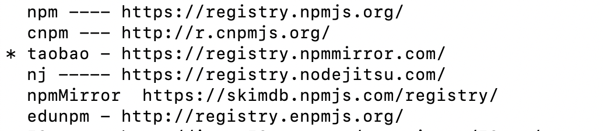

在写electron应用的时候，按照官方的文档创建项目，在安装electron依赖的时候，总是安装失败。之前也创建过electron项目，安装过electron，但是没印象总是安装不成功的情况。

安装不成功，我首先想到的就是npm源的问题，国内的部分网络环境原因，有的时候访问npm源的时候，会有失败的情况，于是我就切换了下npm源。我切换成了taobao的npm镜像，如图：



结果还是不行。

继续百度一下，继续查吧。

最后，通过npm设置了一个electron的镜像源，然后才安装成功。

通过npm设置electron的镜像源：

```bash
npm config set electron_mirror http://npm.taobao.org/mirrors/electron/
```

安装完成之后，重新执行npm install，安装成功。