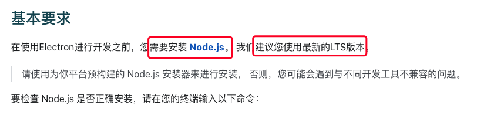

### DevTools was disconnected from the page.（DevTools 与页面断开连接） Once page is reloaded, DevTools will automatically reconnect（页面重新载入后，DevTools 将自动重新连接）

今天在调试electron应用时发现了这个问题，前几天也调试了electron，可能是没有注意这个细节，就没有发现这个问题。

遇到这个问题后，先从网站的文档上看了下有没有类似的问题，在electron的官网上确实看到了这个问题，说是V8崩溃了，问题是列出来了，可是没有给出解决方案，只给了个Chromium日志的环境变量文档。

对于大多数的开发者来说，看这个文档收益太低了。然后就百度一下吧，发现了有出现过类似的问题，说是版本的问题，于是我想到了electron文档上的提示，建议使用最新LTS版本的nodejs

于是，我就更新了下我的nodejs版本，更新到了最新的LTS版本，更新后，问题解决。