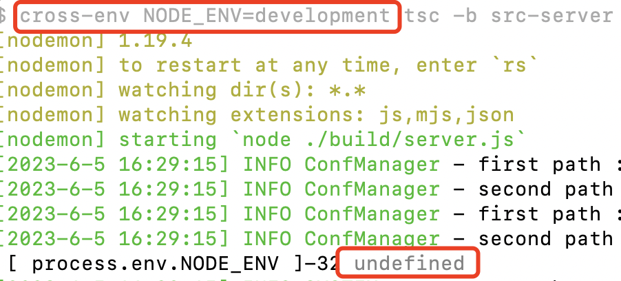
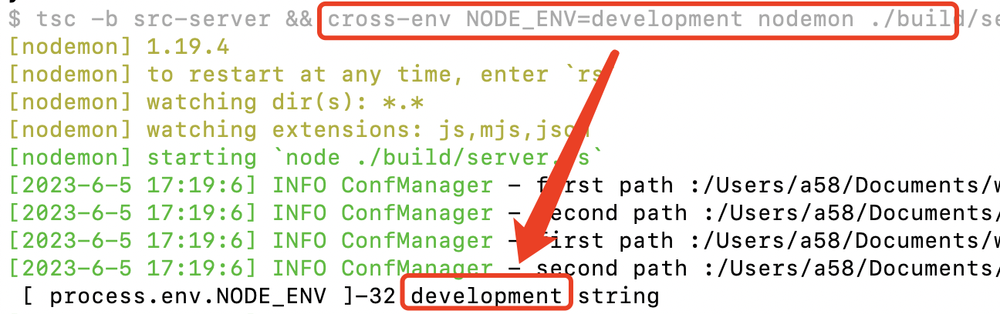

### express项目中通过cross-env配置环境变量不生效

项目中有一处场景，在开发环境需要是一个只，到了线上需要是另外一个值。现在的做法是开发环境的时候改下这个值，然后到上线的时候，把这个值给改过来，再还原成生产环境需要的值。

虽然这样的方式可行，但是不可取，因为一个项目可能周期会拉的很长，上线的时候难免会忘掉这个改动。

我想通过cross-env这个工具包来帮我配置一个环境变量，然后根据环境变量来设置我的场景值。

安装cross-env

```bash
# 安装cross-env
yarn add cross-env
```

在package.json中配置环境变量

```json
"dev": "cross-env NODE_ENV=development tsc -b src-server && nodemon ./build/server",
```

于是，我就开开心心的去yarn dev了，结果确发现NDOE_ENV的到的却是一个undefined，没有拿到任何值。这是什么原因呢？



然后仔细查看了下代码后，发现&&有问题，因为在脚本执行过程中，&&会把前后隔离成2个不同的环境，而我的代码：

```json
"dev": "cross-env NODE_ENV=development tsc -b src-server && nodemon ./build/server"
```

&&把cross-env和nodemon服务隔离开了，也就是说在nodemon启动的node服务中，是获取不到前面通过cross-env配置的环境变量的。找到了问题所在，那么就好解决了，只需要将cross和nodemon启动服务放到&&的一侧就可以了

```json
"dev": "tsc -b src-server && cross-env NODE_ENV=development nodemon ./build/server"
```

修改cross-env的位置后，问题解决。



### 另外一种通过export的方式配置环境变量

除了可以使用cross-env工具包来配置环境变量，也可以通过export的方式配置环境变量，只不过该方式不具备跨平台的能力，如果我们固定在使用mac或者linux，也可以使用这种方式去配置下环境变量

```json
"dev": "export NODE_ENV=development && tsc -b src-server && nodemon ./build/server",
```

本质上就是执行了个shell脚本，在本地配置了个环境变量，不太灵活，不过也能凑合使用。