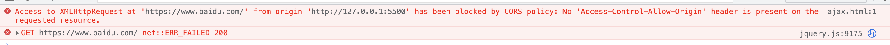

<!-- START doctoc generated TOC please keep comment here to allow auto update -->
<!-- DON'T EDIT THIS SECTION, INSTEAD RE-RUN doctoc TO UPDATE -->
**Table of Contents**  *generated with [DocToc](https://github.com/thlorenz/doctoc)*

- [跨域、cors、options请求](#%E8%B7%A8%E5%9F%9Fcorsoptions%E8%AF%B7%E6%B1%82)
  - [前端通过post、src请求时，会有两条请求记录，一条请求的请求方法为OPTIONS，再有一条的请求方法才是post或者get。](#%E5%89%8D%E7%AB%AF%E9%80%9A%E8%BF%87postsrc%E8%AF%B7%E6%B1%82%E6%97%B6%E4%BC%9A%E6%9C%89%E4%B8%A4%E6%9D%A1%E8%AF%B7%E6%B1%82%E8%AE%B0%E5%BD%95%E4%B8%80%E6%9D%A1%E8%AF%B7%E6%B1%82%E7%9A%84%E8%AF%B7%E6%B1%82%E6%96%B9%E6%B3%95%E4%B8%BAoptions%E5%86%8D%E6%9C%89%E4%B8%80%E6%9D%A1%E7%9A%84%E8%AF%B7%E6%B1%82%E6%96%B9%E6%B3%95%E6%89%8D%E6%98%AFpost%E6%88%96%E8%80%85get)
  - [CORS-跨域资源共享](#cors-%E8%B7%A8%E5%9F%9F%E8%B5%84%E6%BA%90%E5%85%B1%E4%BA%AB)
  - [同源策略](#%E5%90%8C%E6%BA%90%E7%AD%96%E7%95%A5)
  - [CORS和同源策略](#cors%E5%92%8C%E5%90%8C%E6%BA%90%E7%AD%96%E7%95%A5)
  - [预检请求(Preflighted Request)](#%E9%A2%84%E6%A3%80%E8%AF%B7%E6%B1%82preflighted-request)
  - [简单请求和和非简单请求](#%E7%AE%80%E5%8D%95%E8%AF%B7%E6%B1%82%E5%92%8C%E5%92%8C%E9%9D%9E%E7%AE%80%E5%8D%95%E8%AF%B7%E6%B1%82)
    - [怎么区分简单请求和非简单请求？](#%E6%80%8E%E4%B9%88%E5%8C%BA%E5%88%86%E7%AE%80%E5%8D%95%E8%AF%B7%E6%B1%82%E5%92%8C%E9%9D%9E%E7%AE%80%E5%8D%95%E8%AF%B7%E6%B1%82)

<!-- END doctoc generated TOC please keep comment here to allow auto update -->

## 跨域、cors、options请求

### 前端通过post、src请求时，会有两条请求记录，一条请求的请求方法为OPTIONS，再有一条的请求方法才是post或者get。

非简单请求之前，都会进行换一次预检请求，预检请求通过了才会进行正式的XMLHttpRequest请求，预检请求的请求方法是OPTIONS。

### CORS-跨域资源共享

CORS是一种网络浏览器的技术规范，它为web服务器定义了一种方式，允许网页向不同域的服务器发送XMLHttpRequest请求。但是这种策略又是同源策略所禁止的。CORS规范定义了一种浏览器和服务器交互的方式来确定是否允许跨域请求。

> CORS是一种浏览器的技术规范，同源策略是一种协议、约定，具体的表现为cookie同源策略、DOM同源策略和XmlHttpRequest同源策略。

CORS的使用也相对比较简单，需要前端(浏览器)和服务器同时做一些处理.

1. 前端(浏览器)端的支持

CORS的使用，需要浏览器的支持，代码上基本没有什么特殊的地方。好的是现在的浏览器已基本上都支持了CORS，如果是IE的话，需要版本不低于IE10.不过好消息是IE已经在2022年的6月15日退出了历史舞台，虽然短时间内还会有IE设备存在，但是已经被边缘化，是逐消失的节奏，接下来的前端应用，基本上可以不用考虑IE了。

2. 服务器端

服务端需要做一些配置，以便可以让浏览器端通过异步请求可以得到有效的回应，否则访问会被拒绝。

> 跨域，需要解决问题的主要在于服务器端。客户端，一般情况下不需要做什么，浏览器支持了就可以了。也有部分需要在客户端做一些简单的处理，如通过JSONP方式解决跨域请求时，就需要在请求的时候提那家jsonp字段，通过在浏览器端添加script标签，然后通过src的方式向服务器请求资源。

> 跨域问题，所有标签的src属性，是没有同源策略的限制的，如img、script等标签的src属性没有同源策略的限制。这个原理，就是jsonp的根本上的原理所在。

### 同源策略

同源策略，是一个约定、一个协议，所有的web应用，都是建立在同源策略之上的，浏览器是对同源策略的一种实现(CORS,CORS是一个W3C标准，它允许浏览器向不同源的服务器发送XMLHttpRequest请求，从而克服了ajax)。

同源策略，最初是限制不同源的网页之间的cookie不能相互访问，后来扩展到了DOM，并且对XMLHttpRequest也做了限制。

**什么是同源？**

1. 协议相同

2. 域名相同

3. 端口相同

同时满足以上3个条件，算是同源。

**同源策略的3个方面**

1. Cookie的同源策略：不同源Cookie不共享；

2. DOM同源策略：禁止对不同源的页面进行DOM操作，主要是针对iframe跨域；

3. XmlHttpRequest同源策略：禁止使用XMLHttpRequest向不同的域发起请求，典型就是ajax请求；

```html
<button id="btn">ajax请求</button>
<script src="./js/jquery.js"></script>
<script>
    $(function () {
        $("#btn").click(function () {
            $.ajax({
                url: "https://www.baidu.com",
                type: "get"
            });
        });
    })
</script>
```

比如这样的一个小demo，会有报错，提示跨域问题。



**为什么要有同源策略呢？**

在web应用中，除了同源策略之外，还有其他的一些协议，而同源策略，几乎是每个web应用都会涉及到的，因此才得到了大家的重视。在所有的这些协议和限制中，基本上都是为了信息安全，防止信息被恶意窃取和非法使用。

web应用，都是跑在web服务器上，很多都是所有人可访问的，做好信息安全尤其重要。

我们知道了同源策略，初衷是为了应用安全，其实我们也可以从一些反面场景来说一下如果没有同源策略的限制会有哪些危害。

记着以前刚入行的时候，有老师给讲过一个案例，就还拿这个当做案例吧：就是银行账户的案例。

**DOM同源策策略的重要性**

1. 有一个恶意网站，通过iframe嵌入了一个银行网站,这个外部的恶意网站的网页，通过一些样式的设置、调整，让其整个页面显示的就是银行网站的某个重要页面，外部表现就是一个真实的银行网站；

2. 用户在这个恶意站点包裹的银行站点进行了账号信息的验证，进行了登录，如果没有同源策略的限制，那么外部的恶意网站，就看可以实时监听用户输入的信息；

3. 那么这样，一个银行用户的账号信息就被一些不法分子给获取了。这会给这个银行用户带来多大的损失和麻烦，谁也没有办法估量。

**Cookie和XMLHttpRequest同源策策略的重要性**

1. 还是上面的银行网站登录的例子：用户登录了银行网站，服务器根据用户信息，返回了cookie；

2. 用户在登录了银行网站之后，又浏览了其他的网站。非常不幸，这个其他网站，就是一个恶意网站；

3. 没有同源策略限制的恶意网站，轻松的获取到了用户登录银行网站的用户信息以及以及登录后的cookie，并利用这些信息向银行网站的服务器发送了ajax请求，银行服务器通过cookie验证了用户身份，响应了这个恶意网站发送的用户请求；

4. 这样，恶意网站就轻松的获取了用户的个人信息，还有可能会造成一些其他的经济损失，但是这个过程，用户是没有任何感知的。

所以，在同源策略的保护下，我们可以更加安全的上网、尽情的享用互联网给我们带来的生活的便利。

### CORS和同源策略

同源策略是一种约定、协议，对网络的安全做了一些限定，那么在一些特定的场景下，又需要跨过这种约定，那么怎么办呢？

就需要一些特殊的办法去跨过这个门槛。跨过这个门槛的方法有多种，如JSONP、CORS、Access-Conrol-Allow-Origin白名单(其实是cors的一种具体实现)、websocket、代理服务器等。

看到这里应该就明白了，其实CORS是突破同源策略的一种实现。

### 预检请求(Preflighted Request)

预检请求，是CORS中的一种透明服务器验证机制。预检请求首先需要向另外一个域名的资源发送一个HTTP OPTIONS请求头，其目的就是为了判断实际发送的请求是否合法。

需要进行预检请求的2种情况：

1. 简单请求：比如使用Content-Type为application/xml或text/xml的post请求；

2. 请求中设置自定义头，比如X-JSON、X-MENGXIANHUI等。

HTTP请求方法，最常用的是GET和POST，但是除此之外，还有OPTIONS、HEAD、PUT、DELETE、TRACE和CONNECT等方法。

OPTIONS方法是用于请求获得由Request-URI标识的资源在请求/响应的通信过程中可以使用的功能选项。通过这个方法，客户端可以在具体资源请求之前，绝对对该资源采取何种必要措施，或者了解服务器性能。

OPTIONS请求方法的响应不能被缓存。

### 简单请求和和非简单请求

浏览器将CORS请求分为两类：简单请求(simple request)和非简单请求(not-simple request)。简单请求浏览器不会预检，非简单请求，浏览器会进行预检。

#### 怎么区分简单请求和非简单请求？

同时满足下面的3个条件，就是简单请求，否则就是非简单请求。

1. 请求方式只能是：GET、POST和HEAD；

2. HTTP请求头限制下面几个字段：Accept、Accept-language、Content-language、Content-Type、Last-Event-ID；

3. Content-TypeContent-Type只能是如下取值：application/x-www-form-urlencoded、multipart/form-data、text/plain.

非简单请求，是对服务器有特殊要求的请求，比如请求方式是PUT或者DELETE，或者Content-Type字段类型是application/json。都会在正式通信之前，增加一次HTTP请求，称之为预检。浏览器会先询问服务器，当前网页所在域名是否在服务器的许可通信名单之中，服务器允许之后，浏览器才会发送正式的XMLHttpRequest请求，否则会报错，请求失败。

> 如果遇到了预检请求不通过，可以尝试着让服务端排查一下是否排除了OPTIONS请求。如果服务端接收到了OPTIONS请求，直接返回200即可，就是直接通过。

