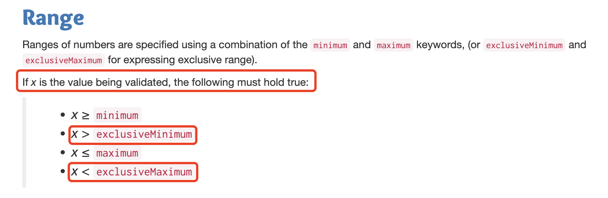

### 1. JSON Schema基础认识

JSON Schema的官方文档：https://json-schema.org/

标准JSON Schema协议：https://json-schema.org/understanding-json-schema

#### 1.1 认识JSON
在了解json schema之前，先明确下对json的认识。

在现在的web开发领域，对于json的使用应该是非常多了，频率非常的高，虽然我们经常使用，但是也有很多朋友可能对json的一些认识是基于印象，而不是明确。

> JSON是一种轻量级的数据交换格式，它是ECMAScript的一个子集，采用完全独立于编程语言的文本格式存储和表示数据。简洁和清晰的数据结构使得JSON成为理想的数据交换语言，易于人的阅读和理解，同时也易于机器的解析和生成，有效的提高了网络传输效率。

简单来说，json就是：

1. JSON就是javascript对象标记法:javascript object Nation

2. JSON是一种轻量级的数据交换格式；

3. JSON具有自我描述能力且易于理解；

4. JSON是一门独立的语言：虽然外观和js对象很像

#### 1.2 什么是JSON Schema

JSON Schema，从字面意义来看，是一种和json相关的协议。

JSON Schema可以理解为一种JSON模式，是一个提议的IETF标准，可以用来描述和校验JSON数据。JSON Schem定义了一套词汇和规则，这套词汇和规则用来定义JSON数据，且元数据也是通过JSON数据形式表达的。JSON元数据定义了JSON数据需要满足的规范，规范包括成员、结构、类型和约束等。我们可以通过它来校验我们的JSON数据是否有效，是否满足规范。它的作用有些类似于Typescript相对于Javascript。

JSON Schema的主要作用是:

1. 对JSON的数据格式进行描述；

2. 提供清晰的人机可读的文档；

3. 数据校验：

    - 自动测试；

    - 验证提交数据的质量

#### 1.3 JSON Schema案例

有如下的一个JSON数据：

```json
{
    "productId": 1,
    "ProductName": "An Red Apple",
    "price": "12.99",
    "tags": ["red","delicious"]
}
```

这个JSON数据对应的JSON Schema可如下：

```json
{
    "$schema": "https://json-schema.org/draft/2020-12/schema",
    "$id": "https://example.com/product.schema.json",
    "title": "Product",
    "description": "A Product",
    "type": "object",
    "properties": {
        "productId": {
            "description": "The unique identifier for a product",
            "type": "integer"
        },
        "productName": {
            "description": "Name of the product",
            "type": "string"
        },
        "price": {
            "description": "The price of the product",
            "type": "number",
            "execsiveMininum": 0
        },
        "tags": {
            "description": "Tags for the product",
            "type": "array",
            "items": {
                "type": "string"
            },
            "minItems": 1,
            "uniqueItems": true
        }
    },
    "required": [
        "productId",
        "productName",
        "price"
    ]
}
```

#### 1.4 JSON Schema关键字

JSON Schema常用的关键字：

1. $schema: 用来声明当前的JSON Schema使用哪个版本的JSON Schema标准，在声明JSON Schema时尽量添加该约束(该约束不是必须的)。

<font color="red">如果在声明了该关键字，那么则必须使用官方提供的值，不能自定义。</font>

2. $id: 为JSON Schema实例提供了一个唯一的标识符，可以用来声明一个解析ref的URI时的基础URI。最佳实践是，每个顶级的JSON Schema实例都应该将id设置为一个由你自己控制的或域内的绝对URI

3. title和description:仅仅是用来描述该字段的作用，实际使用时可省略；

4. type:用于验证JSON数据的约束，上述案例中，JSON数据必须是一个对象；

5. required: 用来描述哪些字段是必须的，对应的值必须是数组格式。如上述案例中，schema声明了productId、productName和price字段是必须的，该3个字段是以数组的方式做为required属性的值。

上面列出的4个关键字，是对Schema的一些注释和设置，针对对应的JSON数据中的每个字段的描述，都在properties属性中，具体每个字段的描述，如每个不同类型的字段对应的描述和关键字都有哪些，整理了下。

1. JSON数据中的每个字段都应该包含一个type字段，用来声明该字段的数据类型。type对应的数据类型如下：

| 类型    | 描述                                                |
| ------- | --------------------------------------------------- |
| string  | 字符串类型，双引号包裹的Unicode字符和反斜杠转义字符 |
| number  | 数字类型，包括整型(int)和浮点类型(float)            |
| boolean | 布尔型：true、false                                 |
| object  | 对象类型，无序键、值对的集合                        |
| array   | 数组类型，有序的值序列                              |
| null    | 空值                                                |

其中的string、number、array和object各自有一些相关的关键字

**string**

| 关键字    | 描述     | schema有效值                   | JSON数据验证                       |
| --------- | -------- | ------------------------------ | ---------------------------------- |
| maxLength | 最大长度 | 大于等于0的整数                | 字符串的长度必须小于等于该值       |
| minLength | 最小长度 | 大于等于0的整数                | 字符串的长度必须大于等于该值       |
| pattern   | 模式     | 字符串，必须是有效的证则表达式 | 当字符串符合证则表达式时，验证通过 |

**number**

| 关键字           | 描述       | schema有效值  | JSON数据验证                                  |
| ---------------- | ---------- | ------------- | --------------------------------------------- |
| multipleOf       | 整数倍     | 大于0的JSON数 | 当JSON实例的值是其整数倍的时候，校验通过      |
| maximum          | 最大值     | 一个JSON数    | 当JSON实例的值小于等于maxinum的时候，校验通过 |
| exclusiveMaxinum | 包含最大值 | 一个JSON数    | JSON实例值一定要小于maxinum值，不能等于       |
| mininum          | 最小值     | 一个JSON数    | 当JSON实例的值小于等于mininum的时候，校验通过 |
| exclusiveMininum | 包含最小值 | 一个JSON数    | JSON实例值一定要大于mininum值，不能等于       |

关于exclusiveMaxinum属性的说明，也在网上看到过一些文档，说该值应该是一个布尔值，如果是true的时候就不能等于maxinum或者mininum值。从JSON Schema官方文档上可以确认，exclusiveMaxinum和exclusiveMininum不是布尔值，而是一个number类型值。

exclusiveMininum和mininum的区别是是否能等于这个极限值，exclusiveMaxinum和maxinum的区别是是否能等于这个极限值。

该部分的文档，可参考:https://json-schema.org/understanding-json-schema/reference/numeric.html#range

**array**

| 关键字          | 描述               | Schema有效值                                 | JOSON数据验证                                                |
| --------------- | ------------------ | -------------------------------------------- | ------------------------------------------------------------ |
| items           | 定义元素           | 必须是schema实例对象或者schema实例对象的数组 | 用于定义array中的元素类型                                    |
| additionalItems | 额外元素           | 布尔值或schema实例对象                       | 当items为schema实例的数组，additionalItems为false的时候，json数据长度必须小于等于items长度；如果additionalItems为schema实例，则items关键字指定的schema实例数组没有匹配到的其他元素都要符合该实例 |
| maxItems        | 长度限制，最大长度 | 大于等于0的整数                              | array实例的长度必须小于等于maxItems的值                      |
| minItems        | 长度限制，最小长度 | 大于等于0的整数                              | array实例的长度必须大于等于minItems的值                      |
| uniqueItems     | 唯一值             | 布尔值，默认值false                          | 当uniqueItems为true的时候，array实例不能有重复值             |

**object**

| 关键字               | 描述         | schema有效值                                       | json数据验证                                                 |
| -------------------- | ------------ | -------------------------------------------------- | ------------------------------------------------------------ |
| properties           | 属性         | 属性的值必须是有效的schema实例对象                 | 用于定义属性列表                                             |
| maxProperties        | 最大属性个数 | 大于等于0的整数                                    | object实例的属性个数必须小于等于maxProperties的值            |
| minProperties        | 最小属性个数 | 大于等于0的整数                                    | object实例的属性个数必须大于等于minProperties的值            |
| required             | 必须属性     | 字符串数组，至少必须有一个元素，数组内不能有重复值 | object实例必须有所有required定义的属性                       |
| patternProperties    | 按属性名校验 | 必须是有效的schema实例对象                         | schema实例的每一个属性的键都是一个证则表达式，值都是一个schema实例。指定符合证则表达式的属性的校验规则 |
| additionalProperties | 额外属性校验 | schema实例对象或布尔值                             | 为false时不允许拥有除了properties和patternProperties匹配到的属性外的属性，如果为schema实例，则没有匹配到的属性要符合该schema。 |

**其他一些通用关键字**

| 关键字 | 描述     | schema有效值                                                 | json数据验证                                   |
| ------ | -------- | ------------------------------------------------------------ | ---------------------------------------------- |
| enum   | 数据枚举 | 必须是数组，而且数组里面的元素至少必须有一个而且不能有重复的值 | 当json实例的值存在于enum列表中时，校验通过     |
| type   | 定义类型 | 可以是字符串或者字符串数组，取值必须在JSON基本类型范围内     | 校验json实例的类型是否符合定义                 |
| allOf  | 数据验证 | 必须是schema实例对象数组，而且数组里面的元素至少必须有一个而且不能重复 | json实例满足其中所有的schema时，校验通过       |
| anyOf  | 数据验证 | 同allOf                                                      | json实例满足其中某个schema时，校验通过         |
| oneOf  | 数据验证 | 同allOf                                                      | json实例刚好只满足其中某一个schema时，校验通过 |
| not    | 数据验证 | 必须是个有效的schema实例对象                                 | 如果不满足json schema的定义，校验通过          |
| const  | 数据验证 | JSON基本类型                                                 | 如果json实例的值和关键字指定的值相同，校验通过 |

JSON Schema为JSON数据提供一些描述，类似于类型约束。JSON Schema的构成主要依托于一些关键字，以此来确定一个JSON的数据结构描述。