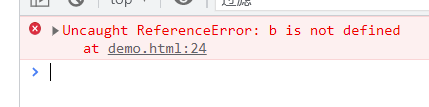

<!-- START doctoc generated TOC please keep comment here to allow auto update -->
<!-- DON'T EDIT THIS SECTION, INSTEAD RE-RUN doctoc TO UPDATE -->
**Table of Contents**  *generated with [DocToc](https://github.com/thlorenz/doctoc)*

- [var、let、const](#varletconst)
  - [块级作用域](#%E5%9D%97%E7%BA%A7%E4%BD%9C%E7%94%A8%E5%9F%9F)
  - [默认参数作用域与暂时性死区](#%E9%BB%98%E8%AE%A4%E5%8F%82%E6%95%B0%E4%BD%9C%E7%94%A8%E5%9F%9F%E4%B8%8E%E6%9A%82%E6%97%B6%E6%80%A7%E6%AD%BB%E5%8C%BA)
- [扩展运算符](#%E6%89%A9%E5%B1%95%E8%BF%90%E7%AE%97%E7%AC%A6)
  - [对象合并](#%E5%AF%B9%E8%B1%A1%E5%90%88%E5%B9%B6)
- [剩余参数](#%E5%89%A9%E4%BD%99%E5%8F%82%E6%95%B0)
- [模板字符串](#%E6%A8%A1%E6%9D%BF%E5%AD%97%E7%AC%A6%E4%B8%B2)
- [获取对象属性 Object.keys()](#%E8%8E%B7%E5%8F%96%E5%AF%B9%E8%B1%A1%E5%B1%9E%E6%80%A7-objectkeys)
- [箭头函数](#%E7%AE%AD%E5%A4%B4%E5%87%BD%E6%95%B0)
- [Array.forEach](#arrayforeach)
- [Array.filter() 过滤筛选](#arrayfilter-%E8%BF%87%E6%BB%A4%E7%AD%9B%E9%80%89)
- [Array.some()](#arraysome)
- [Array.every()](#arrayevery)
- [Array.reduce()](#arrayreduce)
- [对象属性同名简写（对象属性的增强写法）](#%E5%AF%B9%E8%B1%A1%E5%B1%9E%E6%80%A7%E5%90%8C%E5%90%8D%E7%AE%80%E5%86%99%E5%AF%B9%E8%B1%A1%E5%B1%9E%E6%80%A7%E7%9A%84%E5%A2%9E%E5%BC%BA%E5%86%99%E6%B3%95)
- [Promise](#promise)
- [class](#class)
- [解构赋值](#%E8%A7%A3%E6%9E%84%E8%B5%8B%E5%80%BC)
- [对象的增强写法（对象字面量的增强写法）](#%E5%AF%B9%E8%B1%A1%E7%9A%84%E5%A2%9E%E5%BC%BA%E5%86%99%E6%B3%95%E5%AF%B9%E8%B1%A1%E5%AD%97%E9%9D%A2%E9%87%8F%E7%9A%84%E5%A2%9E%E5%BC%BA%E5%86%99%E6%B3%95)

<!-- END doctoc generated TOC please keep comment here to allow auto update -->

### var、let、const

var，是之前ES标准的变量声明关键词，现在不建议继续使用了。

> var可以理解为javascript语言设计上的错误，但这种错误又不好移除，因为它又要向后兼容

var：有变量提升、初始化的提升，值可以在使用中改变，它声明的是变量；它只是声明的提升，赋值没有提升；

let：没有变量声明的提升，在哪里声明的就是在那个节点之后才可以使用，值可以在代码逻辑中改变，它声明的也是变量；

const：没有变量声明的提升，同let，只有在声明的地方之后才可以使用，在代码的一个执行周期中，其值不可以变，所以它声明的是一个常量。

> 常量，指的的是指向的对象不能被修改，但是对象的属性可以被修改。

```html
    <button id="changeConst">修改const对象属性</button>
    <script>
        const p = {
            name: "Nicholas"
        };
        const p2 = {
            age: 12
        };
        document.getElementById("changeConst").addEventListener("click", function () {
            p.name = "Qiuyan Huo";
            console.log(p.name); // Qiuyan Huo
            p = p2; // Uncaught TypeError: Assignment to constant variable.
            // console.log(p);
        });
    </script>
```

> var和let、const的非常明显的一个区别，就是var可以在一个作用域内重复声明多次，最终的结果是以最后的一次声明为准，最后的一次声明会覆盖前面的声明；而let、const在同一个作用域内对同一个变量只能声明一次，否则会报异常。

> 暂时性死区：javascript在ES6之后，有了2个新的声明变量的关键词let和const，这两个关键词声明的变量在声明之前是禁止使用的，如果硬要使用会报错。这个现象被称为暂时性死区。

> 每种开发语言都会有自己的缺陷，js、java都是这样，如js中的var关键词，作者就曾经说过这是语言设计上的错误，但为了向后兼容，又不好改，后来在es的版本迭代中，增加了let、const声明变量的关键词。

```javascript
var userName = "Nicholas";

function fn(){
    console.log(userName);  // 异常了，Uncaught ReferenceError: Cannot access 'userName' before initialization，暂时性死区了
    let userName="LiKaifu";
}

fn();
```

#### 块级作用域

作用域概念：主要指变量作用域，指变量在什么范围内可用；

ES5及以前的js版本中，if、for是没有作用域的概念的，所以很多在if、for的场景中，需要借助匿名function来解决应用外部变量的问题，匿名函数，一般就是指闭包。

```html
    <button class="btn">按钮1</button>
    <button class="btn">按钮2</button>
    <button class="btn">按钮3</button>
    <button class="btn">按钮4</button>
    <button class="btn">按钮5</button>

    <script>
        var btn = document.getElementsByClassName("btn");

        // 这种常规的思路，无论点击哪个按钮，都会显示第5个按钮，因为for本身没有作用域的概念
        // for (var i = 0; i < btn.length; i++) {
        //     btn[i].addEventListener("click", function () {
        //         console.log("第" + i + "个按钮被点击");
        //     });
        // }

        // 这里借助了闭包（函数）解决了应用外部变量的问题,点哪个就显示哪个
        // for (var i = 0; i < btn.length; i++) {
        //     (function (i) {
        //         btn[i].addEventListener("click", function () {
        //             console.log("第" + i + "个按钮被点击"); 
        //         });
        //     })(i);
        // }

        // ES6中有块级作用域的概念，直接常规思路编码即可
        for(let i = 0; i < btn.length; i++){
            btn[i].addEventListener("click",function(){
                console.log("点击了第" + i + "个按钮");
            });
        }
    </script>
```

在ES6之前，Javascript只有全局作用域和函数作用域，从ES6标准开始，引入了一个新的作用域概念：块级作用域，以大括号{}标识。

#### 默认参数作用域与暂时性死区

ES5.1及以前的版本中，给函数定义默认参数的方式就是检测某个参数是否为undefined，如果是undefined，则意味着没有这个参数，那么给它传递一个默认值。

```javascript
function defaultParam(uname) {
    var uname = (typeof uname != "undefined") ? uname : "Nicholas";
    console.log(uname);
}

defaultParam(); // 输出Nicholas，因为没有给defaultParam()函数传递有效的参数
defaultParam("Lalala"); // 输出Lalala，因为给函数defaultParam()传递了一个有效的参数值“Lalala”
```

在ES5.1及之前版本中，我们可以按照上面的方式，但是到了ES6标准后，就不需要上面的方式了，有更简单的方式。

```javascript
function setDefaultParam(uname="Nicholas"){
    console.log(uname);
}

setDefaultParam(); // 输出Nicholas，没有给函数传递参数值，形参uname就取用了默认值Nicholas
setDefaultParam("Nigula"); // 输出Nigula，给函数传递了一个参数值Nigula
```

ES6标准中，在函数参数列表中设置默认参数和在函数体中使用let声明变量的效果是一样的，只不过默认值除了声明了变量外，还初始化了值。默认参数会按照它们的顺序依次被初始化。

```javascript
// 下面两个函数是等价的，形参在函数的参数列表中
function setDefaultParam(uname = "Nicholas") {
    return uname;
}

// 函数的带有参数默认值的形参，和在函数体中声明变量的效果等价
function setDefaultParam() {
    let uname = "Nicholas";
    return uname;
}
```

因为在ES6以后的标准中，已经不再推荐使用var了，所以我们也就不要再使用了。但是在使用let声明变量的时候，要注意看函数的形参列表中是否已经有了同名的变量，如果有同名的变量，会报异常：Uncaught SyntaxError: Identifier 'uname' has already been declared，所以又一个不成文的良好的编程实践是在一个作用域内，不要声明同名变量，无论是使用var、let、const的任何一个关键词，也无论是在函数的参数列表或者函数体中。

```javascript
// 这种方式在Es6标准中国是会报异常的，因为函数参数列表中的参数名和函数体中的变量名同名了
function setDefault(uname, age) {
    let uname = uname;
    let age = age;
    return [uname, age];
}
```

但是如果把代码中声明变量的方式有let改为var就可以了，但是在实践中不建议这么改。let不能声明同名变量，var可以，只是后面的覆盖前面的。

```javascript
function setDefault(uname, age) {
    var uname = uname;
    var age = age;
    return [uname, age];
}
```

一定注意下面的代码是一定不行的，前辈们不小心的时候可能会有这样的习惯，入行新人应该不会有这样的习惯了。在ES6之前的版本中，在没有let的时候，这是一种很常见的设置默认值的方法。现在尤其是要注意的是声明变量的关键词let。

```javascript
function fn(name, age) {
    let name = name || "Nicholas";
    let age = age || 12;
    return [name, age];
}
```

### 扩展运算符

ES5.1及以前，我们在合并数组的时候，常用的方法可能是使用concat、或者遍历数组，将要合并的数组项依次添加到目标数组中：

```javascript
// 使用concat合并数组
function mergeArray() {
    let arr = [1, 2];
    let arr2 = [3, 4];
    let arr3 = [5, 6];
    let newArr = arr.concat(arr2).concat(arr3);
    return newArr;
}

// 通过遍历数组的方式，将一个数组的数组项依次添加到另一个数组中
function eachMergeArr() {
    let arr = [1, 2];
    let arr2 = [3, 4];
    for (let i in arr2) {
        arr.push(arr2[i]);
    }
    return arr;
}
```

ES6标准引入了扩展运算符(...)的概念，我们可以通过扩展运算符来快速合并数组。

```javascript
function extendMerge(){
    let arr = ["a","b"];
    let arr2 = ["c","d"];
    let newArr = [...arr,...arr2];
    return newArr;
}
console.log(extendMerge()); // ["a", "b", "c", "d"]
```

#### 对象合并

对象合并和数组合并有着同样的方式，直接看案例吧：

```javascript
// 原来通过assign的方式合并对象
function asObj() {
    let obj1 = { a: 1 };
    let obj2 = { b: 2 };
    let obj3 = { c: 3 };
    let newObj = { es: "demo" };
    let targetObj = Object.assign({}, obj1, obj2, obj3);
    return targetObj;
}

console.log(asObj()); // {a: 1, b: 2, c: 3}


// 通过扩展运算符来合并对象，和合并数组的方式相同
function restObj() {
    let obj = { a: 1 };
    let obj2 = { b: 2 };
    let newObj = {...obj,...obj2};
    return newObj
}
console.log(restObj()); // {a: 1, b: 2}
```

### 剩余参数

剩余参数符号和扩展运算符相同，都是...。在编码中可能会遇到向一个函数传入的参数个数不固定，这个时候我们可以使用剩余参数统一表示。

剩余参数，都会体现在一个数组里面.

```javascript
function params(param, ...params) {
    console.log(param);
    console.log(params);
}
params(1); // 1,[]
params(1, "苹果"); // 1,["苹果"]
params(1, "苹果", ["大众", "别克", "理想汽车"]); //1,["苹果",["大众", "别克", "理想汽车"]]
params("苹果", 1, 2, 3, 4); // "苹果",[1,2,3,4]
params(1, "苹果", ["大众", "别克", "理想汽车"], { uname: "Nicholas" }); // 1,["苹果",["大众", "别克", "理想汽车"],{uname: "Nicholas"}]
```
### 模板字符串

以前（ES6标准及以前）我们在拼接字符串的方式是使用+拼接，参考下面demo：

```javascript
function spliceString(){
    var name = "Nicholas";
    var age = 18;
    var job = "programmer";
    var userInfo = "我的名字叫" + name + ",今年" +　age + "岁，我的职业是" + job + "。";
    return userInfo;
}
console.log(spliceString()); // 打印出：我的名字叫Nicholas,今年18岁，我的职业是programmer。
```

从ES6标准开始，引入了模板字符串(template string)的概念，模板字符串是增强版的字符串，用反引号(数字键1前面的那个引号)标识。模板字符串可以当做普通字符串去使用，也可以定义多行字符串（可以定义多行字符串的意思就是定义的多行字符串在输出的时候原样输出），也可以在模板字符串中嵌入变量。

定义多行字符串demo：

```javascript
function tempString(){
    let desc = `这里开始
换行了, 
    又换了一下`;  // 这一行在输出的时候，前面会空出2个空格， 因为这前面的空格也会被当作是字符串的一部分；上面一行输出时顶头输出
    return　desc;
}
console.log(tempString());
```

> 上面的demo注释都放到字符串结束后的，因为在字符串没有结束的第二行是不可以注释的，这一细节，以前没有注意过

模板字符串嵌套变量demo：

```javascript
function variInTempString(){
    let uname = "Nicholas";
    let age = 26;
    let userInfo = `我的名字是${uname},我今年${age}岁。`;
    return userInfo;
}
console.log(variInTempString()); // 我的名字是Nicholas,我今年26岁。
```

在模板字符串中嵌入变量，使用$表示，然后将变量用{}包裹即可。

从demo可以看出来，使用模板字符串功能更加强大，代码更加优雅，在我们的代码中可以更多的实践。

### 获取对象属性 Object.keys()

以前在js中，也可以获取到对象的属性，使用方法Object.getOwnPropertyNames(obj),在ES6的标准里，新增了Object.keys(obj)方法来获取对象的属性，也叫key。

```javascript
function getKeys(){
    let obj = {
        name: "Nicholas",
        age: 16,
        gender: "Male"
    };
    let keys = Object.getOwnPropertyNames(obj);
    return keys;
}
console.log(getKeys()); // ["name", "age", "gender"]

function getKeys2(){
    let obj = {
        name:"Nicholas",
        age: 18,
        gender: "Male"
    };
    let keys = Object.keys(obj);
    return keys;
}
console.log(getKeys2()); // ["name", "age", "gender"]
```

两种方法都取到了对象的属性，也可以说是key。

> 明天去确认下Object.getOwnPropertyNames(obj)和Object.keys(obj)的区别，以及对象中属性和key的区别。

### 箭头函数

箭头函数是ES6标准中新增的一种函数类型，允许使用箭头(=>)来定义函数。如：

```javascript
var f = v => v;
// 上面的箭头函数等同于下面的方式
var f = function(v){
    return v;
}
```

箭头函数如果没有参数或者有多个参数，那么使用小括号来代表参数部分：

```javascript
// 没有参数demo
let fn = () => "Nicholas"; // 没有参数，等同于下面方式

let fn = function () {
    return "Nicholas"
}

// 有多个参数
let multipleParams = (num1, num2) => num1 + num2;
console.log(multipleParams(1, 2)); // 3
```

在箭头函数中，如果函数体有多条语句，那么函数体就要使用大括号包裹起来。

```javascript
let multipleParams = (num1, num2) => { return num1 + num2; }
```

由于大括号在ES6标准中被解释为代码块，如果箭头函数直接返回的是一个对象，那么就需要在对象的外面包裹一层小括号：

```javascript
let fn3 = (obj) => ({
    uname: "Nicholas",
    age: 20,
    gender: "Male"
});
console.log(fn3()); // {uname: "Nicholas", age: 20, gender: "Male"}
```

如果我们把直接返回的对象赋值给一个变量返回，则就不需要最外层的小括号包裹了：

```javascript
let fun2 = (obj) => {
    obj = {
        uname: "Nicholas",
        age: 18,
        gender: "Male"
    };
    return obj;
}
console.log(fun2()); // {uname: "Nicholas", age: 18, gender: "Male"}
```

箭头函数和普通函数的区别：

1. 箭头函数不可以作为构造函数，不能使用关键词new来实例化对象；
2. 箭头函数没有自己的this,函数体内的this是定义时所在的对象，而不是使用时所在的对象：解释的再清晰一点，就是向箭头函数的外层作用域逐层查找，最先找到的那个this，就是箭头函数中的this；
3. 箭头函数没有arguments对象；
4. 箭头函数没有原型对象；
5. 箭头函数不可以使用yield命令，因此箭头函数不能用作Generator函数；

### Array.forEach

ES6标准新增的数组遍历方法,改变原数组的值：

```javascript
let arr = [1, 2, 3];
arr.forEach((item, index, arr) => {
    arr[index] = item * item;
});
console.log(arr); // [1, 4, 9]
```

可见，forEach接收1个回调函数，回调函数有3个参数， 分别为当前项、当前项索引以及当前数组。

forEach遍历，没有返回值

经过forEach遍历的数组，会改变原数组的值。

和Array.forEach()功能接近的一个方法是Array.map()方法。

Array.map()方法和Array.forEach()方法功能比较接近，都是对数组项进行遍历，也有一些区别，比较明显的是：

1. Array.forEach()没有返回值，Array.map()返回一个新的数组，新的数组值由当前数组的每一项在执行callback后的值；

这2个方法怎么选择呢？

1. forEach()能实现的功能，map()也能实现;反之也成立；
2. map()的性能更好，map()的性能比forEach()快了70%左右；
3. 习惯函数式编程的，可以选择map()方法；
4. forEach()适合不计划修改数组项值，而仅仅是期望借助数组项做一些事情的时候；
5. map()适合用在我们希望修改数组项值的时候，因为map()会创建一个新的数组，新数组的值是原数组经过处理后的值，原数组不变；

### Array.filter() 过滤筛选

Array.filter()创建一个新的数组，基本用法和Array.map()类似，不会改变原数组的值，然后返回一个新的数组，新的数组由filter中的callback过滤后的返回值组成。

```javascript
let arr = [1, 2, 3];
let arr2 = arr.map(item => item * item);
console.log(arr2); // [1, 4, 9]
let arr3 = arr2.filter(item => item > 7);
console.log(arr3); // [9]，返回了过滤后的新的数组
console.log(arr2); // [1, 4, 9]，原数组的值没有改变

// 上面是分开调用，也可以用链式调用的方式，如下demo
let arr = [1, 2, 3];
let newArr = arr.map(item => item * item).filter(item => item > 8);
console.log(newArr); // [9]
```

### Array.some()

Array.some()返回一个boolean值，该方法会监测数组中的每一项，只要有一项通过了Array.some()中回调的函数的监测，该方法就会返回true，否则就会返回false。

```javascript
let arr = [0, 12, 4];
let flag = arr.some(item => item > 16);
console.log(flag); // false
```
### Array.every()

Array.every()和Array.some()正好相反，Array.some()是数组中只要有一项为true则结果为true，而Array.every()必须是所有的数组项都为true才能为true

### Array.reduce()

和Array.reduce()功能相似的，还有另外一个归并方法Array.reduceRight()，reduce()从左侧开始计算，reduceRight()从右侧开始计算。可参考[Array中reduce](./arr.md)

### 对象属性同名简写（对象属性的增强写法）

```javascript
// 以前的写法
function getObj() {
    const username = "Nicholas";
    const age = 18;

    const obj = {
        username: username,
        age: age
    };
    return obj;
}

console.log(getObj()); //{username: "Nicholas", age: 18}


// ES6标准新增的新的写法
function getObjByES6() {
    const username = "Nicholas";
    const age = 26;
    const obj = {
        username,
        age
    };
    return obj;
}
console.log(getObjByES6());//{username: "Nicholas", age: 26}
```

这种增强写法，是ES6标准新增的一种语法，在对象字面量中，如果字面量的属性值是一个变量，且字面量属性和属性值同名的时候，我们就可以使用这种增强的写法。对象字面量中，方法也可以使用增强的写法。无论是属性的增强写法，还是方法的增强写法都只能使用在字面量的对象中。

```javascript
        let name = "Nicholas Zakas";
        let age = 12;
        let p = {
            name,
            age,
            eat(){
                console.log("该吃饭了");
            },
            // play方法没有增强，eat方法的本质，和play方法一样
            play:function(){
                console.log("该去锻炼身体了");
            }
        };
```

demo中，属性和方法都增强了，确实比ES5精简了一些代码，

### Promise

### class

ES6中，新增了class类的概念，在以前的ES版本中，我们虽然也可以实现类的概念，但是是以函数式的方式实现的。

```javascript
function Person(uname,age) {
    this.uname = uname;
    this.age = age;
}
Person.prototype.getUname = function () {
    return this.uname;
}
Person.prototype.setUname = function (uname) {
    this.uname = uname;
}

var p = new Person();
p.setUname("Nicholas");
console.log(p.getUname()); // Nicholas
```

在ES6标准中，实现了类的标准实现

```javascript
class PPerson {
    constructor(uname, age) {
        this.uname = uname;
        this.age = age;
    }
    setUInfo(uname, age) {
        this.uname = uname;
        this.age = 22;
    }

    getUInfo() {
        return {
            uname: this.uname,
            age: this.age
        };
    }
}

let pp = new PPerson("Nicholas", 20);
console.log(pp.getUInfo()); // {uname: "Nicholas", age: 20}
pp.setUInfo("yugo", 18);
console.log(pp.getUInfo()); // {uname: "yugo", age: 22}
```

ES6标准中，class的本质上还是function，class只不过是function的语法糖。

```javascript
class P{}
console.log(typeof P); // function
```

静态属性和静态方法：如果我们有了解过java，就会知道在面向对象的语言中，会有静态属性和静态方法的概念，同样，js的class中也有静态属性和静态方法的概念。

js中，class中静态属性和静态方法，<font class="#f20">只有class自己才可以访问，class的实例都不可以访问</font>。

```javascript
class Person {
    constructor(uname, age) {
        this.uname = uname;
        this.age = age;
    }

    static age = 22;

    getUName() {
        return this.uname;
    }

    static getAge(){
        return this.age;
    }
}

let p = new Person("Yogu",18);
console.log(p.getUName()); // Yogu
console.log(Person.getAge()); // 22
console.log(p.getAge()); // 报异常了Uncaught TypeError: p.getAge is not a function，getAge()是static的，class的实例不能访问，只有class本身才可以访问
```

继承，面向对象的语言中，都有继承的概念，js中同样也有。在继承了父类后，如果派生类需要借用父类的构造函数，那么需要使用super关键字来调用父类的构造方法

```javascript
class Cat extends Animal {
    constructor(mingzi, nianling, color) {
        super(mingzi, nianling); // 通过super调用父类的构造函数，并将当前派生类的mingzi、nianling属性赋值给父类构造函数的参数
        this.color = color;
    }
    play() {
        return {
            uname: this.uname, // 引用父类构造函数的属性
            age: this.age, // 应用的父类的属性
            color: this.color // 当前派生类的属性
        }
    }
}

let c = new Cat("Lihua", 10, "red");
console.log(c.getAnimalInfo()); // 调用了父类的方法，而自己本身并没有这个方法
console.log(c.play()); // 子类也可以有自己的方法，子类就是一个正常的类，可以有自己的构造方法、属性和方法
```

### 解构赋值

以前我们在获取一个对象里面的属性值的时候，需要这样做：

```javascript
function dec() {
    const obj = {
        uname: "Nicholas",
        age: 18,
        gender: "Male"
    };

    const uname = obj.uname;
    const age = obj.age;
    const gender = obj.gender;
    return { uname, age, gender };
}
console.log(dec()); //{uname: "Nicholas", age: 18, gender: "Male"}


// 如果是相同的字段，
function decAssign() {
    const obj = {
        uname: "Nicholas",
        age: 16,
        gender: "Male"
    };
    const { uname, age, gender } = obj;
    return { uname, age, gender };
}

console.log(decAssign()); // {uname: "Nicholas", age: 16, gender: "Male"}
```

**连续解构赋值**

```javascript
      let obj = {
        a: {
          b: {
            c: 12,
          },
        },
      };
```

一个对象中又包裹了多层对象，如果需要解构最内层的值，可以使用连续解构的方式。如案例中我想解构c的值：

```javascript
      const {
        a: {
          b: { c },
        },
      } = obj;
      console.log(c); // 12
```

连续解构的时候，只能使用解构的最终的值c，而解构过程中出现的a和b是不可以使用的,会提示没有定义

```javascript
      const {
        a: {
          b: { c },
        },
      } = obj;
      console.log(b); // Uncaught ReferenceError: b is not defined
```

如效果：



解构变量过程中，还可以给变量重命名：如案例中最终需要使用c属性，但是c属性可读性又不高，我就希望重命名一下为data吧：

```javascript
      const {
        a: {
          b: { c: data }, // 将c重命名为data
        },
      } = obj;
      console.log(data); // 12
```

### 对象的增强写法（对象字面量的增强写法）

对象字面量，很多开发语言中都有类似的概念。

