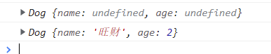

### ES6中的类

ES6中的类，有两种声明方式，一种就是ES6之前的版本中的声明方式，通过function来声明，只不过名称的首字母使用大写。

使用大写也仅仅是一种书写的习惯，仅仅是为了可读性的一种实践，并不是技术问题。

```javascript
function Dog(name, age) {
    this.name = name;
    this.age = age;
}

const d = new Dog();
console.log(d); // Dog {name: undefined, age: undefined}
const d2 = new Dog("旺财", 2);
console.log(d2); // Dog {name: '旺财', age: 2}
```

这段代码可能不很严谨，但是确实表示了一个类。

类，就是表示具有相同属性或方法的集合。

如果如图所示：



打印出的内容是什么意思呢？

前面的Dog表示这是这个对象是由哪个类生成的，也可以理解为构造函数，{}部分表示当前的实例对象。

**通过class关键字声明类**

另一种声明类的方法就是通过class关键字，这是在ES6标准中新增的实现，但是本质上class只是类实现的一个语法糖，本质上还是函数。

```javascript
class Person {}

const p1 = new Person();
console.log(p1); // Person {}
```

打印的内容和前面说的一样，Person表示当前对象是由哪个类、或者交构造函数，也或者说是new哪个构造器出来的对象实例，{}部分才是正儿八经的当前的实例对象，虽然本案例中的实例对象没有属性，即没有数据。

在ES6的class中，this表示当前类的那个实例对象。

```javascript
class Person {
    // 构造器函数
    constructor(name, age) {
        /**
           * 构造函数中的this，指向当前这个类的实例对象
           * 如我实例化一个对象 const p = new Person();那么这里的this就是p
           */
        this.name = name;
        this.age = age;
    }

    play() {
        /**
         * 一般方法，定义在了类的原型对象上，供实例是使用
         * 通过类Person的实例p1调用时，这里面的this就指的是p1，一般情况是这样
         * 但是也有通过call、apply、bind更改this指向的情况，那个时候更改给了谁，this就是谁了
         */
        console.log("Playing football!");
    }
}
```

**继承**

ES6中可以通过extends关键字实现类的继承。

当子类拥有和父类完全相同的实例初始化参数时，那么子类不需要实现构造函数了，实例化对象时直接调用父类的构造函数；但是当子类和父类的实例化对象参数不同时，那么子类就需要重新实现构造函数。在实现子类的构造函数时，首先要保证父类的参数顺序，再添加子类中特有的参数，然后通过super方法实现对父类已经实现的初始化的数据的继承。

```javascript
 /**
  * 创建一个Student类，继承Person类
  * ES6中通过extends实现类的继承
  * 子类可以继承父类的属性、方法
  */
class Student extends Person {
    /**
     * 子类需要添加和父类不同的年级grade属性，需要重新实现构造函数
     * 子类中构造函数的参数，1要保证父类中构造函数参数的顺序，2添加子类的差异化参数，3通过super关键字实现对父类构造函数中初始化参数的调用
     */
    constructor(name, age, grade) {
        /**
         * super实现父类中方法的调用
         * super的位置要在其他数据的初始化位置之前
         */
        super(name, age);
        this.grade = grade;
    }

    /**
     * 子类重写父类的方法
     * 重写，就是重新实现父类中已经有的方法
     */
    play() {
        console.log(`我叫${this.name},今年${this.age}岁了，在读${this.grade}年级！`);
    }
}
```

> 1. 类中的构造器不是必须要有的，只有在需要对类的实例进行一些属性需要初始化操作时，如子类添加了父类不具备的属性时；
> 2. 如果A类继承了B类，且A类中写了构造函数，那么A类中的super必须要调用，且要注意顺序；
> 3. 类中定义的方法，都放在了类的原型对象上，去供类的实例对象去调用

### 扩展

如果子类中没有显示的定义constructor构造方法,那么这个方法会被默认添加.也就是说,不管有没有显示定义constructor构造方法,任何一个子类都会有这个方法.

```js
class ColorPoint extends Point{
}
```
在类ColorPoint中,该类继承了Point,那么ColorPoint就是一个子类,虽然在子类ColorPoint中没有显示定义constructor构造方法,但是该类中也是有构造方法的.也可以使用new来实例化一个对象.