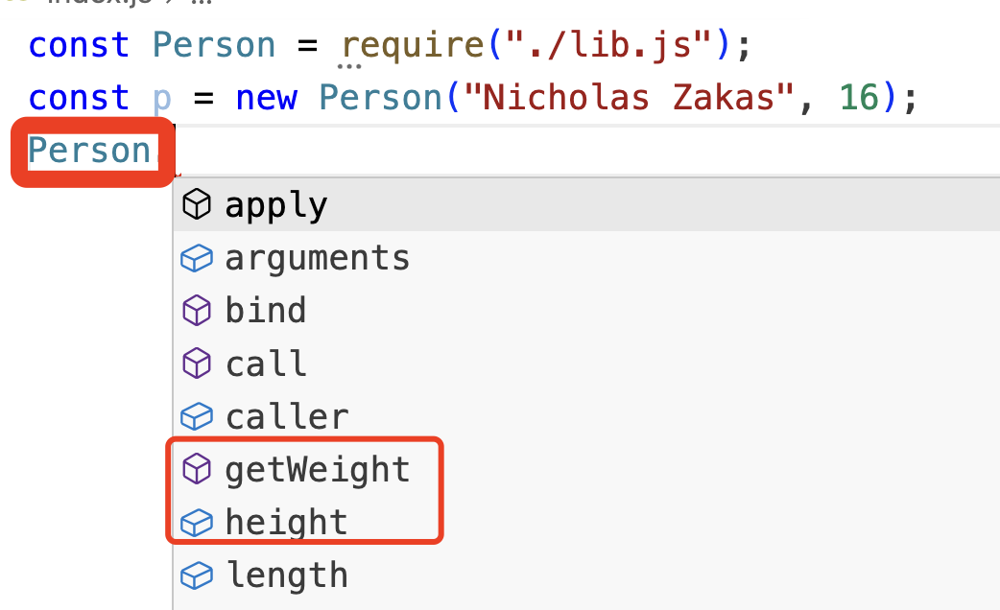
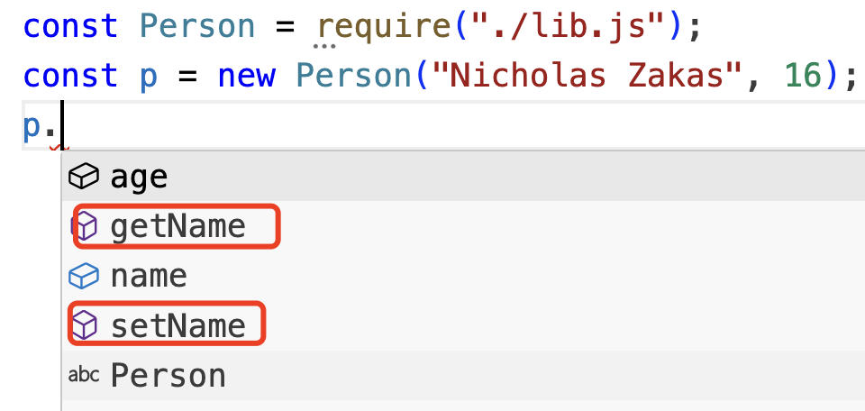

<!-- START doctoc generated TOC please keep comment here to allow auto update -->
<!-- DON'T EDIT THIS SECTION, INSTEAD RE-RUN doctoc TO UPDATE -->
**Table of Contents**  *generated with [DocToc](https://github.com/thlorenz/doctoc)*

- [class](#class)
  - [1. 类的定义](#1-%E7%B1%BB%E7%9A%84%E5%AE%9A%E4%B9%89)
  - [2. 类的构造函数](#2-%E7%B1%BB%E7%9A%84%E6%9E%84%E9%80%A0%E5%87%BD%E6%95%B0)
  - [3. 实例、原型和类成员](#3-%E5%AE%9E%E4%BE%8B%E5%8E%9F%E5%9E%8B%E5%92%8C%E7%B1%BB%E6%88%90%E5%91%98)
  - [4. 继承](#4-%E7%BB%A7%E6%89%BF)

<!-- END doctoc generated TOC please keep comment here to allow auto update -->

### class

ES5使用function模拟类的行为，虽然通过各种方式实现了类的各种行为，但是不管哪种策略，都或多或少的存在一些问题。

为了解决ES5中通过function各种策略模拟类行为的问题，ES6标准引入了class的概念，从此js具备了真正定义类的能力。

<font color="#f20">class实际背后使用的仍旧是原型和构造函数的概念。</font>

#### 1. 类的定义

类(class)有两种定义方式：都要通过类关键字class

1. 类声明

   ```javascript
   class Person {
   
   }
   ```

2. 类表达式

   ```javascript
   const Animal = class {
   
   }
   ```

   类表达式在被赋值之前，也不能被调用、引用：引用会报错，具体错误类型根据类表达式变量声明的关键字不同也有所不同。

   如使用var声明的类表达式，在赋值之前使用了，会提示undefined

   使用let/const声明的类表达式，提前使用会提示引用错误。

   ```javascript
   console.log(Animal); // class.js:4 Uncaught ReferenceError: Cannot access 'Animal' before initialization
   const Animal = class {
   
   }
   ```

类声明和函数声明有2个不同点：

1. 函数定义可以提升，类声明不能提升；
2. 作用域不同：函数是函数作用域限制，类受块作用域限制；

**类的构成**

一个类里面，可以包括构造函数方法、实例方法、获取函数、设置函数和静态方法、静态属性等，但是这些都不是必须的。

#### 2. 类的构造函数

constructor用来创建类的构造函数。constructor函数不是必须的，可以有也可以没有。


#### 3. 实例、原型和类成员

类可以通过static关键字定义静态类成员，<font color="#f20">每个类中最多只能有1个类成员。</font>我参考的的《javascript高级程序设计》大红书去学习的，但是我代码实践是：一个类中可以有多个类的静态成员，且类的静态成员可以是方法，也可以是属性，只是定义类的静态属性时不能使用var、let、const关键字。

```javascript
/**
 * 大红书写到：可以在类上定义静态方法，且每个类中最多只能有1个静态成员
 * 案例中，定义了多个静态方法，以及多个静态属性
 * 代码运行正常
 * 大红书中的结论好像有问题，待求证
 */
class Person {
    static getName() {
        console.log("这是静态方法");
    }
    static getNum() {
        console.log("类中的第二个静态方法");
    }
    static a = "12";
    static b = 13;
}

Person.getName(); // 这是静态方法
console.log(Person.a); // 12
Person.getNum(); // 类中的第二个静态方法
console.log(Person.b); // 13
```

**static修饰符**

class中通过static修饰的成员变量称为静态成员,如静态属性、静态方法,静态成员只有类本身可以访问,类的实例是不可以访问的.

```js
class Person {
  constructor(name, age) {
    this.name = name;
    this.age = age;
  }

  static height = 180;
  static getWeight() {
    return 130;
  }

  setName(name) {
    this.name = name;
  }

  getName() {
    return this.name;
  }
}

module.exports = Person;
```



从编辑器的提示中,我们可以看到,类Person中声明的静态成员height和getWeight都被类Person本身索引了出来,而实例方法setName和getName都没有被类本身Person给索引出来,也说明了静态成员只有类本身可以访问,实例成员只有类的实例可以访问.



> 原型、继承相关的,看懂了就看看,看不懂了,就直接跳过.因为, 大多数人就是看不懂.因为这部分看不懂,在日常编码时,一样玩的飞起.

#### 4. 继承

##### 4.1 基础继承

ES6支持单继承

使用关键字extends，可以继承任何拥有[[Construct]]和原型的对象。也就是说，不仅可以继承一个类，也可以继承普通的构造函数。

```javascript
// 类的继承
class Vehicle {
    constructor(name) {
        this.name = name;
    }
    // 类中也可以定义属性，但是定时属性时不要使用var、let、const
    num = 1332;
    run() {
        console.log("running");
    }
    getName() {
        return this.name;
    }
}
console.log(Vehicle.num);

// 继承类,继承了一个class
class Bus extends Vehicle {

}

let b = new Bus("依维柯");
b.run(); // running
console.log(b.num);
console.log(b.getName());

// 普通的函数构造函数基类
function Person() {
    this.play = function () {
        console.log("playing football");
    }
}

// 继承一个普通构造函数的派生类
class Teacher extends Person {

}
let t = new Teacher();
t.play(); // playing football

let Animal = {
    num: 12,
    eat() {
        console.log("having food");
    }
};

class Monkey extends Animal { // 会报异常  字面量对象没有[[construct]]和原型对象

}
let m = new Monkey();
m.eat();
```


##### 4.2 构造函数、super

派生类中可以通过super关键字引用它们的原型，也可以简单理解为调用父类的方法。

super，只能在派生类中使用，且仅限于构造函数、实例方法和静态方法

##### 4.3 抽象基类

##### 4.4 继承内置类型

##### 4.5 类混入
