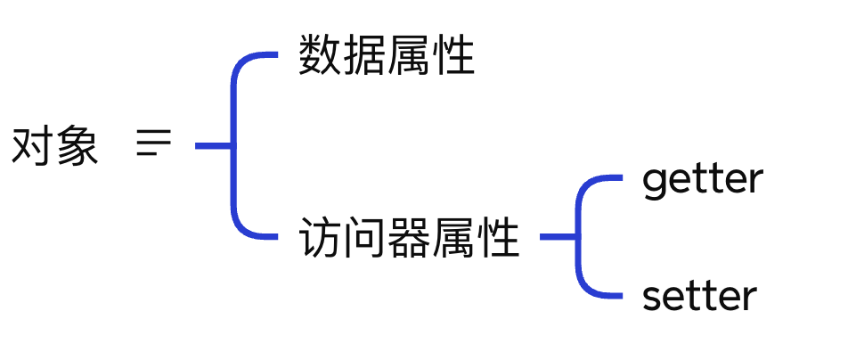

<!-- START doctoc generated TOC please keep comment here to allow auto update -->
<!-- DON'T EDIT THIS SECTION, INSTEAD RE-RUN doctoc TO UPDATE -->
**Table of Contents**  *generated with [DocToc](https://github.com/thlorenz/doctoc)*

- [1. js对象：Object类型](#1-js%E5%AF%B9%E8%B1%A1object%E7%B1%BB%E5%9E%8B)
  - [1. 显示的创建Object对象有两种方式：](#1-%E6%98%BE%E7%A4%BA%E7%9A%84%E5%88%9B%E5%BB%BAobject%E5%AF%B9%E8%B1%A1%E6%9C%89%E4%B8%A4%E7%A7%8D%E6%96%B9%E5%BC%8F)
  - [2. 属性的读取](#2-%E5%B1%9E%E6%80%A7%E7%9A%84%E8%AF%BB%E5%8F%96)
  - [3.  使用构造函数创建对象和使用字面量方式创建对象的区别？](#3--%E4%BD%BF%E7%94%A8%E6%9E%84%E9%80%A0%E5%87%BD%E6%95%B0%E5%88%9B%E5%BB%BA%E5%AF%B9%E8%B1%A1%E5%92%8C%E4%BD%BF%E7%94%A8%E5%AD%97%E9%9D%A2%E9%87%8F%E6%96%B9%E5%BC%8F%E5%88%9B%E5%BB%BA%E5%AF%B9%E8%B1%A1%E7%9A%84%E5%8C%BA%E5%88%AB)
  - [4. 创建对象的方式](#4-%E5%88%9B%E5%BB%BA%E5%AF%B9%E8%B1%A1%E7%9A%84%E6%96%B9%E5%BC%8F)
    - [4.1使用Object构造函数方式创建](#41%E4%BD%BF%E7%94%A8object%E6%9E%84%E9%80%A0%E5%87%BD%E6%95%B0%E6%96%B9%E5%BC%8F%E5%88%9B%E5%BB%BA)
    - [4.2 使用对象字面量方式创建](#42-%E4%BD%BF%E7%94%A8%E5%AF%B9%E8%B1%A1%E5%AD%97%E9%9D%A2%E9%87%8F%E6%96%B9%E5%BC%8F%E5%88%9B%E5%BB%BA)
    - [4.3 工厂模式](#43-%E5%B7%A5%E5%8E%82%E6%A8%A1%E5%BC%8F)
    - [4.4 构造函数模式](#44-%E6%9E%84%E9%80%A0%E5%87%BD%E6%95%B0%E6%A8%A1%E5%BC%8F)
    - [4.5 原型模式](#45-%E5%8E%9F%E5%9E%8B%E6%A8%A1%E5%BC%8F)
- [2. Js对象的常用操作](#2-js%E5%AF%B9%E8%B1%A1%E7%9A%84%E5%B8%B8%E7%94%A8%E6%93%8D%E4%BD%9C)
  - [2.1 Object.keys()](#21-objectkeys)
  - [2.2 Object.values()](#22-objectvalues)

<!-- END doctoc generated TOC please keep comment here to allow auto update -->

### 1. js对象：Object类型

大多数引用值的类型都是Object类型。

Object是js中最常用的类型之一，Object本身没有多少功能，但是比较适合存储在和应用之间的交换数据。

#### 1. 显示的创建Object对象有两种方式：

1. 使用new操作符和Object的构造函数。

   ```javascript
   let person = new Object();
   person.name = "Nicholas Zakas";
   person.age = 22;
   ```

2. 使用对象字面量

   对象字面量创建对象，是对象定义的一种简写形式，尤其是包含了大量属性的对象的创建。

   ```javascript
   let person2 = {
       name: "Nicholas Zakas",
       age: 28
   };
   ```

   对象字面量中，最后一个属性的逗号，案例中省略了。这个逗号，在现代新标准的浏览器中，可有可无，但是在一些老旧的传统浏览器中，如果在对象的最后一个属性后面加了逗号，可能会报错。所以我们就干脆记住一点：<font color="#f20">对象字面量最后一个属性后面，不要加逗号</font>

   对象字面量的属性，可以是字符串，也可以是数字。<font color="#f20">当属性是数字时，会自动转化为字符串。</font>

   ```javascript
   let person2 = {
       name: "Nicholas Zakas",
       age: 28,
       66: "Hanmeimei"
   };
   ```

   当字面量的属性是数字时，访问该属性时，就只能通过中括号的方式来读取该属性了

   ```javascript
   let person2 = {
       name: "Nicholas Zakas",
       age: 28,
       66: "Hanmeimei"
   };
   console.log(person2["66"]); // Hanmeimei
   ```

   > 注意，当是数字属性时，不是说可以使用中括号的方式读取属性，而是只能是通过中括号的方式读取属性，不能通过点语法去读取属性。
   
   > 在使用对象字面量方式创建函数时，并不会实际调用Object构造函数  -----  理论上来说，使用对象字面量的方式创建对象不会调用Object的构造函数，但是字面量对象的constructor实际指向了Object的构造函数

   对象字面量的属性，可以加引号，也可以不加引号；

#### 2. 属性的读取

js对象有两种属性:数据属性和访问器属性



数据属性,就是普通的变量属性,访问器属性,是通过getter和setter函数来读取和设置属性值的方式.

```js
const user = {
    name: "John",
    surname: "Smith",
    get fullName(){
        return this.name + " " + this.surname;
    },

    set fullName(value){
        this.name = value;
    }
};
user.fullName = "Pete Parker";
const uname = user.fullName;
```

demo中,fullName是访问器属性,当为fullName属性赋值的时候,调用了set方法,当读取fullName值的时候,调用的是get方法.

js中，对象读取属性有两种方式：

1. 点语法

   点语法读取对象属性，是大多数面向对象语言都遵循的惯例

   ```javascript
   let person = new Object();
   person.name = "Nicholas Zakas";
   person.age = 22;
   console.log(person.name); // 通过点语法读取属性
   ```

   点语法，面向对象语言都遵循这样的规则，更容易理解。

2. 中括号

   中括号语法读取对象属性，好像只有js有这个能力，但是<font color="#f20">在使用中括号语法的时候，属性名要使用字符串形式。</font>

   ```javascript
   let person2 = {
       name: "Nicholas Zakas",
       age: 28,
       66: "Hanmeimei"
   };
   console.log(person2["66"]); // Hanmeimei
   ```

   使用中括号语法读取对象属性，属性要使用字符串形式，简单理解下，就是属性要使用引号引起来。

   从实现属性访问本身的功能来说，点语法和中括号语法都没有什么本质的区别，但是通过中括号语法可以实现通过变量访问属性。

   属性中可能会有语法错误的字符，如属性中出现空格、关键字、保留字时，也可以使用中括号语法读取属性

   ```javascript
           let person = {
               name: "Nicholas Zakas",
               age: 18
           };
           let propertyName = "name";
           console.log(person[propertyName]);
           // 关键字属性
           person["const"] = "关键字属性";
           console.log(person["const"]);
   
           // 属性中出现了空格
           person["first name"] = "Nicholas";
           console.log(person["first name"]);
   ```

   像关键字属性、具有空格的属性，在点语法中都是不允许的，但是通过中括号语法可以实现。

**对象的两个基本的认知**

函数对象的原型是对象（原型链为：实例，通过new构造函数->函数对象->对象->null）

只有函数有prototype，对象没有

#### 3.  使用构造函数创建对象和使用字面量方式创建对象的区别？

两种创建对象的方法都可以创建对象，但在实践中，更加倾向于使用对象字面量的方式。

**上下文**

表达式上下文：ECMAScript中，表达式上下文指的是期待返回值的上下文。如赋值操作符表示后面要跟一个值，因此赋值操作符后表示一个表达式的开始：如

```javascript
let person2 = {
    name: "Nicholas Zakas",
    age: 28
};
```

左大括号表示一个表达式上下文的开始

语句上下文：一个语句块的环境，如if语句后面跟的{}里面，就是一个语句上下文。

```javascript
if (true) {
    // 逻辑代码
}
```

这里面就是一个语句上下文。

#### 4. 创建对象的方式

这里说的创建对象，不仅仅指Object对象，而是任意的自定义对象。

##### 4.1使用Object构造函数方式创建

```javascript
// 使用Object构造函数创建对象
let Person = new Object();
Person.name = "Nicholas Zakas";
Person.age = 21;
Person["job"] = "Teacher";
console.log(Person.name); // Nicholas Zakas
console.log(Person.constructor); // f Object() 构造函数
console.log(Person["job"]); // 通过中括号语法读取属性
```

##### 4.2 使用对象字面量方式创建

```javascript
// 对象字面量方式创建对象
let p = {
    name: "Nicholas Zakas",
    age: 18
};
console.log(p.constructor); // f Objct()  使用对象字面量创建对象，并不会实际调用Object的构造函数，那么为什么constructor指向了Object的构造函数
console.log(p.name); // Nicholas Zakas
```

有一个地方没有想明白，就是创建字面量对象并不会调用Object构造函数，但是字面量对象的constructor却指向了Object的构造函数，没有想明白这个道理。

##### 4.3 工厂模式

```javascript
// 工厂模式创建对象
function createPerson(name, age, job) {
    let obj = new Object();
    obj.name = name;
    obj.age = age;
    obj.job = job;
    obj.getName = function () {
        return this.name;
    }
    return obj;
}

let p1 = createPerson("Nicholas Zakas", 26, "Teacher");
console.log(p1.getName); // Nicholas Zakas
console.log(p1.constructor); // f Object
```

工厂模式，可以创建多个类似的对象，但是这些对象不知道是属于哪个具体的类，这些对象时什么类型的，现在只能是知道是Object类型的，并不知道具体的类型，如Person还是Animal等。

##### 4.4 构造函数模式

> 小常识：函数名问题，一般情况下，构造函数的函数名一般首字母大写，非构造函数的函数名首字母小写。

```javascript
// 构造函数模式
function Person(name, age) {
    this.name = name;
    this.age = age;
    this.getName = function () {
        return this.name;
    }
}

let p = new Person("Nicholas Zakas", 17);
console.log(p.getName());
```

##### 4.5 原型模式

```javascript
// 原型模式
function Person() {

}
Person.prototype.name = "Nicholas Zakas";
Person.prototype.age = 21;
Person.prototype.getName = function () {
    console.log(this.name);
}
let p = new Person();
p.getName();
```

原型模式的一个优势，就是在原型上创建的书型和方法，可以被所有的对象实例共享。

### 2. Js对象的常用操作

#### 2.1 Object.keys()

Object.keys()方法会返回一个由一个给定对象的自身可枚举属性组成的数组，数组中属性名的排列顺序和正常循环遍历该对象时返回的顺序一致。

**语法**

```javascript
Object.keys(obj)
```

**参数**
obj：要返回其枚举自身属性的对象

**返回值**

一个给定对象的所有可枚举属性的字符串数组

```javascript
    const obj = {
        "id": 1,
        "name": "拜登",
        "gender": "男",
        "mobile": "132xxxxxxxx",
        "email": "baideng@bb.com",
        "address": "北美华盛顿白宫",
        "remark": "半个疯子"
    };
    console.log(Object.keys(obj)); // ['id', 'name', 'gender', 'mobile', 'email', 'address', 'remark']
```

#### 2.2 Object.values()

Object.values()方法返回一个给定对象自身的可枚举属性的属性值组成的数组，值的顺序与使用for……in循环遍历的顺序相同 --- 区别在于for-in循环枚举原型链中的属性。

**语法**

```javascript
Object.values(obj)
```

**参数**

obj:一个拥有可枚举属性且被返回自身所有可枚举属性值的对象 ------- 就是一个对象，一般情况下，就是我们自定义对象。

**返回值**

对象中可枚举属性的属性值组成的数组。

```javascript
    const obj = {
        "id": 1,
        "name": "拜登",
        "gender": "男",
        "mobile": "132xxxxxxxx",
        "email": "baideng@bb.com",
        "address": "北美华盛顿白宫",
        "remark": "半个疯子"
    };
    console.log(Object.values(obj)); // [1, '拜登', '男', '132xxxxxxxx', 'baideng@bb.com', '北美华盛顿白宫', '半个疯子']
```

#### 2.3 Object.entries()

Object.entries()返回一个给定对象的自身可枚举属性的键值对数组，其排列顺序与使用for……in循环遍历该对象时返回的顺序一致。

```js
const obj = {
    name: "Nicholas Zakas",
    age: 18
};
console.log(Object.entries(obj)); // [["name","Nicholas Zakas"],["age","18"]]
```