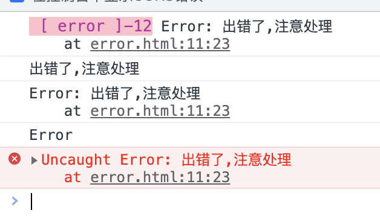
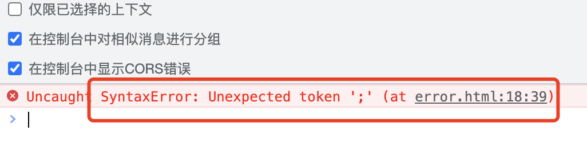
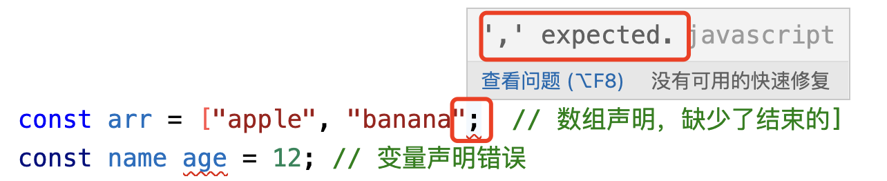
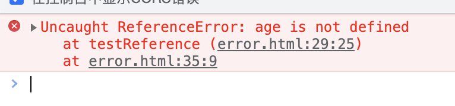
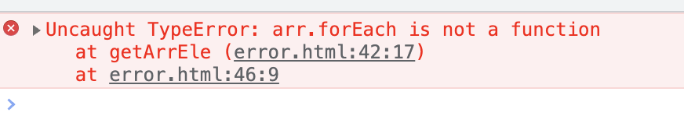
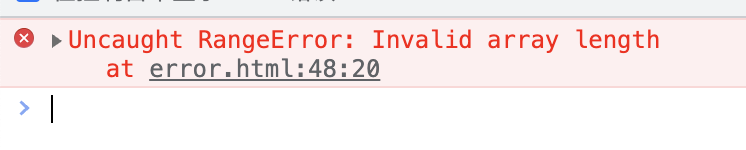
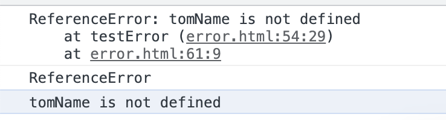
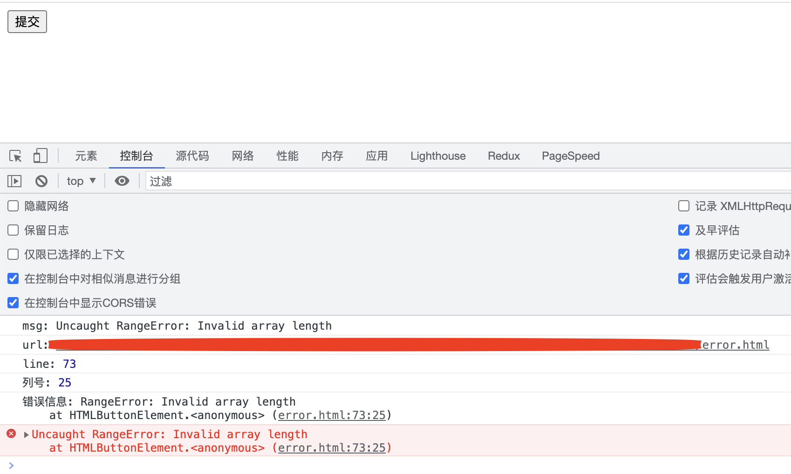
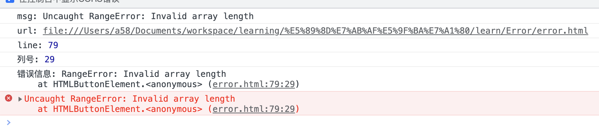

<!-- START doctoc generated TOC please keep comment here to allow auto update -->
<!-- DON'T EDIT THIS SECTION, INSTEAD RE-RUN doctoc TO UPDATE -->
**Table of Contents**  *generated with [DocToc](https://github.com/thlorenz/doctoc)*

- [1. Error对象](#1-error%E5%AF%B9%E8%B1%A1)
- [2. js中的异常类型](#2-js%E4%B8%AD%E7%9A%84%E5%BC%82%E5%B8%B8%E7%B1%BB%E5%9E%8B)
- [3. 抛出异常](#3-%E6%8A%9B%E5%87%BA%E5%BC%82%E5%B8%B8)
- [4. 异常捕获、处理](#4-%E5%BC%82%E5%B8%B8%E6%8D%95%E8%8E%B7%E5%A4%84%E7%90%86)
  - [4.1 同步异常处理](#41-%E5%90%8C%E6%AD%A5%E5%BC%82%E5%B8%B8%E5%A4%84%E7%90%86)
  - [4.2 异步异常处理](#42-%E5%BC%82%E6%AD%A5%E5%BC%82%E5%B8%B8%E5%A4%84%E7%90%86)
- [5. 捕获的异常的有效利用](#5-%E6%8D%95%E8%8E%B7%E7%9A%84%E5%BC%82%E5%B8%B8%E7%9A%84%E6%9C%89%E6%95%88%E5%88%A9%E7%94%A8)

<!-- END doctoc generated TOC please keep comment here to allow auto update -->

参考链接:https://juejin.cn/post/7224068169341648955?utm_source=gold_browser_extension#heading-4

### 1. Error对象

javascript中，Error(错误)是一个对象。由于js是解释执行，并不存在本地编译器，所以没有办法在本地程序编译期间捕获程序的异常，只能在程序执行的时候发现了异常，才能够抛出错误对此并中断程序的执行。

```js
const error = new Error("出错了,注意处理");
console.log('%c [ error ]-12', 'font-size:13px; background:pink; color:#bf2c9f;', error)
console.log(error.message);
console.log(error.stack);
console.log(error.name);
throw error;
```

效果如下：



**Error对象的属性**

如上面demo，Error对象使用到了3个属性，其实Error对象也就有这3个属性:

message:异常消息的字符串

stack:发生异常的执行堆栈信息

name:异常的类型
### 2. js中的异常类型

js内置了6种异常类型，也有说7种异常类型的，有分歧的一种类型是Error。

Error是最基本的错误类型，所有的其他类型都基于Error类型，所有有人认为Error本身就是一种错误类型，有人认为Error本身并不能算是一种错误类型，只能是一种基准类型。对于这个划分类别的标准不必纠结，了解其中的缘由即可。

Error对象，参考1.

**异常类型**

本文我们暂且不把Error作为一种异常类型，而是讨论具体的异常类型。

1. SyntaxError 语法错误

语法错误主要是指我们在开发过程中没有遵循js语法而导致的错误，这类异常是最容易修复的异常。在开发过程中，通过一些IDE插件、语法检查工具可以规避大量的语法异常。

```ts
const arr = ["apple", "banana"; // 数组声明，缺少了结束的]
const name age = 12; // 变量声明错误
```



一般情况下编辑器也会给些语法异常提示，但有的是好可能不太准



2. ReferenceError 引用错误

当代码中的变量引用不正确发声的异常。如先访问变量后声明、访问了不存在的变量、访问了没有权限访问的变量等。

```js
console.log(username); // 访问了一个不存在的变量
function testReference(){
    // console.log(uname); // 先访问后声明
    const uname = "Dave Herman";
    console.log(age); // 访问了没有权限访问的内部函数中的变量
    return function(){
        const age = 12;
    }
}
testReference();
```



3. TypeError 类型使用错误

当js程序中某些变量得不到预期的值就会抛出这个类型的异常

```js
const arr = "Hello World!";
function getArrEle(arr) {
    arr.forEach(item => {
        console.log(item);
    });
}
getArrEle(arr);
```



getArrEle函数需要一个数组，然后打印数组的数组项，但是在函数调用中传递给函数的是一个字符串，结果就报了类型异常。

4. RangeError 范围错误

当变量设置的值超出其合法范围的时候就会报该异常。

```js
const ar = new Array(4294967296);
console.log('%c [ ar ]-49', 'font-size:13px; background:pink; color:#bf2c9f;', ar)
```

数组的长度超出了数组正常的长度值。

js中数组的长度值范围为:0-2<sub>32</sub>-1。



5. URIError 编码解码异常

6. EvalError Eval函数内部错误

### 3. 抛出异常

错误发生并被抛出才能成为异常，终止程序正常执行。js中通过throw抛出异常。

```js
throw new TypeError("类型错误");
throw new ReferenceError("引用错误");
```

错误一旦被抛出，就会在程序调用堆栈中冒泡，直到被捕获，否则将终止程序的正常执行。需要注意的是，在Promise中发生的错误如果没有被捕获，浏览器会打印出错误提示，但是不会退出进程、终止脚本执行，即Promise内部的错误不会被影响到外部代码的执行，有时被称为"Promise会吃掉错误"。

### 4. 异常捕获、处理

为了保证线上产品的正常运行，在开发过程中合理设计代码可能会发生的错误并捕获是非常重要的环节。

#### 4.1 同步异常处理

同步代码按照编写的顺序执行，在可能发生异常的部分使用try/catch/finally处理。

```js        
function testError() {
    try {
        const tom = tomName;
    }catch(e){
        console.log(e.stack); // 异常信息的堆栈信息，比较多
        console.log(e.name); // ReferenceError
        console.log(e.message); // tomName is not defined
    }
}
testError();
```


#### 4.2 异步异常处理

异步异常主要是指异步事件中的异常处理，浏览器中的异步事件主要包括Promise、定时器、ajax、事件等。

异步中的异常不能通过try/catch来处理。

**事件**

事件中的异常，主要是指注册绑定的事件处理程序，如onClick、addEvenetListener等事件的处理函数。因为它们是异步的，所以它们的异常不能通过try/catch来处理。

事件中的异常，可以通过onerror事件进行捕获。

方式：

```js
window.onerror = function(message, source, lineno, colno, error){}
// message: 错误信息
// source: 发生错误的脚本
// lineno: 行号
// colno: 列号
// error: Error对象
```

demo:
```js
window.onerror = function (msg, url, line, colnum, error) {
    console.log("msg:", msg);
    console.log("url:", url);
    console.log("line:", line);
    console.log("列号:", colnum);
    console.log("错误信息:", error);
}
const btnSubmit = document.querySelector("#btn");
btnSubmit.addEventListener("click", function () {
    const arr = new Array(4294967296);
    console.log("123");
}, false);
```



事件处理程序是异步程序，但是事件处理程序内部是同步执行的，所以事件处理函数的内部也可以使用try/catch去捕获异常

```js
btnSubmit.addEventListener("click", function () {
    try {
        const arr = new Array(4294967296);
        console.log("123456");
    } catch (e) {
        console.log(e);
    }
}, false);
```

响应事件本身是异步函数，但是函数内部的代码还是同步的，是依次顺序执行的，所以也可以在函数内部使用try/catch捕获异常。

即使同时有window监听了onerror事件，事件处理程序内部也有try/catch方式捕获异常，那么究竟哪种方式会被谁捕获到呢？

异常信息具有冒泡的特性，如果处理函数内部通过try/catch方式捕获了异常，但是然后在函数内部做了异常处理，而并没有通过throw将异常抛出，那么就不会再执行外部的window上的onerror事件了。但是如果通过throw将异常抛出了，那么就还是会执行外部顶层的window的onerror事件的。

```js
btnSubmit.addEventListener("click", function () {
    try {
        const arr = new Array(4294967296);
        console.log("123456");
    } catch (e) {
        throw e;
    }
}, false);
```
函数内部通过catch捕获到了异常后通过throw抛出了，那么这个异常信息就会被最外层的window上的onerror捕获到，结果如下：



**定时器**

**Promise**

### 5. 捕获的异常的有效利用

在开发领域，不要还跑异常，能够把抛出来的异常有效的利用起来，也是异常的一大价值。

1. 可以有效防止程序因为错误而导致中断执行，从而保证程序的顺利执行

    当然了，从业务层面来看也可能中断执行了才是最好的，因为不会造成脏数据

2. 可以供开发人员快速定位、分析问题

3. 异常数据，可以帮助开发人员做针对性的技术规划、特殊场景处理，从而促进程序更加健壮