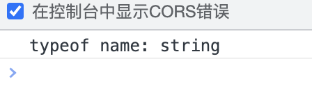

### js中的name

今天在测试typeof能力的时候，本想使用typeof检测一个未定义的变量的类型值，但是出乎意料的是给我返回了string，但是我代码中并没有定义name这个变量。

```js
<script>
    console.log("typeof name:", typeof name); // typeof name: string
</script>
```

打印结果如图：



我的代码中没有定义name这个变量，那么它是哪里来的呢？难道它是js的关键字或者保留字？

经过查询资料，原来name既不是js的保留字，也不是js的关键字，只是在一些浏览器如Chrome、Safari、Firefox、Opera中的实现中定义了一个非标准的name属性，是window自带的全局属性，所以我直接通过typeof检测name类型值的时候，实际上检测的是window.name的类型值，所以就得出了stirng的结果。

### 尽量在代码中不要直接使用name变量

所以在我们自己的代码中，尽量不要直接使用name标识符，可以根据实际场景添加修饰符如username、productname等等。