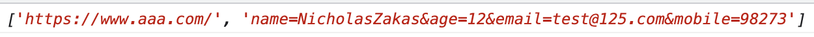
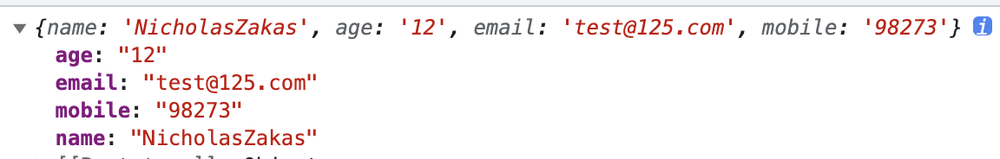

### split()

split():是js中的一个字符串方法，将字符串按照给定的标识符分隔成一个数组。

```js
const url = "https://www.aaa.com/?name=NicholasZakas&age=12&email=test@125.com&mobile=98273";
const url2 = url.split("&");
```

demo中会将url这个字符串根据?进行分隔，分隔成一个含有2个数组项的数组: ["https://www.aaa.com/","name=NicholasZakas&age=12&email=test@125.com&mobile=98273"]



很多场景下，split会做一个操作，就是将一个查询字符串序列化，序列化成一个对象，如demo中的查询字符串部分，会序列化成一个对象：

```js
const url = "https://www.aaa.com/?name=NicholasZakas&age=12&email=test@125.com&mobile=98273";
const newUrl = url.split("?");
const url2 = newUrl[1].split("&");
const params = {};
url2.forEach(item => {
    const pk = item.split("=");
    params[pk[0]] = pk[1];
});
console.log('%c [ params ]-15', 'font-size:13px; background:pink; color:#bf2c9f;', params)
```



split(sep)根据指定的分隔符分隔字符串，并序列化成对象，我感觉这是这个方法最优秀的地方了。