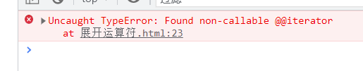
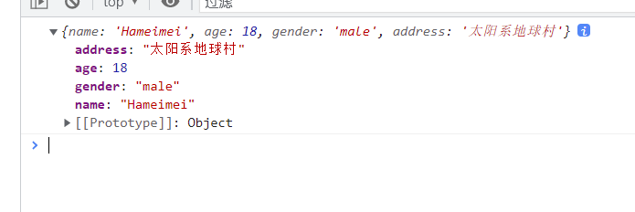

### 展开运算符：...运算符

展开运算符，即...运算符，经常被用来展开一个字面量(数组、对象)、连接数组、函数传参

**展开数组**

```javascript
let arr = [1, 3, 5, 7, 9];
let arr2 = [2, 4, 6, 8, 10];
console.log("原数组：", arr); // (5) [1, 3, 5, 7, 9]
console.log("被展开之后的结果：", ...arr); // 1 3 5 7 9
```

**连接数组**

```javascript
let arr = [1, 3, 5, 7, 9];
let arr2 = [2, 4, 6, 8, 10];
console.log(arr3); // (10) [1, 3, 5, 7, 9, 2, 4, 6, 8, 10]
```

展开运算符不能展开一个对象

```javascript
let obj = {
  name: "Nicholas Zakas",
  age: 18,
  gender: "male",
};
console.log(...obj);
```



在 React 中，react 和 babel 编译器一起，可以让展开运算符展开一个对象

```html
<!--react应用容器-->
<div id="app"></div>

<!--导入react库-->
<script src="../js/react.development.js"></script>
<script src="../js/react-dom.development.js"></script>
<script src="../js/babel.min.js"></script>

<script type="text/babel">
  // 创建组件
  class User extends React.Component {
    render() {
      const { name, age, gender } = this.props;
      return (
        <div className="user">
          <ul className="list">
            <li>姓名：{name}</li>
            <li>年龄：{age}</li>
            <li>性别：{gender}</li>
          </ul>
        </div>
      );
    }
  }
  // 渲染组件到页面
  const user = {
    name: "Hanmeimei",
    age: 18,
    gender: "女",
  };
  ReactDOM.render(<User {...user} />, document.querySelector("#app"));
</script>
```

babel 和 react 一起，可以让展开运算符展开一个对象，但是这个展开对象的操作，并不是无条件的，它只能使用在标签属性内：

```javascript
ReactDOM.render(<User {...user} />, document.querySelector("#app"));
```

这里是使用在组件标签内，看下的 demo 就是不可以的：

```html
<!--导入react库-->
<script src="../js/react.development.js"></script>
<script src="../js/react-dom.development.js"></script>
<script src="../js/babel.min.js"></script>

<script type="text/babel">
  // 创建组件
  class User extends React.Component {
    render() {
      const { name, age, gender } = this.props;
      return (
        <div className="user">
          <ul className="list">
            <li>姓名：{name}</li>
            <li>年龄：{age}</li>
            <li>性别：{gender}</li>
          </ul>
        </div>
      );
    }
  }
  // 渲染组件到页面
  const user = {
    name: "Hanmeimei",
    age: 18,
    gender: "女",
  };
  console.log(...user); // 这一行的展开运算符是不可以的，虽然也在react和babel的作用域内
  ReactDOM.render(<User {...user} />, document.querySelector("#app"));
</script>
```

展开运算符在合并对象时，还可以修改属性名称

```javascript
let obj = {
  name: "Nicholas Zakas",
  age: 18,
  gender: "male",
};
let obj2 = { ...obj, name: "Hameimei", address: "太阳系地球村" };
console.log(obj2); // {name: 'Hameimei', age: 18, gender: 'male', address: '太阳系地球村'}
```


