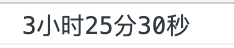

### 秒时间格式化为时分秒

在日常的业务开发中，经常会遇到接口给的时间是秒，但是需要展示的格式为xx小时xx分xx秒，如果小时或者分为0的话，就不再展示时分了，只展示秒。

```js
 function secondsFormat(seconds) {
    const h = Math.floor(seconds / 60 / 60);
    const m = Math.floor(seconds / 60 % 60);
    const s = Math.floor(seconds % 60);
    let res = h === 0 ? (m === 0 ? `${s}秒` : `${m}分${s}秒`) : `${h}小时${m}分${s}秒`;
    return res;
}
```

看如下案例：

```js
function secondsFormat(seconds) {
    const h = Math.floor(seconds / 60 / 60);
    const m = Math.floor(seconds / 60 % 60);
    const s = Math.floor(seconds % 60);
    let res = h === 0 ? (m === 0 ? `${s}秒` : `${m}分${s}秒`) : `${h}小时${m}分${s}秒`;
    return res;
}
console.log(secondsFormat(12330));
```

效果如下图:

