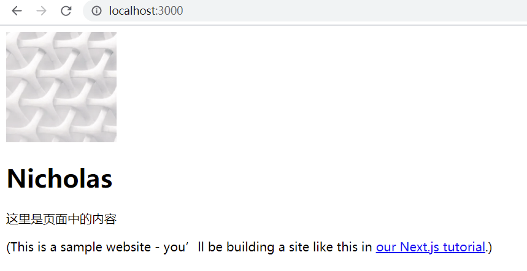
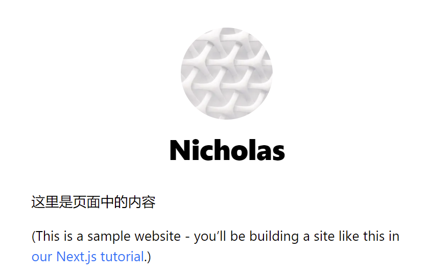

### 页面预渲染

页面预渲染，应该是next.js相比较React应用的一个重大的优势了。

页面预渲染，指的是页面在展示到浏览器之前，已经在服务端给渲染成了HTML文档，浏览器只是负责将拼接好的HTML文档给展示出来，浏览器不需要负责渲染、拼接HTML结构，这样的技术解决方案，非常利于SEO，爬虫过来了，直接有内容可以抓取。而直接使用React或者Vue做的应用，就不同了，直接使用React和Vue的应用，需要浏览器来拼接HTML结构，然后再将拼接好的HTML结构展示给最终用户。

那么怎么才能看出来什么是预渲染呢？我们可以禁用浏览器的javascript。

我们先看下禁用javascript后的nextjs应用：

再来看下浏览器启用js后的nextjs应用效果：

我们不难看出，浏览器禁用js后和禁用js前，页面的DOM结构都正常的渲染了出来，只是禁用js后通过js来设置的样式没有被正常的解释、执行，也就是说页面的样式没有了，页面不美观了。

下面再分别看下禁用js后的React和Vue应用：

禁用js后的Vue应用渲染效果

禁用js后的React应用渲染效果

我们看到了禁用js后，通过客户端渲染的页面都不能正常的展示了，只是给出了一个需要js功能的提示，我们并不能看到页面的任何数据。

这就是nextjs的预渲染，在页面的HTML结构到达浏览器之前，就已经拼接完成。