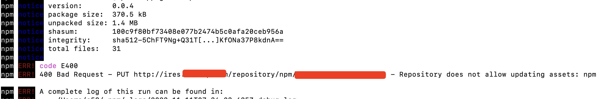

### 发布npm包的时候提示异常信息：Repository does not allow updating assets: npm

公司有自己的npm服务器来管理自己的npm组件。

当我使用publish指令发布组件的时候，给我报了一个异常，阻止了我组件的发布，异常关键信息如下:

```bash
400 Bad Request - PUT http://ires.xxx.com/repository/npm/@xxx%2fxxxx - Repository does not allow updating assets: npm
```



大概的意思就是资源库禁止更新npm。

那么为甚么禁止更新呢？我已经正常登录了当前的npm服务器，原来每个插件都需要有唯一版本号，且版本号每次发版的时候，不能和已发版的版本号相同。

我的问题就出现在这里了，我发版的时候没有更新版本号。我项目中需要手动更新下package.json中的version字段值，也就是我要发布的插件的最新的版本号。其实我的发布cli做的有些欠缺，因为在发布指令publish执行之前，我还有执行过另外一个指令，去更新当前插件包的一些信息，但是遗憾的就是没有去自动更新下版本号，这就带来了Repository does not allow updating assets的问题。

解决办法，就两种办法，一种是在通过指令自动更新，再就是每次发布插件之前，手动更新下package.json中的版本号就可以了，保证版本号唯一。