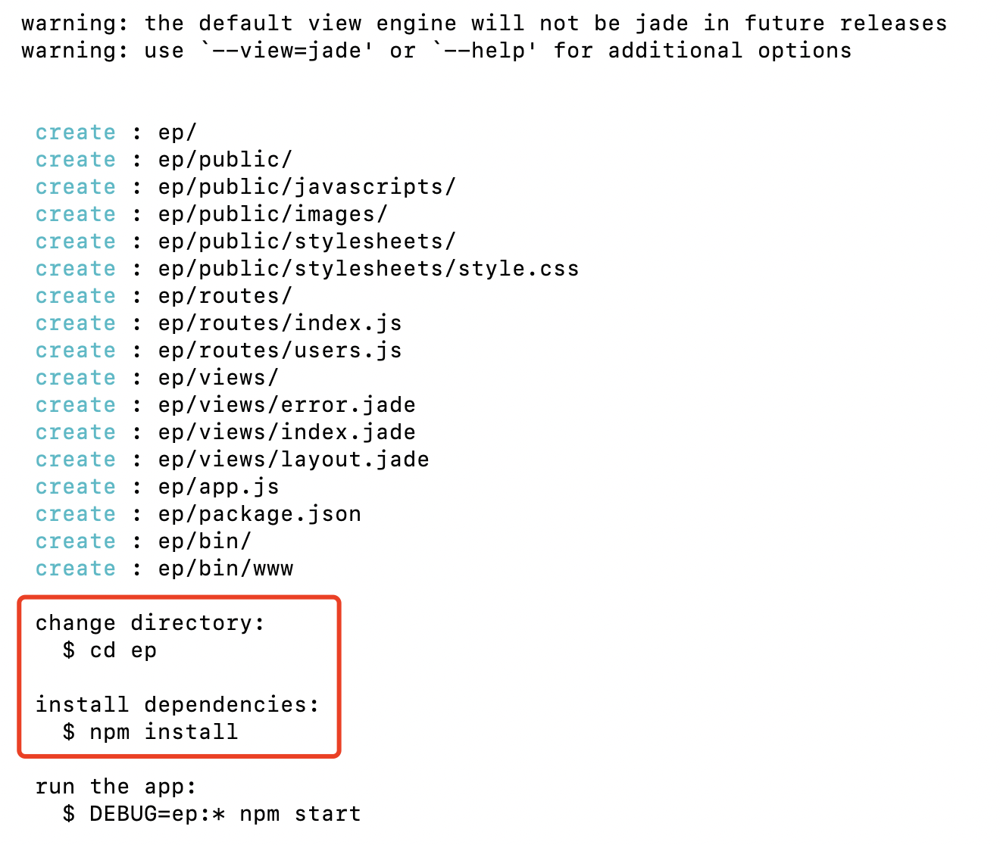
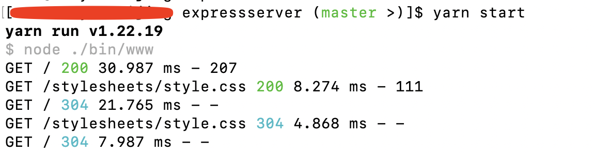
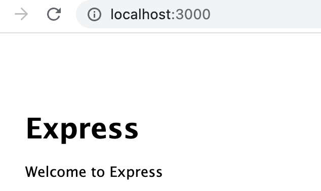
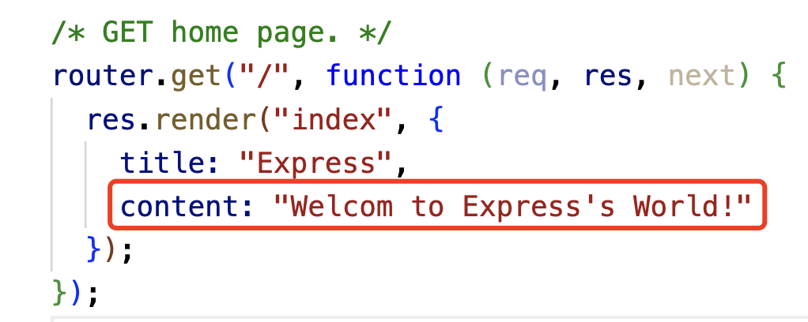
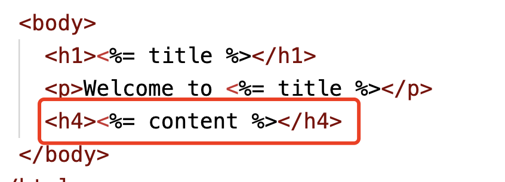
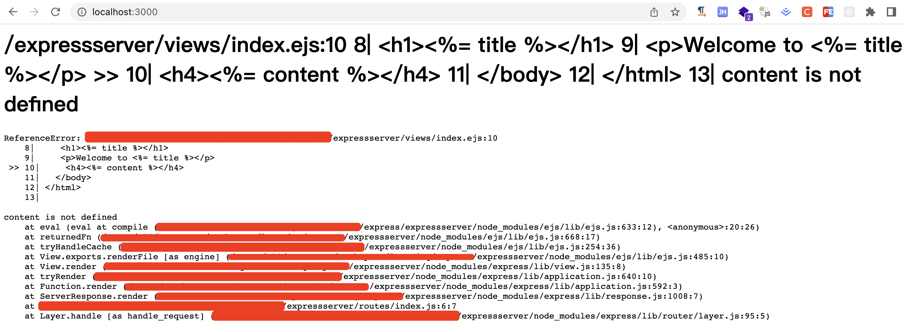

参考文档：https://www.expressjs.com.cn/

### 1. 简单了解

### 2. 快速入门

#### 2.1 创建项目

1. 项目创建

创建项目，无非有两种方式，一种是通过npm初始化一个空的前端项目，然后安装express等各种依赖包，然后根据需求编写代码；还有一种是使用项目生成器express-generator.为了高效，一般项目中要求的也是要求效率，很少会通过一个个的依赖包的方式去创建项目的，我们也主要学习使用项目生成器来创建项目，创建项目快速、便捷，还为我们组织好了项目目录。

在较新版本的nodejs(8.2.0，其实这个版本，也已经不高了，刚看了下最新的版本，已经到了19.7.0了)中内置了npx，然后可以直接通过npx来使用express-generator项目生成器创建exprss项目。

```bash
npx express-generator project_name
```

**低版本node(低于8.2.0版本)**

出了一些服务器上可能会有node比较老的版本，指8.2.0以下的版本，在开发场景中应该会很少会遇到了。如果真的有node低于8.2.0版本的时候，node中没有内置npx工具，那么单独安装一下就可以了。

```bass
npm install express-generator -g 
```

这样，低版本的node环境也可以使用项目生成器express-generator来创建express项目了。

```bash
express --view=pug project
```

可以通过view参数指定一个模板类型，也可以不指定模板类型，直接创建项目，不指定模板类型，现在默认的是jade。

```bash
express project
```

2. 安装依赖

通过项目生成器创建完项目后，并没有给项目安装依赖，需要手动安装。

具体的操作步骤，在项目创建完成的时候，已经给了我们提示，进入到项目目录后执行yarn 或者npm instal,如图：



工具给的提示是使用npm install，由于我习惯使用yarn，也可以使用yarn，效果是一样的。

```bash
cd project
yarn
```

等待一会，依赖安装完成。

> 依赖安装时长，依赖网络环境。

3. 启动服务

通过start指令启动服务

```bash
yarn start
```

如果看到下面指令，说明服务启动成功



可以从浏览器校验效果了：



> express服务默认端口3000.

4. 热启动

看到了程序已经成功的跑了起来，心里立刻澎湃了起来，马上就想加点东西，展示下自己强大的效果，改了些文案后，over了，页面崩溃了。

我就改了2个地方，一个是router中新增了一个返回值字段，一个是模板中将新增的返回值字段展示出来：





结果就不行了。



这是什么原因呢？就是我express部分有变动，也就是node部分，也可以称为服务端部分，有了变动，但是服务没有重启，没有监听到服务端的变化，导致客户端模板部分找不到了变量content，就报错了。那怎么解决这个问题呢？

重启下服务就好了。

可问题是，我在开发环节，频繁的改动、调试代码，也不能每次更改代码都重启下服务吧，太耽误时间了，影响效率。

可以通过nodemon来帮助我们实现node服务的热重启：

```bash
nodemon ./bin/www
```

#### 2.2 指定html模板


#### 2.3 跨域问题

#### 2.4 nginx托管express服务

node服务是通过localhost方式运行起来的，为了使node服务能够在一个正常的域名跑起来

```bash
server {
    location / {
        #  try_files $uri $uri/ /index.html;
            proxy_pass http://localhost:3000;
    }
    listen      80;
    server_name www.expressserver.com;

    charset utf-8;
    client_max_body_size 100M;
}
```

