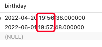
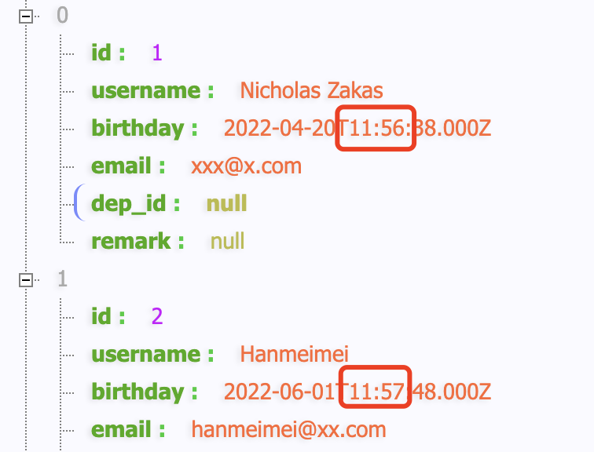
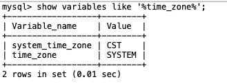

### express查询mysql时间，和mysql库中存取时间相差了8个小时

今天在使用express查询mysql时发现一个问题，数据库中有一个字段datetime类型，该字段在数据库中存储的时间是2022-04-20 19:56:38，但是我通过express读取到以后，就变成2022-04-20 11:56:38了，时间差了8个小时.



我们可以看到存储到数据库中的时间是19:56和19:57，但是通过express读取出来后就不是这个值了：



这是为什么呢？

主要是时区的原因。mysql的时区和我们读取时间字段的时区不同导致的。

原来node中mysql默认使用的是UTC通用标准时间，又称世界统一时间、世界标准时间、国际协调时间。但是mysql数据库中使用的是中国标准时间CST，中国标准时间要比国际标准时间早8个小时，也就出现了前面说的通过node读取mysql的时间时，少了8个小时。

mysql的时区怎么查询呢？或者我怎么知道我的mysql的时区呢？可以通过show variables like '%time_zone%'指令来查询。

```bash
show variables like '%time_zone%';
```



那么怎么解决这个问题呢？现在已经知道问题所在了，那么怎才可以让node读取出来的数据就是真实的数据库中存储的数据呢？

既然是时区不同导致的问题，那么解决问题，就只需要让时区相同，就可以了。有两种方案：

1. 设置mysql数据库中的时区和node中使用的相同的时区；

2. 设置node中使用的时区和mysql数据库中相同的时区；

**修改mysql的时区**

修改mysql数据库时区，又有临时修改和永久修改两种方式，由于我不是采用的这种方式，我没有测试，把查到的一些结局方案发出来吧：

1. 临时修改

```bash
set global time_zone = ‘+8:00‘;  # 临时修改下mysql时区
```

其实临时修改，还有一种方式，就是在通过指令启动mysql服务的时候，通过添加指令参数：

```bash
mysqld --default-time-zone='+08:00'
```

2. 永久性修改

这种方式需要在mysql的配置文件中去修改。

在my.cnf文件添加一行：

```bash
default-time_zone = ‘+8:00‘
```

> mac中通过dmg文件安装的方式，没有my.cnf配置文件，如果需要的话，可以新建一个配置文件。mac中修改mysql配置的方式可以参考：[mac中修改mysql配置](../../db/mac%E4%B8%AD%E4%BF%AE%E6%94%B9mysql%E9%85%8D%E7%BD%AE.md)

**设置node的使用时区**

这里我主要尝试了两种方法，都生效了：

1. node链接mysql的链接配置中，添加dateStrings配置项

```js
var pool = mysql.createPool({
    connectionLimit: 10,
    host: "xxxxx",
    port: xxxx,
    user: "root",
    password: "xxxxx",
    database: "xxxxx",
    dateStrings: true // 强制让时间类型的值以字符串类型数据返回
});
```

这种方式解决了时间值不准确的问题，但是并没有解决时区问题，最终的结果值是对的。我觉着不到实在没有办法的事，不要使用这种方式。因为毕竟强制转换了类型值；

2. 通过timezone显示设置时区

```js
var pool = mysql.createPool({
    connectionLimit: 10,
    host: "xxxx",
    port: xxxx,
    user: "xxxxx",
    password: "xxxxxx",
    database: "xxxx",
    timezone: "08:00" // 一定要加，mysql包中的时区是世界标准时，mysql的是中国标准时CST
});
```
这种方式，设置了+8时区(东八区，该值可以根据实际的区域做修改，如09:00、-04:00等)，这样就解决了时区问题，也没有改变数据的时间类型，我比较推荐这种方式。

```bash
date -R # 查看当前系统的时区
```