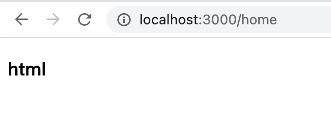
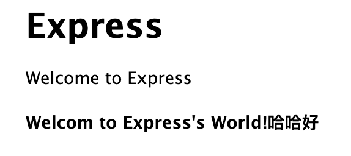

### 1. express配置模板引擎

在使用expres是的时候，更多的时候因该是用来提供一些接口，偶尔的少部分场景也会用来直接渲染页面。

现在express默认使用的是pug模板引擎，pug以前叫jade，后来改了个名字。出了pug这个默认的模板引擎外，也可以自定义配置其他的模板引擎，使用量比较多的如ejs、vm等。

现在我的项目中有一个渲染页面诉求，我期望使用html，那么在express中怎么配置使用html模板呢？

#### 1.1 express配置使用html模板

1. 安装ejs

```bash
npm install ejs --save
```

2. app.js导入ejs的引用

```js
var ejs = require('ejs');
```

3. 模板引擎设置(app.js)

```js
app.engine('.html', ejs.__express);
app.set('view engine', 'html');
```

到此，express配置使用html模板已经完成，效果如下:



4. html模板引擎语法

#### 1.2 express配置art-template模板引擎


### 2. express配置njk模板引擎

njk,全称nunjucks，是一款功能强大的javascript模板引擎。

模板引擎文档:https://nunjucks.bootcss.com/getting-started.html

1. 安装模板引擎

```bash
npm install nunjucks
```

2. express中配置

```javascript
// app.js
var express = require('express');
const nunjucks = require("nunjucks");
// view engine setup
app.set('views', path.join(__dirname, 'views'));
// 配置模板引擎
nunjucks.configure("views",{
  autoescape: true,
  express: app
});
// 扩展名一定要写上njk,否则找不到这个文件名报错
app.set("view engine", "njk");
```
3. 配置完成，使用吧

```njk
<h1>{{title}}</h1>
<p>Welcome to {{title}}</p>
<h4>{{content}}</h4>
```

render的值：

```js
router.get("/", function (req, res, next) {
  res.render("index", {
    title: "Express",
    content: "Welcom to Express's World!哈哈好",
  });
});
```
效果如下:

