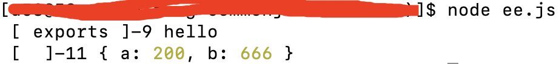

### 前端模块化四大规范

在js发展的早期,一直都没有自己的模块化方案,没有办法将一个大的程序、文件拆分成若干个小文件,然后再用简单的方法拼接.其他众多开发语言都有类似功能,如Ruby有require机制,Python有import机制,css也有@import.但是js没有类似的支持,在一些大型、复杂的项目中形成了很大的障碍.

在ES6之前,社区制定、推出了一些模块化方案,也得到了很大范围的推广和应用,如应用于服务端的CommonJS(CJS),以及应用于浏览器端的AMD.ES6在语言标准的层面上,实现了模块功能,而且实现的相对简单,完全可以取代社区推出的且已经应用很广泛的CommonJS和AMD规范,称为浏览器端和服务端通用的模块化解决方案.

在前端领域的模块化规范常用的有4个,分别为:CommonJs、AMD、CMD、ES6模块,除此之外用的相对较多的还有UMD和SystemJS.

#### CommonJS

服务器端使用,即主要在nodejs中使用

CommonJS和AMD都是社区推出的模块化方案,并不是语言上的标准.

Node采用CommonJS模块规范,每个文件就是一个模块,每个模块有自己的作用域,在一个文件(模块)内定义的变量、函数、类等都是私有的,对模块外部的文件不可见.在服务器端,模块的加载时同步运行的;在浏览器端,模块需要提前编译打包处理.

**特点**

所有代码都运行在当前的模块作用域,不会污染全局作用域.

模块可以被多次加载,但是只会在第一次加载时运行一次,然后运行结果被缓存,以后再次加载的时候就直接读取缓存数据.如果想要模块再次运行,需要手动清除缓存.

模块的加载顺序,按照其在代码中出现的先后顺序

**基本语法**

暴露模块: module.exports = value、exports.xxx = value;

导入模块: require(xxx); xxx为第三方模块名或者文件路径

**CommonJS模块规范暴露的对象**

CommonJS模块中,每个文件就是一个模块,在每个模块的内部,都有一个module属性代表当前模块,这个属性module是一个固定的名称,该属性是一个对象,这个对象又有一个exports属性是对外的接口.在CommonJS规范下,加载某个模块,其实就是加载了该模块的module.exports属性.

另外,CommonJS规范中还有一个exports属性,该属性默认是对module.exports的引用,即exports和module.exports指向了内存的同一个模块,相当于在每个模块的头部,都加了这样一个指令:

```js
var exports = module.exports;
```


从打印的信息中也可以看出,在nodejs中,一个模块即module,有很多个属性,exports只是module众多属性的一个.

在CommonJS规范下:

- 当通过exports修改内存中的内容时,module.exports的值会跟着改变

- 当通过module.exports修改内存中的内容时,exports的值也会跟着改变

- 当module.exports的值本身被改变的时候,exports不会被改变

- 当exports本身的值被改变时,module.exports也不会被改变

**module.exports和exports指向内存中的同一地址**

```js
// 这种场景,它们指向了内存中的同一地址
module.exports.a = 100;
exports.a = 200;
```

上述案例,module.exports和exports它们指向了内存中的同一地址,无论修改了module.exports还是exports,都会彼此影响对方的结果.

```js
module.exports.a = 100;
exports.a = 200;
exports.b = 300;
const c = 400;
exports.c = c;
const d = 500;
module.exports.d = d;
```

这种方式的改变,无论是exports改变了属性值,还是module.exports改变了属性值,它们两个都会彼此影响到对方.

但是如果exports或者module.exports本身的值改变了的时候,它们就会中断和对方的链接,如:

```js
module.exports.a = 100;
exports.a = 200;
exports = "hello";
module.exports.b = 666;
console.log(exports);
console.log(module.exports)
```



所以在实际编码中,推荐统一采用module.exports方式导出模块.

在一个文件中,可能会有exports或者module.exports多次,但是在另外一个文件从该文件导入模块的时候,只需要require一次,就把该文件整个模块全部导入了进来,即便是只需要该模块中的某部分成员,那么require过来的也是整个模块,该模块是一个对象,模块内部的成员通过对象访问成员的方式去访问、调用.

**require模块的命名**

在CommonJS规范下,通过require导入的模块名可以自定义,和模块导出的时候任何变量、类、函数等都没有关系.

```js
const ee = require("./ee.js");
console.log(ee(2,3))
```

导入模块的模块名称ee是可以自定义、任意命名的.

module.exports、exports导出的内容只有一个模块的时候,函数名可以是匿名的,也可以导出常量,其实就是给modules.exports重新赋了个值.

```js
module.exports = function (a, b) {
  return a + b;
};

// or
module.exports = 12
```

#### AMD

#### CMD

#### ES6模块

ES6模块的设计思想是尽量的静态化,在代码编译阶段就能确定模块之间的依赖关系,以及模块的输入、输出变量.这点和CommonJS以及AMD的模块化标准,有很大的区别,CommonJS和AMD都只能在运行时才能确定模块之间的依赖关系,如CommonJS模块就是对象

##### 概述

ES的模块化分为导出(export)和导入(import)两个模块

ES6中,一个模块就是一个独立的文件,该文件内部所有的变量,包括函数、方法、变量、常量,外部都无法获取.如果希望外部文件使用该文件内的变量,就必须使用export关键字导出该变量.

export在导出变量的时候,通常情况下导出的就是变量本来的、原来的名字,但是也可以为export通过as关键字起别名导出.

**export**

export导出模块的要求:

1. 先声明后导出;

2. 要和模块内的变量一一对应;

3. 不能直接导出值;

```js
// 导出变量
export const firstName = "Nicholas";
export const lastName = "Zakas";
export const year = 2012;

// 导出函数
export function add(a, b) {
  return a + b;
}

// 导出类
export class Person {
  constructor(name, age) {
    this.name = name;
    this.age = age;
  }

  setName(name){
    this.name = name;
  }
  getName(){
    return this.name;
  }
}

/**
 * as别名
 * 通过as为变量起别名的方式导出、输出
 */
function multiply(a, b) {
  return a * b;
}
export { multiply as multiplyTwo }
```
上面的案例,使用export直接导出类变量,也可以使用大括号指定一组要输出变量.这两种导出变量的作用是等效的,但是使用大括号集中输出变量的方式可以更加直观的看出该模块中输出了哪些变量,个人推荐使用大括号集中输出变量的写法.但是不反对使用export直接导出变量的方式.

```js
// 默认导出
const firstName = "Nicholas";
const lastName = "Zakas";
const year = 2012;

// 导出函数
function add(a, b) {
  return a + b;
}

// 导出类
class Person {
  constructor(name, age) {
    this.name = name;
    this.age = age;
  }

  setName(name) {
    this.name = name;
  }

  getName() {
    return this.name;
  }
}

// 使用as为变量别名导出后,通过import导入的是就需要使用别名导入,不能使用变量原来的名了
export { firstName as xing, lastName as ming, year, add as jia, Person };
```

> export指令必须与模块内的变量是一一对应的关系,不能通过export直接导出模块内的值.

```js
/**
 * export需要与模块内的变量一一对应,不能直接导出值
 */
export 1; // 直接导出值,报错
const m = 1;
export m; // 还是直接导出值,报错
```


默认导出  export default

```js
// 1. 先声明,后导出
function add(a,b){
  return a + b;
}
export default add;

// 先声明后导出,也可以是厦下面的这种写法
export default function add(a,b){
  return a + b;
}

// 2. 导出的函数可以匿名
export default function(a,b){
  return a + b;
}

// 3. export default 后不能直接导出const|let|var 声明变量的,变量声明和导出需要分开两个步骤
export default const age = 12; // 这样是不可以的,会报错,可按照如下方式修改

const age = 12;
export default age;
```

1. 一个模块只能有一个默认导出,即一个文件中只能使用一次export default

2. 一个文件可以导出包含expert default在内的多个成员变量

3. export default后不能直接导出const|let|var 声明变量,变量声明和导出需要分开为2个步骤;如果需要导出多个变量,可以封装到一个对象中

```js
const userAge = 16;
export default userAge;
```

**import**

1. 通过export导出的,需要时import {}的方式导入

```js
import {userAge} from "./md.js"
```

2. 通过export default方式导出的模块,导入的名字可以任意

```js
// 导出
const age = 16;
export default age;

// 导入
import aa from "./md.js"
console.log(aa)
```

3. import * as 的方式导入整个模块导出的变量

导入导出文件内所有的导出变量,然后可以通过点(.)的方式访问导出变量

```js
// 导出文件 ma.js
// 导出变量
export const firstName = "Nicholas";
export const lastName = "Zakas";
export const year = 2012;

// 导出函数
export function add(a, b) {
  return a + b;
}

// 导出类
export class Person {
  constructor(name, age) {
    this.name = name;
    this.age = age;
  }

  setName(name){
    this.name = name;
  }
  getName(){
    return this.name;
  }
}

// as别名
function multiply(a, b) {
  return a * b;
}
export { multiply as multiplyTwo }

// 导入&使用
import * as info from "./ma.js"
info.multiply(3,4);
```


4. 别名导入

es6模块可以通过export as的语法导出模块别名,import也可以通过import 变量名 as 新变量名 的方式为导入的模块重命名

```js
import {add as addtion } from "./ma.js";
addtion(3,5);
```

##### 特点

- ES6的模块化自动开启严格模式,无论模块顶部是否加入了"use strict"声明;

- 模块中可以导出和导入各种类型的变量,如函数、对象、字符串、数字、布尔值、类等;

- 每个模块都有自己的上下文,每个模块内部声明的变量都是局部变量,不会污染全局作用域;

- 每个模块只加载一次(单例模式),如果再次加载同一个目录下的同一个文件,那么会直接从内存中读取;

**ES6模块与CommonJS模块有什么不同?**

当CommonJS模块化中使用require(path)导入一个模块时,CommonJS会将path模块运行一遍,并返回一个对象,然后将这个对象缓存起来,这个对象包含path模块的所有API.以后无论多少次加载这个path模块但是取的值都是缓存起来的值,也就是第一次运行时的结果,除非手动清除.

ES6使用import导入path模块时,只会加载path模块中的3个方法,其他的方法不会加载,这就是编译时加载.ES6可以在编译时就完成模块的加载,当ES6遇到import时,不会像CommonJS去完整的执行一遍这个被引入的模块,然后把这个模块去缓存下来,而是生成一个动态的只读引用,当真正需要的时候再去模块里去取相应的值.

ES6中每个文件是一个模块,或者说一个模块就是一个独立的文件,但是该文件不可被直接引用,因为ex6中通过export导出的并不是模块本身,而是模块中的变量.该变量包括函数、方法、类、定义的变量、常量等.

总结起来,就是:

1. CommonJS模块输出的是一个值的拷贝,ES6模块输出的是值的引用;

2. CommonJS模块是运行时加载,ES6模块是编译时输出接口;

看个简单的例子吧,有点没有想明白:

```js
// lib.js
export let counter = 3;
export function incCounter() {
  counter++;
}

// main.js
import { counter,incCounter } from "./lib.js";
console.log(counter) // 3
incCounter();
console.log(counter) // 4
```

### UMD和SystemJS

