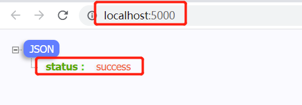

### 背景

在前端开发中，可能会使用到node做一些简单的服务端方面的开发，比如模拟个简单的服务器，也有一些应用也直接使用了node作为服务端的开发语言。那么node服务的管理，就是是一个现实的问题了。

node应用中，如果想通过node运行一个js文件，最简单的方式，就是直接通过node指令运行,如 node servre.js

```js
// server.js
const fastify = require("fastify")();
fastify.get("/", async () => {
    return {
        status: "success"
    }
});
fastify.listen(5000, () => {
    console.log("server is listening at http://localhost:5000");
});
```

使用了fastify服务器端的框架作为演示。

```bash
node server.js
```
PS D:\node> node .\server.js
server is listening at http://localhost:5000
```

这时表示node服务器已经启动，然后可以从浏览器去验证一下：



### nodemon

### pm2

中文文档：[https://github.com/shipengqi/PM2-docs-Zh-CN](https://github.com/shipengqi/PM2-docs-Zh-CN)

英文文档：[https://pm2.keymetrics.io/](https://pm2.keymetrics.io/)