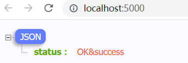

### 背景

在前端开发中，可能会使用到node做一些简单的服务端方面的开发，比如模拟个简单的服务器，也有一些应用也直接使用了node作为服务端的开发语言。那么node服务的管理，就是是一个现实的问题了。

node应用中，如果想通过node运行一个js文件，最简单的方式，就是直接通过node指令运行,如 node servre.js

```js
// server.js
const fastify = require("fastify")();
fastify.get("/", async () => {
    return {
        status: "success"
    }
});
fastify.listen(5000, () => {
    console.log("server is listening at http://localhost:5000");
});
```

使用了fastify服务器端的框架作为演示。

```bash
PS D:\node> node .\server.js
server is listening at http://localhost:5000
```

这时表示node服务器已经启动，然后可以从浏览器去验证一下：


在开发环境中，我们会经常改动代码，但是改动后发现一个问题，就是改动之后的效果，并没有直接响应到返回内容上，比如我将返回内容的status更改为了ok，但是返回值并没有直接响应，而是需要重启下node服务才可以。

虽然这样在功能上能够实现，但是对于在开发环境频繁改动代码来说并不合适，起码说不是一个理想的开发状态。

nodemon可以帮我们解决需要频繁重启node的问题。

### nodemon

全局安装nodemon

```bash
npm install nodemon -g
```

nodemon的使用也比较简单，在运行一个js文件的时候和node基本一致，只需要将node更改为nodemon即可

```bash
PS D:\WebStudy\node\nodemon-pm2> nodemon .\server.js
[nodemon] 2.0.15
[nodemon] to restart at any time, enter `rs`
[nodemon] watching path(s): *.*
[nodemon] watching extensions: js,mjs,json
[nodemon] starting `node .\server.js`
server is listening at http://localhost:5000
```

表示已经成功的通过nodemon运行了一个js文件，本demo中，其实就是启动了一个node服务。

nodemon比node的好处就是，每当有了开发的文件有了变动之后，就会自动重新编译，当然了，返回数据是需要重新请求才能反应出来

```js
const fastify = require("fastify")();
fastify.get("/", async () => {
    return {
        status: "OK&success"
    }
});
fastify.listen(5000, () => {
    console.log("server is listening at http://localhost:5000");
});
```

开发文件中修改了返回值，将success修改成了OK&success，来看下终端中nodemon的响应：

```bash
PS D:\node> nodemon .\server.js
[nodemon] 2.0.15
[nodemon] to restart at any time, enter `rs`
[nodemon] watching path(s): *.*
[nodemon] watching extensions: js,mjs,json
[nodemon] starting `node .\server.js`
server is listening at http://localhost:5000
[nodemon] restarting due to changes...
[nodemon] starting `node .\server.js`
[nodemon] clean exit - waiting for changes before restart
[nodemon] restarting due to changes...
[nodemon] starting `node .\server.js`
[nodemon] restarting due to changes...
[nodemon] starting `node .\server.js`
server is listening at http://localhost:5000
```

终端详细的展示出了通过nodemon启动一个node服务，且当js文件变动的时候自动重新编译、重启服务的过程



### pm2

中文文档：[https://github.com/shipengqi/PM2-docs-Zh-CN](https://github.com/shipengqi/PM2-docs-Zh-CN)

英文文档：[https://pm2.keymetrics.io/](https://pm2.keymetrics.io/)

nodemon那么优秀，有了文件变动后能够直接重新编译，那么使用nodemon就足够了，为什么还要学习、使用pm2呢？

nodemon是足够优秀，在开发环境中确实能够满足我们的调试代码的需求，但是我们也发现了一个现象：就是nodemon需要占用一个终端，在通过nodemon开启的服务的终端是不能够关掉的，终端关掉了，服务也就停止了，这在生产环境不是一个优秀的解决方案。pm2就可以解决这个问题。

安装pm2:需要全局安装

```bash
npm install pm2 -g
```

通过pm2启动node服务：

```bash
PS D:\node> pm2 start .\server.js
[PM2] Applying action restartProcessId on app [server](ids: [ 0 ])
[PM2] [server](0) ✓
[PM2] Process successfully started
┌─────┬───────────┬─────────────┬─────────┬─────────┬──────────┬────────┬──────┬───────────┬──────────┬──────────┬──────────┬──────────┐
│ id  │ name      │ namespace   │ version │ mode    │ pid      │ uptime │ ↺    │ status    │ cpu      │ mem      │ user
    │ watching │
├─────┼───────────┼─────────────┼─────────┼─────────┼──────────┼────────┼──────┼───────────┼──────────┼──────────┼──────────┼──────────┤
│ 0   │ server    │ default     │ 1.0.0   │ fork    │ 19464    │ 0s     │ 0    │ online    │ 0%       │ 31.6mb   │ xxx    │ disabled │
└─────┴───────────┴─────────────┴─────────┴─────────┴──────────┴────────┴──────┴───────────┴──────────┴──────────┴──────────┴──────────┘
PS D:\node>
```

已经成功通过pm2启动了一个node服务，我们可以从终端中发现，pm2服务启动后，就直接推出了当前指令的状态，而是进入了下一条指令的输入区域了。这说明一个问题，就是pm2在运行过程中，不需要占用一个终端窗口，服务启动成功后，终端就可以关掉了。也让我们在服务管理中的事情上有了更多的操作空间，非常适合线上的服务的管理。

使用pm2管理node服务，在文件有变动后不会自动重启服务，但是这也正是生产环境需要的谨慎的操作吧。

所以，pm2和nodemon都是非常优秀的ndoe的开发工具，具有自己的使用场景，配合使用，让node服务运转的更加完美，开发体验更加优秀。

**pm2停止和重启服务**

停止服务，需要指定一下要停止服务的服务id、或者文件名称，使用stop指令

```bash
# 停止服务
pm2 stop server.js
```

重启服务：可以使用reload和restart两个指令，但是一般情况下使用reload，重载

使用reload或者restart重载或者重启服务的时候，也需要指定服务的id或者name

```bash
# 重载、重启服务
PS D:\node> pm2 reload .\server.js
Use --update-env to update environment variables
[PM2] Applying action reloadProcessId on app [.\server.js](ids: [ 0 ])
[PM2] [server](0) ✓
PS D:\node>
```

