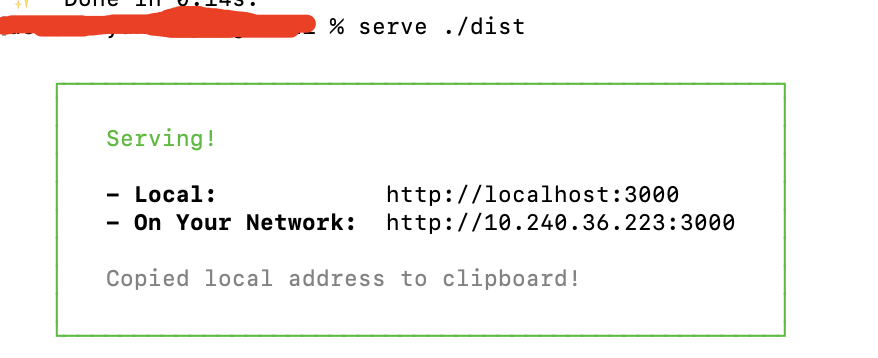

### yarn

### yarn的安装

我经常是windows和mac切换着使用，所以我总结的文档中有的是用windows下的demo，有的是mac下的demo，不过我一般情况下都写清楚是在哪个环境下，不给读者造成困扰。

正式因为我经常使用windows和mac切换使用，所以我一般安装yarn会使用两种方式：npn和brew的方式。

```bash
# 通过npm的方式安装
npm install yarn -g
# 通过brew的方式安装
brew install yarn
```

安装

```bash
xxx@xxxxxx ~ % npm install yarn -g

> yarn@1.22.17 preinstall /Users/xxx/.nvm/versions/node/v14.12.0/lib/node_modules/yarn
> :; (node ./preinstall.js > /dev/null 2>&1 || true)

/Users/xxx/.nvm/versions/node/v14.12.0/bin/yarn -> /Users/xxx/.nvm/versions/node/v14.12.0/lib/node_modules/yarn/bin/yarn.js
/Users/xxx/.nvm/versions/node/v14.12.0/bin/yarnpkg -> /Users/xxx/.nvm/versions/node/v14.12.0/lib/node_modules/yarn/bin/yarn.js
+ yarn@1.22.17
added 1 package in 3.935s
```

一般看到这些信息，就表示yarn已经成功安装了，但是还是经过常规途径确认一下。

**安装完成后通过yarn --version检查版本的方式确认是否安装成功**

```bash
xxx@xxxxxx ~ % yarn --version
1.22.17
```

到这里就可以放心、大胆的确认，yarn已经被成功的安装了。
### 常用命令

检查/获取当前yarn的bin的位置

yarn global bin

```
PS C:\Users\xxx> yarn global bin
D:\NodeJs\node_global\bin
```

检查当前yarn的全局安装路径

yarn global dir

```
PS C:\Users\xxx> yarn global dir
C:\Users\xxx\AppData\Local\Yarn\Data\global
```

检查yarn安装的包的缓存位置

yarn cache dir

```
PS C:\Users\xxxx> yarn cache dir
C:\Users\xxxx\AppData\Local\Yarn\Cache\v6
```

设置、修改全局安装路径

yarn config set global-foler "path"

```
PS C:\Users\xxx> yarn config set global-folder "E:\nodejs\yarn\global"
yarn config v1.22.5
success Set "global-folder" to "E:\\nodejs\\yarn\\global".
Done in 0.06s.
```

设置、修改缓存目录

yarn config set cache-folder "path"

```
PS C:\Users\xxx> yarn config set cache-folder "E:\nodejs\yarn\cache"
yarn config v1.22.5
success Set "cache-folder" to "E:\\nodejs\\yarn\\cache".
Done in 0.06s.
```

安装npm包

```bash
yarn add package

yarn add package --dev  # 安装开发时依赖

yarn add package --peer # 安装到peerDependencies

yarn add package --optional # 安装到optionalDependencies

yarn global add package # 全局安装，注意不能是yarn add package global
```

查看安装列表

```bash
yarn list # 查看本地安装列表

yarn global list # 查看全局安装列表
```

> 我的所有案例都是在 windows 上做的 demo 和验证，不过在非 windows 平台如 linux、mac 上应该是大同小异

查看yarn的当前的源

```bash
yarn config get registry # 查看yarn的当前的源
```
> yarn也有一个类似nrm的源管理工具cgr，可以同时管理yarn、npm、cnpm,可以参考：[nrm、cgr](./nrm.md)

### 常见问题

1. 使用yarn全局安装的包，指令无法使用，找不到，如Zsh command not found serve

案例中，我使用

```bash
yarn global add serve
```

成功的安装了serve，但是当使用serve的是，却提示：Zsh command not found serve。就是没有找到这个serve指令。

出现这个提示，就说名在系统的环境变量中找不到这个指令，那么我们已经成功的安装过了，那是什么原因呢？

如果尝试使用npm全局安装一个包，是可以正常使用的。

原因：

根上的原因是yarn安装的包没有添加到系统的环境变量中。那我们就把yarn的bin，执行文件目录添加到环境变量中就可以了。

> 我机器上的yarn是通过npm安装的：npm install yarn -g，在安装yarn之前，npm配置过了系统的环境变量，或者node配置过了，但是通过npm安装yarn之后，yarn的快执行文件目录没有配置到系统环境变量中，所以就找不到yarn安装的指令，就很正常了。

```bash
yarn global bin  # 查看yarn的全局执行文件目录
vi ~/.zshrc  # 我系统使用的shell是zsh，如果使用的bash，就编辑~/.bash_profile
export PATH=/Users/xxx/.yarn/bin:$PATH  # 添加yarn的全局执行文件目录到系统环境变量
:wq  # 保存编辑文件
source ~/.zshrc # 重载shell的配置文件，即时生效
```

再执行serve，就没问题了。



**那为甚么npm全局安装的指令可以正常执行呢**

是因为在安装node的时候，配置过了系统环境变量。

