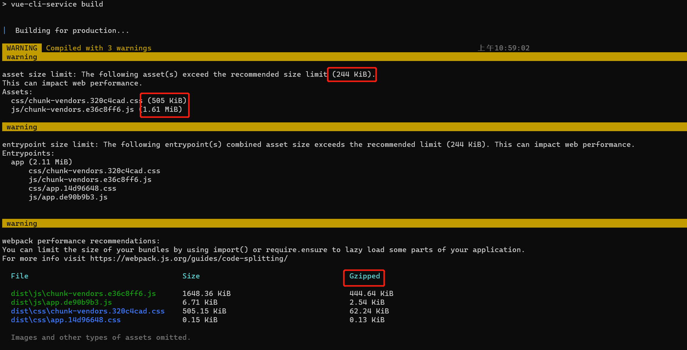

### Vue文件质量

不知道大家是否有注意过，就是vue推荐的最大的打包后文件质量不超过244kb，如果超过了这个质量的限制后，会影响到vue项目的性能。我们都知道，需要加载的静态资源越小，页面就加载的越快，结果是性能数据就越漂亮。

上图中案例，是一个全量引入antd的效果图。一个空的项目，全量方式接入了antd，结果是vendor文件过大，css文件高达500k，js文件高达1.6M，对于一个前端项目来说，还没有加入业务代码和UI的文件就已经达到了这样的质量，是无法接受的，所以我们需要想办法把这个文件的质量降下来。

### 怎么降低代编译后码质量

代码分割、webpack进行代码压缩、标准库的剔除