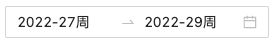

### antd中RangePicker组件周维度时组件回显选中起始周的第一天和结束周的最后一天

antd给我们提供了非常强大的能力，能够让我们将更多的精力在业务中，不需要花费很大的精力去造轮子。

最近在做需求的时候，期望是以周的维度显示日期。于是我就非常快乐的找到了RangePicker组件，以很快的速度交给了产品看效果，产品说：嗯，这个效果不错，但是现在选中时间后默认显示的是第几周第几周，而不是一个具体、直观的时间。

如图，我直接使用默认时间交给产品的效果图：



产品希望的是，能够将组件中显示的第几周第几周如2022-27周、2022-29周显示为第27周的周一和第29周周日，这样更直观。也确实是这么回事，现在的效果，虽然用户(使用者)确实满足了最基本的需求，是以周的维度选择了数据，在视觉上可以看到当前选择了第几周到第几周，但是功能上有一个缺陷，就是组件获取的时间是我选中的起始时间，而不是选择的起始时间所在周的第一天，结束时间也不是结束时间所在周的最后一天。这在和服务端交互的时候，就不太友好了，有2个解决方案:

1. 前端处理好选中时间起始时间所在周的第一天和结束时间所在周的最后一天，将时间格式处理好，提交给服务端做数据检索；

2. 前端不做数据处理，就直接将第几周第几周提交给服务端，时间解析的工作交给服务端。

这两种方案，在技术上都可行，但是第二种方案，估计要和服务端来个大PK，时间上节省不来。那么既然无论怎么做都不会节省时间，那么倒不如前端将时间处理好，在技术上，前端更有价值；在写作上，也会更顺畅。

那么就来看下具体的实现，直接看代码：

```tsx
import React, { FC, memo, useState } from 'react';
import { DatePicker,Button } from 'antd';
const { RangePicker } = DatePicker;
import locale from 'antd/es/date-picker/locale/zh_CN';
import moment, { Moment } from "moment";
const Capability: FC = () => {
    const [weekValue,setWeekValue] = useState();
    const handleWeekChange = (date:Moment, dateString:String) => {
        // 当前日是该周的第几天
        const startDay = (new Date(dateString[0])).getDay();
        const endDay = (new Date(dateString[1])).getDay();
        const startWeekFirstDay=moment(dateString[0]).subtract(startDay - 1, 'days');
        const endWeekLastDay =  moment(dateString[1]).add(7-endDay, 'days');
        setWeekValue([startWeekFirstDay,endWeekLastDay]);
    }
    return (
        <>
            <RangePicker
                locale={locale}
                format="YYYY-MM-DD"
                picker='week'
                style={{width: '260px'}}
                value={weekValue}
                onChange={handleWeekChange}
            />
        </>
    );
};

export default memo(Capability);
```