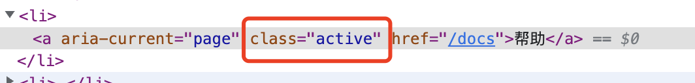

<!-- START doctoc generated TOC please keep comment here to allow auto update -->
<!-- DON'T EDIT THIS SECTION, INSTEAD RE-RUN doctoc TO UPDATE -->
**Table of Contents**  *generated with [DocToc](https://github.com/thlorenz/doctoc)*

- [1. 简单了解react-router](#1-%E7%AE%80%E5%8D%95%E4%BA%86%E8%A7%A3react-router)
- [2. 基本使用](#2-%E5%9F%BA%E6%9C%AC%E4%BD%BF%E7%94%A8)
  - [2.1 BrowserRouter](#21-browserrouter)
  - [2.2 Link组件](#22-link%E7%BB%84%E4%BB%B6)
  - [2.3 NavLink组件](#23-navlink%E7%BB%84%E4%BB%B6)
  - [2.4 Routes](#24-routes)

<!-- END doctoc generated TOC please keep comment here to allow auto update -->

### 1. 简单了解react-router

react项目中使用react-router，主要会使用到2个方面的内容：react-router和react-router-dom.

react-router：为React应用提供了路由的核心功能；

react-router-dom：基于react-router,加入了在浏览器环境下的一些功能

> react不光能开发基于浏览器的web项目，也可以开发小程序、app等其他形式的应用。

### 2. 基本使用

#### 2.1 BrowserRouter

想要在React应用中使用react-router，那么就需要先在React应用中导入react-router，并包裹应用的根组件。

```tsx
import React, { StrictMode } from 'react';
import ReactDOM from 'react-dom/client';
import { BrowserRouter } from 'react-router-dom';
import './index.css';
import App from './App';
import reportWebVitals from './reportWebVitals';

const root = ReactDOM.createRoot(
  document.getElementById('root') as HTMLElement
);
root.render(
  <StrictMode>
    <BrowserRouter>
      <App />
    </BrowserRouter>
  </StrictMode>
);

reportWebVitals();
```

在这个入口文件中，我们从react-router-dom中导入了BrowserRouter组件，并使用BrowserRouter组件包裹了React应用的根组件App，这样，来自react-router-dom的其他组件和hooks已经可以正常使用了。

BrowserRouter(浏览器路由)是react-router中使用最频繁的路由方式。react-router中除了BrowserRouter，还包含了以下几种路由方式：

1. HashRouter:在路径前加1个#成为一个哈希值，hash路由模式的好处是不会因为刷新页面找不到对应的路径；

2. MemoryRouter:不存储history，路由过程存储在内存中，适用于React Native这种非浏览器环境；

3. NativeRouter:配合React Native使用，多应用于移动端；

4. StaticRouter:主要用于服务端渲染；

#### 2.2 Link组件

在react应用中，可以通过<Link />组件来创建常规链接，功能和效果类似html中的a标签。

1. <Link />组件通过属性to来传递需要跳转的链接。

```tsx
        <header className={styles.header}>
            <ul className={styles.menu}>
                <li>
                    <Link to="/home">首页</Link>
                </li>
                <li>
                    <Link to="/newsList">列表</Link>
                </li>
            </ul>
        </header>
```

2. to属性可以设置和传递一些参数，如通过search关键字设置查询字符串，pathname设置跳转路由，hash传递hash值

```ts
  <Link to={{
      pathname: '/newsList',
      search: '?sort=date',
      hash: '#hash'
  }}>列表</Link>
```

跳转后参数会体现在url上，如下:


#### 2.3 NavLink组件

NavLink是在Link组件的基础上做了一个功能的封装，其常规功能和Link组件一致，就是在Link跳转功能的基础上，加上了active状态的能力，然后在实际应用中根据active状态可以为当前导航添加高亮样式。

在使用<NavLink />组件时，当点击当前导航时，当前导航会自动添加active这个class，如：



代码如下：

```tsx
<NavLink to="/docs">帮助</NavLink>
```

1. 如果没有模块化代码，样式中设置了active这个class的样式，则会直接生效；

2. 如果使用了模块化的样式，那么需要做些处理:

```tsx
<NavLink
    to="/docs"
    className={({ isActive }) => isActive ? `${styles['link']} ${styles['nav-active']}` : `${styles['link']}`}
>帮助</NavLink>
```

也可以通过isActive来设置style:

```tsx
<NavLink
    to="/feedback"
    style={({isActive}) => isActive ? ({color: '#6BE61A', fontSize: '16px'}) : ({})}
>反馈</NavLink>
```

className中，isActive是一个内置的属性，直接解构就可以了，固定的不能改为其他变量名。

在设置style的时候，需要注意下箭头函数的使用细节，其他的，就没有什么需要注意的了，就是很常规的设置方式。

#### 2.4 Routes

Routes就是将路由射射为页面组件。首先我们需要从react-router-dom中导入Routes组件，Routes组件将导航映射为不同的页面组件。

**Routes组件的使用方式：**

1. Routes组件中使用Route组件定义路由；

2. Route路由接收2个props：

  2.1 path: 页面导航，和<Link />组件的to属性值一致

  2.2 element: 页面导航到该路由时映射的UI元素，React应用中就是导航映射的React组件

```tsx
<Routes>
  <Route path="/home" element={<Home />} />
  <Route path="/newsList" element={<NewsList />} />
  <Route path='/feedback' element={<Feedback />} />
  <Route path='/docs' element={<Docs />} />
  <Route path='*' element={<PageNotFound />} />
</Routes>
```

记得最后添加一个通配的路由，当路由不存在时，就统一到这个通配组件中做托底处理。

#### 2.5 路由顺序

在ReactRouter 6以前版本，定义路由需要按照一定的顺序，只有这样才能得到正确的组件渲染。在React Router 6开始，路由的定义顺序已经不那么重要了.

如在React Router 5中，路由使用<Switch />组件：

```tsx
<Switch>
  <Route path="/product/:id" component={Product} />
  <Route path="/product/new" component={NewProduct} />
</Switch>
```

在上面的demo中，/product/new会匹配到第一个路由，并渲染Product组件。

在React Router 6中，<Switch>组件改成了<Routes>组件，在React Route6中，同样的/product/new将会同时匹配两个路由，但是会渲染NewProduct组件。

```tsx
<Routes>
  <Routes path="/product/:id" element={<Product />} />
  <Routes path="/product/new" element={<NewProduct />} />
</Routes>
```

### 3. 编程式导航

React Router提供了两种不同的编程式导航方式：

1. 声明式的导航组件<Navigate />组件

2. 命令式的导航方法useNavigate Hook

**<Navigate />**

这是个导航组件，只要这个组件出现了，路由就会跳转到to指定的路由。

> 注意这不是<Link />组件，不是在页面中用来实现路由、链接跳转的。

<Navigate />组件，不能嵌套文字，这是一个声明式的导航，只要代码中渲染到了这个组件时，路由就会自动跳转到to属性指定的路由中，该组件可以用来做路由的重定向。

```tsx
<Route path='/about' element={<Navigate to='/home' />} />
```

在路由跳转到/about时，重定向到了/home路由。这里的<Navigate />做了重定向的作用。

**useNavigate**

useNavigate是一个react的hook。

使用useNavigate，先从react-router-dom中导入。

```tsx
const Home:FC<PageProps> = (props) => {
    // 声明一个useNavigate实例
    const navigate = useNavigate();
    const handleDocs = () => {
        // 命令式的路由跳转
        navigate('/docs');
    }
    return (
        <div className={styles.home}>
            <h3>Home</h3>
            <button onClick={handleDocs}>产品说明</button>
        </div>
    )
}
```
在触发按钮的点击事件时，命令式的实现路由的跳转。

> 一般情况下，我认为<Navigate />多用于配置的场景下，而useNavigage这个Hook主要用于响应事件中。

### 4. 路由传递状态

react-router-dom中，在进行路由跳转时，可以实现状态的传递。

1. <Link />、<NavLink />组件

```tsx
<Link to='/product' state={"产品说明"}>产品</Link>
```

state数据传递了出去，那么目标页面怎么接收呢？

通过useLocation来接收,useLocation可以从react-router-dom中导入。

```tsx
import { FC, memo } from "react";
import { useLocation } from "react-router-dom"; // 导入useLocation

interface PageProps{}

const Product:FC<PageProps> = (props) => {
  // 实例化useLocation
    const location = useLocation();
    return (
        <>
            <h3>产品</h3>
            <p>产品信息: {location.state}</p> {/*通过useLocation获取状态*/}
        </>
    )
}

export default memo(Product);
```

state除了传递常规类型的数值外，也可以传递对象、数组。

<Link />组件传递对象数据:

```tsx
<Link 
  to='/product2' 
  state={
      {
          name: "Nichoalas Zakas",
          price: 160
      }
}>产品2</Link>
```

传递数组数据:

```tsx
const data: Array<ProductProps> = [
    {
        id: 1,
        name: 'Mac Pro电脑',
        price: '13000'
    },
    {
        id: 2,
        name: 'Huawei P40',
        price: '4999'
    }
];
const [product, setProduct] = useState(data); // 商品信息
<Link className={styles.link} to='/productList' state={product}>产品列表</Link>
```

state的状态product是一个状态，默认是一个数组类型值。

**目标页面接收<link />组件通过state传递的值**

<Link />组件通过state传递的数据，目标页面可以通过useLocation Hook接收。

* 接收常规类型值

```tsx
// 传值
<Link to='/product' state={"产品说明"}>产品</Link>
// 目标文件接收值
import { FC, memo } from "react";
import { useLocation } from "react-router-dom";

interface PageProps { }
const Product: FC<PageProps> = (props) => {
    // 实例化useLocation，接收传递过来的state
    const location = useLocation();
    return (
        <>
            <h3>产品</h3>
            <div className="p1">
                <h4>产品1</h4>
                <p>产品信息: {location.state}</p> {/* 使用接收的state值 */}
            </div>
            
        </>
    )
}

export default memo(Product);
```

* 接收对象类型值

```tsx
// 通过state传递对象,demo中传递的值直接传递的字面量，也可以放入到一个state中
<Link to='/product2' state={
    {
        name: "Nichoalas Zakas",
        price: 160
    }
}>产品2</Link>
````

* 接收数组类型值

2. <Navigate />组件

3. useNavigate Hook
#### 4.1 <Link />组件

<Link />和<NavLink />组件除了可以通过to属性实现路由的跳转以外，还可以通过state属性实现状态的传递。

#### 4.2 <Navigate />组件


#### 4.3 useNavigate hook
