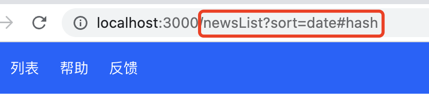
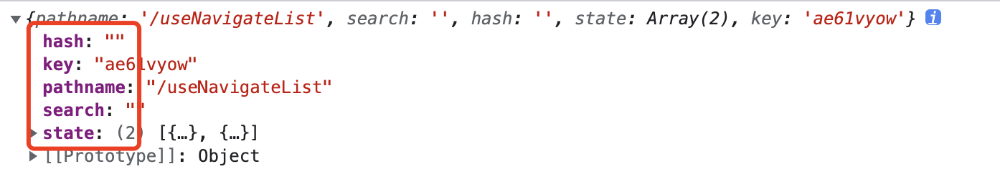

<!-- START doctoc generated TOC please keep comment here to allow auto update -->
<!-- DON'T EDIT THIS SECTION, INSTEAD RE-RUN doctoc TO UPDATE -->
**Table of Contents**  *generated with [DocToc](https://github.com/thlorenz/doctoc)*

- [1. 简单了解react-router](#1-%E7%AE%80%E5%8D%95%E4%BA%86%E8%A7%A3react-router)
- [2. 基本使用](#2-%E5%9F%BA%E6%9C%AC%E4%BD%BF%E7%94%A8)
  - [2.1 BrowserRouter](#21-browserrouter)
  - [2.2 Link组件](#22-link%E7%BB%84%E4%BB%B6)
  - [2.3 NavLink组件](#23-navlink%E7%BB%84%E4%BB%B6)
  - [2.4 Routes](#24-routes)
  - [2.5 路由顺序](#25-%E8%B7%AF%E7%94%B1%E9%A1%BA%E5%BA%8F)
- [3. 编程式导航](#3-%E7%BC%96%E7%A8%8B%E5%BC%8F%E5%AF%BC%E8%88%AA)
- [4. 路由传递状态](#4-%E8%B7%AF%E7%94%B1%E4%BC%A0%E9%80%92%E7%8A%B6%E6%80%81)
  - [4.1 Link、NavLink组件](#41-linknavlink%E7%BB%84%E4%BB%B6)
  - [4.2 <Navigate />组件](#42-navigate-%E7%BB%84%E4%BB%B6)
  - [4.3 useNavigate hook](#43-usenavigate-hook)
- [5. 动态路由](#5-%E5%8A%A8%E6%80%81%E8%B7%AF%E7%94%B1)
- [6. 嵌套路由](#6-%E5%B5%8C%E5%A5%97%E8%B7%AF%E7%94%B1)
- [7. 查询参数](#7-%E6%9F%A5%E8%AF%A2%E5%8F%82%E6%95%B0)
- [8. Route配置](#8-route%E9%85%8D%E7%BD%AE)

<!-- END doctoc generated TOC please keep comment here to allow auto update -->

### 1. 简单了解react-router

本文档中的代码、案例可参考：https://github.com/suchcl/react2022/tree/master/reactrouter6

react项目中使用react-router，主要会使用到2个方面的内容：react-router和react-router-dom.

react-router：为React应用提供了路由的核心功能；

react-router-dom：基于react-router,加入了在浏览器环境下的一些功能

> react不光能开发基于浏览器的web项目，也可以开发小程序、app等其他形式的应用。

### 2. 基本使用

#### 2.1 BrowserRouter

想要在React应用中使用react-router，那么就需要先在React应用中导入react-router，并包裹应用的根组件。

```tsx
import React, { StrictMode } from 'react';
import ReactDOM from 'react-dom/client';
import { BrowserRouter } from 'react-router-dom';
import './index.css';
import App from './App';
import reportWebVitals from './reportWebVitals';

const root = ReactDOM.createRoot(
  document.getElementById('root') as HTMLElement
);
root.render(
  <StrictMode>
    <BrowserRouter>
      <App />
    </BrowserRouter>
  </StrictMode>
);

reportWebVitals();
```

在这个入口文件中，我们从react-router-dom中导入了BrowserRouter组件，并使用BrowserRouter组件包裹了React应用的根组件App，这样，来自react-router-dom的其他组件和hooks已经可以正常使用了。

BrowserRouter(浏览器路由)是react-router中使用最频繁的路由方式。react-router中除了BrowserRouter，还包含了以下几种路由方式：

1. HashRouter:在路径前加1个#成为一个哈希值，hash路由模式的好处是不会因为刷新页面找不到对应的路径；

2. MemoryRouter:不存储history，路由过程存储在内存中，适用于React Native这种非浏览器环境；

3. NativeRouter:配合React Native使用，多应用于移动端；

4. StaticRouter:主要用于服务端渲染；

#### 2.2 Link组件

在react应用中，可以通过Link组件来创建常规链接，功能和效果类似html中的a标签。

1. Link组件通过属性to来传递需要跳转的链接。

```tsx
        <header className={styles.header}>
            <ul className={styles.menu}>
                <li>
                    <Link to="/home">首页</Link>
                </li>
                <li>
                    <Link to="/newsList">列表</Link>
                </li>
            </ul>
        </header>
```

2. to属性可以设置和传递一些参数，如通过search关键字设置查询字符串，pathname设置跳转路由，hash传递hash值

```ts
  <Link to={{
      pathname: '/newsList',
      search: '?sort=date',
      hash: '#hash'
  }}>列表</Link>
```

跳转后参数会体现在url上，如下:



#### 2.3 NavLink组件

NavLink是在Link组件的基础上做了一个功能的封装，其常规功能和Link组件一致，就是在Link跳转功能的基础上，加上了active状态的能力，然后在实际应用中根据active状态可以为当前导航添加高亮样式。

在使用<NavLink />组件时，当点击当前导航时，当前导航会自动添加active这个class，如：


代码如下：

```tsx
<NavLink to="/docs">帮助</NavLink>
```

1. 如果没有模块化代码，样式中设置了active这个class的样式，则会直接生效；

2. 如果使用了模块化的样式，那么需要做些处理:

```tsx
<NavLink
    to="/docs"
    className={({ isActive }) => isActive ? `${styles['link']} ${styles['nav-active']}` : `${styles['link']}`}
>帮助</NavLink>
```

也可以通过isActive来设置style:

```tsx
<NavLink
    to="/feedback"
    style={({isActive}) => isActive ? ({color: '#6BE61A', fontSize: '16px'}) : ({})}
>反馈</NavLink>
```

className中，isActive是一个内置的属性，直接解构就可以了，固定的不能改为其他变量名。

在设置style的时候，需要注意下箭头函数的使用细节，其他的，就没有什么需要注意的了，就是很常规的设置方式。

#### 2.4 Routes

Routes就是将路由射射为页面组件。首先我们需要从react-router-dom中导入Routes组件，Routes组件将导航映射为不同的页面组件。

**Routes组件的使用方式：**

1. Routes组件中使用Route组件定义路由；

2. Route路由接收2个props：

  2.1 path: 页面导航，和Link组件的to属性值一致

  2.2 element: 页面导航到该路由时映射的UI元素，React应用中就是导航映射的React组件

```tsx
<Routes>
  <Route path="/home" element={<Home />} />
  <Route path="/newsList" element={<NewsList />} />
  <Route path='/feedback' element={<Feedback />} />
  <Route path='/docs' element={<Docs />} />
  <Route path='*' element={<PageNotFound />} />
</Routes>
```

记得最后添加一个通配的路由，当路由不存在时，就统一到这个通配组件中做托底处理。

#### 2.5 路由顺序

在ReactRouter 6以前版本，定义路由需要按照一定的顺序，只有这样才能得到正确的组件渲染。在React Router 6开始，路由的定义顺序已经不那么重要了.

如在React Router 5中，路由使用Switch组件：

```tsx
<Switch>
  <Route path="/product/:id" component={Product} />
  <Route path="/product/new" component={NewProduct} />
</Switch>
```

在上面的demo中，/product/new会匹配到第一个路由，并渲染Product组件。

在React Router 6中，Switch组件改成了Routes组件，在React Route6中，同样的/product/new将会同时匹配两个路由，但是会渲染NewProduct组件。

```tsx
<Routes>
  <Routes path="/product/:id" element={<Product />} />
  <Routes path="/product/new" element={<NewProduct />} />
</Routes>
```

### 3. 编程式导航

React Router提供了两种不同的编程式导航方式：

1. 声明式的导航组件Navigate组件

2. 命令式的导航方法useNavigate Hook

**Navigate**

这是个导航组件，只要这个组件出现了，路由就会跳转到to指定的路由。

> 注意这不是Link组件，不是在页面中用来实现路由、链接跳转的。

Navigate组件，不能嵌套文字，这是一个声明式的导航，只要代码中渲染到了这个组件时，路由就会自动跳转到to属性指定的路由中，该组件可以用来做路由的重定向。

```tsx
<Route path='/about' element={<Navigate to='/home' />} />
```

在路由跳转到/about时，重定向到了/home路由。这里的Navigate做了重定向的作用。

**useNavigate**

useNavigate是一个react的hook。

使用useNavigate，先从react-router-dom中导入。

```tsx
const Home:FC<PageProps> = (props) => {
    // 声明一个useNavigate实例
    const navigate = useNavigate();
    const handleDocs = () => {
        // 命令式的路由跳转
        navigate('/docs');
    }
    return (
        <div className={styles.home}>
            <h3>Home</h3>
            <button onClick={handleDocs}>产品说明</button>
        </div>
    )
}
```
在触发按钮的点击事件时，命令式的实现路由的跳转。

> 一般情况下，我认为Navigate多用于配置的场景下，而useNavigage这个Hook主要用于响应事件中。

### 4. 路由传递状态

react-router-dom中，在进行路由跳转时，可以实现状态的传递。

#### 4.1 Link、NavLink组件

Link和NavLink组件除了可以通过to属性实现路由的跳转以外，还可以通过state属性实现状态的传递。

```tsx
<Link to='/product' state={"产品说明"}>产品</Link>
```

state数据传递了出去，那么目标页面怎么接收呢？

通过useLocation来接收,useLocation可以从react-router-dom中导入。

```tsx
import { FC, memo } from "react";
import { useLocation } from "react-router-dom"; // 导入useLocation

interface PageProps{}

const Product:FC<PageProps> = (props) => {
  // 实例化useLocation
    const location = useLocation();
    return (
        <>
            <h3>产品</h3>
            <p>产品信息: {location.state}</p> {/*通过useLocation获取状态*/}
        </>
    )
}

export default memo(Product);
```

state除了传递常规类型的数值外，也可以传递对象、数组。

Link组件传递对象数据:

```tsx
<Link 
  to='/product2' 
  state={
      {
          name: "Nichoalas Zakas",
          price: 160
      }
}>产品2</Link>
```

传递数组数据:

```tsx
const data: Array<ProductProps> = [
    {
        id: 1,
        name: 'Mac Pro电脑',
        price: '13000'
    },
    {
        id: 2,
        name: 'Huawei P40',
        price: '4999'
    }
];
const [product, setProduct] = useState(data); // 商品信息
<Link className={styles.link} to='/productList' state={product}>产品列表</Link>
```

state的状态product是一个状态，默认是一个数组类型值。

**目标页面接收link组件通过state传递的值**

Link组件通过state传递的数据，目标页面可以通过useLocation Hook接收。

* 接收常规类型值

```tsx
// 传值
<Link to='/product' state={"产品说明"}>产品</Link>
// 目标文件接收值
import { FC, memo } from "react";
import { useLocation } from "react-router-dom";

interface PageProps { }
const Product: FC<PageProps> = (props) => {
    // 实例化useLocation，接收传递过来的state
    const location = useLocation();
    return (
        <>
            <h3>产品</h3>
            <div className="p1">
                <h4>产品1</h4>
                <p>产品信息: {location.state}</p> {/* 使用接收的state值 */}
            </div>
            
        </>
    )
}

export default memo(Product);
```

* 接收对象类型值

```tsx
// 通过state传递对象,demo中传递的值直接传递的字面量，也可以放入到一个state中
<Link to='/product2' state={
    {
        name: "Nichoalas Zakas",
        price: 160
    }
}>产品2</Link>
// 通过useState设置变量,然后传值
const [product,setProduct] = useState<ProductProps>(data);
<Link to='/product2' state={product}>产品3</Link>

// 接收传递的对象的值
import { FC, memo } from "react";
import { useLocation } from "react-router-dom";

interface PageProps { }
const Product2: FC<PageProps> = (props) => {
    // 实例useLocation实例
    const location = useLocation();
    // 从useLocation中获取的值中解构name和price
    const { name, price } = location.state;
    return (
        <>
            <h3>产品2</h3>
            {/* 页面中正常使用接收到的值 */}
            <p>名称: {name}</p>
            <p>价格: {price}</p>
        </>
    )
}
export default memo(Product2);
```

**接收数组类型值**

```tsx
const data: Array<ProductProps> = [
    {
        id: 1,
        name: 'Mac Pro电脑',
        price: '13000'
    },
    {
        id: 2,
        name: 'Huawei P40',
        price: '4999'
    }
];
const [product, setProduct] = useState(data); // 商品信息
// 传递数组值
<Link className={styles.link} to='/productList' state={product}>产品列表</Link>

// 接收数组类型值，并在组件中渲染数据
import { FC, memo } from "react";
import { useLocation } from "react-router-dom";
import styles from './index.module.less';

interface PageProps { }
const ProductList: FC<PageProps> = (props) => {
    const location = useLocation();
    // 结构传递过来的值
    const { state } = location;
    return (
        <>
            <h3>产品列表</h3>
            <ul>
                {
                  {/* 将传递过来的值遍历使用 */}
                    state.map((item: any) => {
                        return (
                            <li key={item.id} className={styles['product-item']}>
                                <p>名称: {item.name}</p>
                                <p>价格: {item.price}</p>
                            </li>
                        )
                    })
                }
            </ul>
        </>
    )
}

export default memo(ProductList);
```


#### 4.2 <Navigate />组件

Navigate组件和Link组件类似，也是通过state通信，可以通信的数据类型有普通的数据类型值、对象和数组。

* Navigate通过state传递和接收常规类型值

```tsx
// 声明式的方式传递普通类型值
<Route path='/feedback' element={<Navigate to='/navigateCmp' state={"从feedback重定向来的"} />} />

// 目标页面通过useLocation接收Navigate组件通过state传递的普通类型值
import { FC, memo } from "react";
import { useLocation } from "react-router-dom";
import styles from "./index.module.less";
interface PageProps{}
const NavigateCmp:FC<PageProps> = (props) => {
    const location = useLocation();
    const {state} = location;
    return (
        <>
            <h3>接收Navigate的普通值</h3>
            <p>Navigate通过state携带的常规类型值: <span className={styles.fcr}>{state}</span></p>
        </>
    )
}
export default memo(NavigateCmp);
```

由案例可见，接收由Navigate组件通过state传递的普通类型值，和Link组件基本是一致的，区别就是Navigate组件有一种命令式的跳转方式，这种跳转方式带来了传值方式的区别。

* Navigate组件通过state传递和接收对象类型值

```tsx
// Navigate组件通过state传递对象类型值
<Route path='/feed' element={<Navigate to='/navigateObj' state={user} />} />
// Link组件指向/feed路由，进行路由重定向
<Link to='/feed'>验证接收Navigator传递的对象类型值</Link>

// 目标页面接收Navigate组件通过state传递的对象类型值
import { FC, memo } from "react";
import { useLocation } from "react-router-dom"; // 通过useLocation接收数据
interface PageProps{}
const NavigateObj:FC<PageProps> = (props) => {
    const {name,age} = useLocation().state; // 从state中解构数据
    return (
        <>
            <h3>接收Navigate组件传递的对象值</h3>
            {/* 解构的数据的使用 */}
            <p>姓名: {name}</p>
            <p>年龄: {age}</p>
        </>
    )
}

export default memo(NavigateObj);
```

* Navigate组件通过state传递和接收数组类型值

```tsx
// 传值
<Route path='/userList' element={<Navigate to={'/navigateList'} state={userList} />} />

// 接收Navigate组件传递过来的数组类型值
import { FC, memo } from "react";
import { useLocation } from "react-router-dom"; // 导入userLocation，用来接收数据
interface PageProps { }
const NavigateList: FC<PageProps> = (props) => {
    // 实例化useLocation
    const location = useLocation();
    // 解构数据
    const { state } = location;
    return (
        <>
            <h3>接收Navigate数组类型值</h3>
            <ul>
                {
                    // 将传递过来的数据渲染到页面中
                    state.map((item: any) => {
                        return (
                            <li key={item.id}>
                                <p>姓名: {item.name}</p>
                                <p>年龄: {item.age}</p>
                            </li>
                        )
                    })
                }
            </ul>
        </>
    )
}

export default memo(NavigateList);
```

#### 4.3 useNavigate hook

useNavigate是个hook，它和Navigate组件的功能是一致的，只是Navigate组件是声明式的，useNavigate是命令式的

**useNavigate传递和接收普通类型值**
```tsx
// 命令式的传递普通类型值
// Navigate通过命令式传递普通类型值
import {useNavigate } from "react-router-dom";

const sendCommonTypeData = () => {
    navigate("/navigateCmp", {
        state: "命令式传值" // 传递的值
    });
}

// 接收通过useNavigate的命令式传递的普通类型值
import { FC, memo } from "react";
import { useLocation } from "react-router-dom";
import styles from "./index.module.less";
interface PageProps{}
const NavigateCmp:FC<PageProps> = (props) => {
    const location = useLocation();
    const {state} = location;
    return (
        <>
            <h3>接收Navigate的普通值</h3>
            <p>useNavigate通过state携带的常规类型值: <span className={styles.fcr}>{state}</span></p>
        </>
    )
}
export default memo(NavigateCmp);
```

**useNavigate传递和接收对象类型值**

```tsx
// 通过命令式传递对象类型值
const sendObjData = () => {
    navigate('/useNavigateObj', {
        state: productObj
    });
}
// 接收useNavigate传递的对象类型值
import { FC, memo } from "react";
import { useLocation } from "react-router-dom";

interface PageProps{}
const UseNavigateObj:FC<PageProps> = (props) => {
    const {name,price} = useLocation().state;
    
    return (
        <>
            <h3>接收useNavigate传递的对象值</h3>
            <p>产品名称: {name}</p>
            <p>价格: {price}</p>
        </>
    )
}
export default memo(UseNavigateObj);
```

****useNavigate传递和接收数组类型值****

```tsx
// useNavigate通过命令式传递数组类型值
const sendArrayData = () => {
    navigate('/useNavigateList', {
        state: product
    });
}

// 目标页面接收通过useNavigate传递的数组类型值
import { FC, memo } from "react";
import { useLocation } from "react-router-dom";

interface PageProps { }
const UseNavigateList: FC<PageProps> = (props) => {
    const { state } = useLocation();
    return (
        <>
            <h3>接收useNavigate传递的数组类型值</h3>
            <ul>
                {
                    state.map((item: any) => {
                        return (
                            <li key={item.id}>
                                <p>名称: {item.name}</p>
                                <p>价格: {item.price}</p>
                            </li>
                        )
                    })
                }
            </ul>
        </>
    )
}

export default memo(UseNavigateList);
```

到此为止，通过Link组件、Navigate组件和useNavigate这个hook通信能力都已经完成，并且可以得出几个简单的几轮：

1. 这几个组件的传值方式是一致的；

2. 接收值：无论是使用Link组件、Navigate组件还是useNavigate hook传值，但是接收值的时候都是通过useLocation这个hook；

3. useLocation在页面跳转过程中发挥着很重要的作用，里面包含了很多有价值的信息，在页面跳转场景可以多关注这个hook



一般情况下，Link、NavLink用来声明静态的跳转，如导航的跳转、固定连接的跳转，useNavigate用于命令式的路由跳转，如从列表跳转到详情、从一个元素的点击事件后跳转到另外一个路由等。
### 5. 动态路由

前面我们已经了解了一些和路由相关的知识点，也实现了一些路由跳转，但是前面实现的路由跳转，都是固定的路由，但是有如下如掘金文章页的url:


类似这样的路由，路由的最后一级应该就是文章id了，或者是类似文章id的其他的唯一标识文章的属性。我们不可能提前知道每一篇文章的这个属性，而且也不太会可能会为每篇文章都去定义一个路由。其实，像这样的路由，我们只需要声明一个带有id的占位符即可。对于这种场景，我们可以这样声明路由:

动态路由大多数情况下用于命令式的路由跳转，使用useNavigate的时候会多一些。

在使用动态路由、通过一个占位路由情况的时候，接收这个占位路由时可用useParams这个Hook，这个Hook返回一个对象,该对象包含了该占位符的参数及其值。

```tsx
// 动态路由跳转
const dynamicRoute = () => {
    const id = 6;
    navigate(`/detail/${id}`);
}

// 目标页面接收动态路由传递的动态值
import { FC, memo } from "react";
import { useParams } from "react-router-dom";

interface PageProps{}
const Detail:FC<PageProps> = () => {
    const {id} = useParams();
    return (
        <>
            <h3>动态路由</h3>
            <p>文章编号: {id}</p>
        </>
    )
}

export default memo(Detail);
```

在目标页面接收到了动态路由的关键词后，再通过关键词做相应的处理，如去请求页面数据。

在页面中有useParams和useEffect时，页面优先执行useParams再执行useEffect，所以可以放心的在获取到了路由之后再去做对应的副作用处理是没有任何问题的，不需要做相应的执行顺序或者依赖值的判断。

### 6. 嵌套路由

嵌套路由允许父路由充当包裹器并控制子路由的渲染。

引用看到过一个案例，我就还是拿来借用一下吧，不用再去设计案例了。

比如有一个消息列表，可以通过/messageList路由来显示消息列表(消息列表，可以单独抽象一个组件，也可以不抽象，直接写到父组件中，案例中我也是借用了朋友的案例，不再重新设计了)，那么我设计这个路由时如下：

```tsx
<Route path="/messageList/*" element={<MessageList />} />
```

当浏览器导航到/messageList路由时渲染MessageList组件，展示消息列表，消息组件我实现如下：

```tsx
import { FC, memo, useState } from "react";
import Conversations from "./Conversations";
import { Routes, Route } from 'react-router-dom';
import styles from "./message.module.less";
import MessageDetail from "./MessageDetail";
interface PageProps { }
const list = [
    {
        id: 1,
        title: "消息1"
    },
    {
        id: 2,
        title: "消息2"
    }
];

const MessageList: FC<PageProps> = (props) => {
    const [MessageList, setMessageList] = useState(list);
    return (
        <div className={styles['message-contaienr']}>
            <div className={styles['message-list-container']}>
                <h3>消息列表</h3>
                <Conversations messageList={MessageList} />
            </div>
            <Routes>
                <Route path=":id" element={<MessageDetail />} />
            </Routes>
        </div>
    )
}

export default memo(MessageList);
```

案例中，我把消息列表单独抽象出来了一个组件Conversations，仅仅展示消息列表。然后在消息组件中直接嵌套了一层子路由：

```tsx
<Routes>
    <Route path=":id" element={<MessageDetail />} />
</Routes>
```

在父路由中嵌套的子路由的path，不用像在父路由中一样写完整的路径，只写子路由的路径即可，如案例中的path=":id",其实际的完整匹配路由为:/messageList/:id,:id为动态匹配的路由。

到这里，其实就已经配置成功了，可以实现一个基本的消息列表的展示了。需要注意的是，在父路由的配置中：

```tsx
<Route path="/messageList/*" element={<MessageList />} />
```

path通配了/messageList下的所有路由*,这个通配不能省略，否则点击消息列表寻找子路由的时候，会404.

上面的实现，虽然实现了父路由嵌套子路由，以及消息内容的展示，但是有不足的时候，父路由和子路由的定义不在一起。父路由定义在外层，而子路由定义在了父路由的渲染组件中，不好管理。那么有没有办法直接将父路由嵌套子路由直接定义呢？比如下面的这种方式:

```tsx
<Route path='/messageList' element={<MessageList />}>
    <Route path=":id" element={<MessageDetail />} />
</Route> 
```

### 7. 查询参数

### 8. Route配置