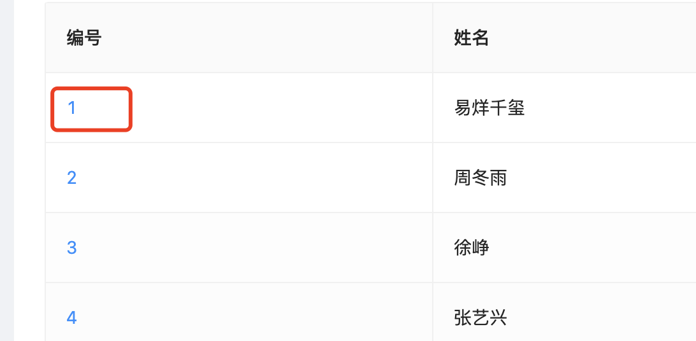

### 1. 为个别字段添加连接

如图：



我们需要给编号字段添加跳转链接,看了下ant的api，没有直接的给某个字段添加连接的api，但是column有一个render函数，我们可以通过这个函数来实现为某个指定字段添加连接。

我的table的数据源数据结构如下：

```ts
  const customer = [
    {
      id: 1,
      name: "易烊千玺",
      gender: "male",
      url: "https://www.baidu.com"
    },
    {
      id: 2,
      name: "周冬雨",
      gender: "female",
      url: "https://www.google.com"
    }
  ];
```

那么在渲染的数据的时候，让每条数据都可以跳转到指定的连接就可以了。

直接来看代码实现吧：

```tsx
import { FC, useEffect, useState } from 'react';
import { getCustomer } from "@/services/customer";
import { Table } from "antd";

const customer: FC = () => {
  const [customer, setCustomer] = useState([]);


  async function getCustomerList() {
    try {
      const customer = await getCustomer();
      setCustomer(customer.data);
    } catch (err) {
      console.log(err);
    }
  }
  useEffect(() => {
    getCustomerList();
  }, []);

  const columns = [
    {
      title: "编号",
      dataIndex: "id",
      render: (text: string, record: any) => {
        return <a href={record.url} target="_blank">{text}</a>
      }
    },
    {
      title: "姓名",
      dataIndex: "name"
    },
    {
      title: "性别",
      dataIndex: "gender"
    }
  ];

  return (
    <>
      <h3>客户管理</h3>
      <Table
        bordered columns={columns}
        dataSource={customer}
        rowKey={record => record.id}
        pagination={{ position: ['bottomCenter'] }}
      />
    </>
  );
};

export default customer;
```

### 2. 指定操作如添加、删除等行为

### 3. 常见问题

1. Warning: Each child in a list should have a unique "key" prop.

```bash
devScripts.js:6523 
        
       Warning: Each child in a list should have a unique "key" prop.

Check the render method of `Body`. See https://reactjs.org/link/warning-keys for more information.
    at BodyRow (http://localhost:8000/mf-dep_vendors-node_modules_antd_es_table_index_js.b067548e.async.js:10112:25)
    at Body (http://localhost:8000/mf-dep_vendors-node_modules_antd_es_table_index_js.b067548e.async.js:10494:19)
    at table
    at div
    at div
    at http://localhost:8000/mf-dep_vendors-node_modules_antd_es_table_index_js.b067548e.async.js:11627:23
    at div
    at Table (http://localhost:8000/mf-dep_vendors-node_modules_antd_es_table_index_js.b067548e.async.js:11642:25)
    at div
    ……
```

问题原因很明确，就是key，这是react或者vue都要求的，所有的自定义组件或者循环列表都必须要添加key，那么这里也是需要添加一个key的。

解决方案：

给Table添加一个rowKey属性，为table的表格行添加key属性区分唯一值。

```tsx
      <Table
        bordered columns={columns}
        dataSource={customer}
        rowKey={record => record.id} // 解决报错唯一值的问题
        pagination={{ position: ['bottomCenter'] }}
      />
```