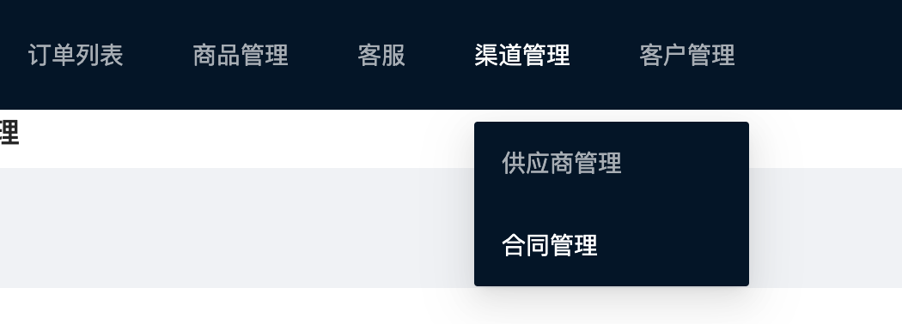

### react+antd 实现二级菜单

antd 给我们提供了一级菜单和单纯的下拉菜单，如果一个导航中同时有一级菜单和下拉菜单，需要我们做一些处理。

直接贴源码：

```tsx
import { Layout, Menu } from "antd";
const { Header, Footer, Content } = Layout;
import { FC, useEffect, useState } from "react";
import { history } from "umi";
import style from "./layout.less";
import request from "umi-request";
const { SubMenu } = Menu;

const Layouts: FC = (props) => {
  const [menu, setMenu] = useState([]);
  useEffect(() => {
    request.get("http://localhost:3000/menu").then((res) => {
      setMenu(res);
    });
  }, []);
  const menuClick = (item: any) => {
    history.push(item.key);
  };
  return (
    <>
      <Header>
        <Menu
          theme="dark"
          mode="horizontal"
          defaultSelectedKeys={["2"]}
          onClick={menuClick}
        >
          {menu.map((item: any) => {
            if (item.children) {
              const smenu = item.children;
              return (
                <SubMenu title={item.name} key={item.path}>
                  {smenu.map((citem: any) => {
                    return <Menu.Item key={citem.path}>{citem.name}</Menu.Item>;
                  })}
                </SubMenu>
              );
            } else {
              console.log(item.path);
              return <Menu.Item key={item.path}>{item.name}</Menu.Item>;
            }
          })}
        </Menu>
      </Header>
      <Content>{props.children}</Content>
    </>
  );
};
export default Layouts;
```

demo只实现了一级和二级菜单的效果,但是我没没有很多场景还会有三级菜单(一般最多也就是3级吧，不会有再多了)，或者无限循环菜单的效果，接下来再优化下实现一个无限级别循环菜单



> demo中有部分代码仅仅是为了实现菜单级点击菜单实现路由跳转，部分没有考虑其合理性，看官有需要的时候，自行优化代码。