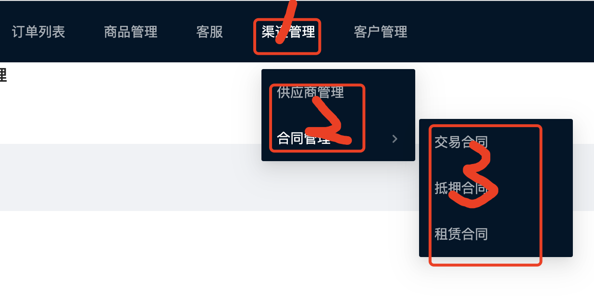

<!-- START doctoc generated TOC please keep comment here to allow auto update -->
<!-- DON'T EDIT THIS SECTION, INSTEAD RE-RUN doctoc TO UPDATE -->
**Table of Contents**  *generated with [DocToc](https://github.com/thlorenz/doctoc)*

- [1. react+antd 实现二级菜单](#1-reactantd-%E5%AE%9E%E7%8E%B0%E4%BA%8C%E7%BA%A7%E8%8F%9C%E5%8D%95)
- [2. antd实现多级菜单](#2-antd%E5%AE%9E%E7%8E%B0%E5%A4%9A%E7%BA%A7%E8%8F%9C%E5%8D%95)
- [3. antd菜单实现路由跳转](#3-antd%E8%8F%9C%E5%8D%95%E5%AE%9E%E7%8E%B0%E8%B7%AF%E7%94%B1%E8%B7%B3%E8%BD%AC)

<!-- END doctoc generated TOC please keep comment here to allow auto update -->

### 1. react+antd 实现二级菜单

antd 给我们提供了一级菜单和单纯的下拉菜单，如果一个导航中同时有一级菜单和下拉菜单，需要我们做一些处理。

直接贴源码：

```tsx
import { Layout, Menu } from "antd";
const { Header, Footer, Content } = Layout;
import { FC, useEffect, useState } from "react";
import { history } from "umi";
import style from "./layout.less";
import request from "umi-request";
const { SubMenu } = Menu;

const Layouts: FC = (props) => {
  const [menu, setMenu] = useState([]);
  useEffect(() => {
    request.get("http://localhost:3000/menu").then((res) => {
      setMenu(res);
    });
  }, []);
  const menuClick = (item: any) => {
    history.push(item.key);
  };
  return (
    <>
      <Header>
        <Menu
          theme="dark"
          mode="horizontal"
          defaultSelectedKeys={["2"]}
          onClick={menuClick}
        >
          {menu.map((item: any) => {
            if (item.children) {
              const smenu = item.children;
              return (
                <SubMenu title={item.name} key={item.path}>
                  {smenu.map((citem: any) => {
                    return <Menu.Item key={citem.path}>{citem.name}</Menu.Item>;
                  })}
                </SubMenu>
              );
            } else {
              console.log(item.path);
              return <Menu.Item key={item.path}>{item.name}</Menu.Item>;
            }
          })}
        </Menu>
      </Header>
      <Content>{props.children}</Content>
    </>
  );
};
export default Layouts;
```

demo只实现了一级和二级菜单的效果,但是我没没有很多场景还会有三级菜单(一般最多也就是3级吧，不会有再多了)，或者无限循环菜单的效果，接下来再优化下实现一个无限级别循环菜单


> demo中有部分代码仅仅是为了实现菜单级点击菜单实现路由跳转，部分没有考虑其合理性，看官有需要的时候，自行优化代码。

### 2. antd实现多级菜单

菜单组件(nav.tsx)

```tsx
import { FC } from 'react';
import { Menu } from 'antd';
const { SubMenu } = Menu;
import { Link } from 'react-router-dom';

interface MenuType {
  menuList: any;
}
const CustomeNav: FC<MenuType> = (props: any) => {
  const { menuList } = props;
  function formSubmenuChild(obj: any) {
    let cHtml = <div></div>;
    let childArray = obj.children;
    if (obj.children && obj.children.length > 0) {
      cHtml = childArray.map((item: any) => {
        return formSubmenuChild(item);
      });
      return (
        <SubMenu key={obj.path} title={obj.text}>
          {cHtml}
        </SubMenu>
      );
    } else {
      return (
        <Menu.Item key={obj.path}>
          <Link to={obj.path}>{obj.text}</Link>
        </Menu.Item>
      );
    }
  }

  // 拼接菜单项
  let html = menuList.map((obj: any) => {
    if (obj.children && obj.children.length > 0) {
      return formSubmenuChild(obj);
    } else {
      return (
        <Menu.Item key={obj.path}>
          <Link to={obj.path}>{obj.text}</Link>
        </Menu.Item>
      );
    }
  });

  return (
    <Menu mode="horizontal" theme="dark">
      {html}
    </Menu>
  );
};

CustomeNav.propTypes = {};

export default CustomeNav;
```

调用：

```tsx
// 导入子组件
import CustomeNav from './nav';
// 调用子组件
<CustomeNav menuList={menu}></CustomeNav>
```




### 3. antd菜单实现路由跳转

antd菜单实现路由跳转，有两种方法，1是通过给menu控件添加onClick事件，2是通过在菜单导航内添加<Link>组件实现路由跳转。

**通过Menu的onCLick事件，设置<Menu.Item>组件的key属性值为path**

```tsx
import { Layout, Menu } from 'antd';
const { Header, Footer, Content } = Layout;
import { FC, useEffect, useState } from 'react';
import request from 'umi-request';

const Layouts: FC = (props) => {
  const [menu, setMenu] = useState([]);
  useEffect(() => {
    request.get('http://localhost:3000/menu').then((res) => {
      setMenu(res);
    });
  }, []);
  // 导航菜单路由跳转
  const menuClick = (item: any) => {
    history.push(item.key);
  };

  return (
    <>
      <Menu
        theme="dark"
        mode="horizontal"
        defaultSelectedKeys={['2']}
        onClick={menuClick} // onCLick事件，
      >
        {menu.map((item: any) => {
          if (item.children) {
            const smenu = item.children;
            return (
              <SubMenu title={item.name} key={item.path}>
                {smenu.map((citem: any) => {
                  // key的属性值设置为当前菜单的跳转路由
                  return <Menu.Item key={citem.path}>{citem.name}</Menu.Item>;
                })}
              </SubMenu>
            );
          } else {
            // key的属性值设置为当前菜单的跳转路由
            return <Menu.Item key={item.path}>{item.name}</Menu.Item>;
          }
        })}
      </Menu>
    </>
  );
};
export default Layouts;
```

**通过在Menu组件内添加<Link>组件实现路由跳转**

这个就比较简单了,在<Menu.Item>内包裹一层<Link>组件，并将<Link>组件的to属性赋正常的路由值就可以了。

```tsx
<Menu.Item key={citem.path}>
  <Link to={citem.path}>{citem.name}</Link>
</Menu.Item>
```

这种方式不需要任何事件，实现较为简单，但是和为<Menu>相比，增加了一些代码量。