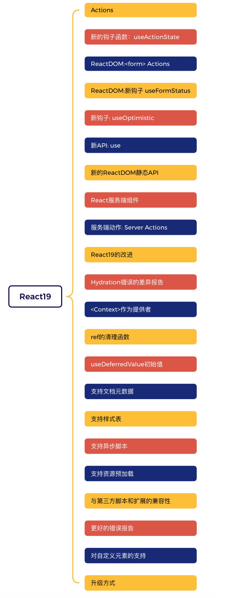

<!-- START doctoc generated TOC please keep comment here to allow auto update -->
<!-- DON'T EDIT THIS SECTION, INSTEAD RE-RUN doctoc TO UPDATE -->
**Table of Contents**  *generated with [DocToc](https://github.com/thlorenz/doctoc)*

- [React19发布了](#react19%E5%8F%91%E5%B8%83%E4%BA%86)
- [React19中的新功能](#react19%E4%B8%AD%E7%9A%84%E6%96%B0%E5%8A%9F%E8%83%BD)
  - [Actions](#actions)
  - [useActionState 一个新的钩子函数](#useactionstate-%E4%B8%80%E4%B8%AA%E6%96%B0%E7%9A%84%E9%92%A9%E5%AD%90%E5%87%BD%E6%95%B0)
  - [ReactDOM: <form>Actions](#reactdom-formactions)
  - [ReactDOM: useFormStatus 新的钩子函数](#reactdom-useformstatus-%E6%96%B0%E7%9A%84%E9%92%A9%E5%AD%90%E5%87%BD%E6%95%B0)
- [useOptimistic: 新的钩子函数](#useoptimistic-%E6%96%B0%E7%9A%84%E9%92%A9%E5%AD%90%E5%87%BD%E6%95%B0)
  - [新的API: use](#%E6%96%B0%E7%9A%84api-use)
  - [新的ReactDOM静态API](#%E6%96%B0%E7%9A%84reactdom%E9%9D%99%E6%80%81api)
- [React服务端组件](#react%E6%9C%8D%E5%8A%A1%E7%AB%AF%E7%BB%84%E4%BB%B6)
  - [服务端组件(Server Components)](#%E6%9C%8D%E5%8A%A1%E7%AB%AF%E7%BB%84%E4%BB%B6server-components)
  - [服务端动作: Actions](#%E6%9C%8D%E5%8A%A1%E7%AB%AF%E5%8A%A8%E4%BD%9C-actions)
- [React19的改进](#react19%E7%9A%84%E6%94%B9%E8%BF%9B)
  - [ref作为属性](#ref%E4%BD%9C%E4%B8%BA%E5%B1%9E%E6%80%A7)
  - [Hydration错误的差异报告](#hydration%E9%94%99%E8%AF%AF%E7%9A%84%E5%B7%AE%E5%BC%82%E6%8A%A5%E5%91%8A)
  - [<Context>作为提供者](#context%E4%BD%9C%E4%B8%BA%E6%8F%90%E4%BE%9B%E8%80%85)
  - [ref的清理函数](#ref%E7%9A%84%E6%B8%85%E7%90%86%E5%87%BD%E6%95%B0)
  - [useDeferredValue初始值](#usedeferredvalue%E5%88%9D%E5%A7%8B%E5%80%BC)
  - [支持文档元数据](#%E6%94%AF%E6%8C%81%E6%96%87%E6%A1%A3%E5%85%83%E6%95%B0%E6%8D%AE)
  - [支持样式表](#%E6%94%AF%E6%8C%81%E6%A0%B7%E5%BC%8F%E8%A1%A8)
  - [支持异步脚本](#%E6%94%AF%E6%8C%81%E5%BC%82%E6%AD%A5%E8%84%9A%E6%9C%AC)
  - [支持资源预加载](#%E6%94%AF%E6%8C%81%E8%B5%84%E6%BA%90%E9%A2%84%E5%8A%A0%E8%BD%BD)
  - [与第三方脚本和扩展的兼容性](#%E4%B8%8E%E7%AC%AC%E4%B8%89%E6%96%B9%E8%84%9A%E6%9C%AC%E5%92%8C%E6%89%A9%E5%B1%95%E7%9A%84%E5%85%BC%E5%AE%B9%E6%80%A7)
  - [更好的错误报告](#%E6%9B%B4%E5%A5%BD%E7%9A%84%E9%94%99%E8%AF%AF%E6%8A%A5%E5%91%8A)
  - [对自定义元素的支持](#%E5%AF%B9%E8%87%AA%E5%AE%9A%E4%B9%89%E5%85%83%E7%B4%A0%E7%9A%84%E6%94%AF%E6%8C%81)
- [如何升级](#%E5%A6%82%E4%BD%95%E5%8D%87%E7%BA%A7)

<!-- END doctoc generated TOC please keep comment here to allow auto update -->

### React19发布了

参考链接：[https://react.dev/blog/2024/12/05/react-19](https://react.dev/blog/2024/12/05/react-19)

React19终于发布了，这是自2022年react18发布，时隔2年以来再一次发布的一个大版本。

React19中有哪些大的改动呢？可先参考下图:

### React19中的新功能

#### Actions

#### useActionState 一个新的钩子函数

#### ReactDOM: <form>Actions

#### ReactDOM: useFormStatus 新的钩子函数

### useOptimistic: 新的钩子函数

#### 新的API: use

#### 新的ReactDOM静态API

### React服务端组件

#### 服务端组件(Server Components) 

#### 服务端动作: Actions

### React19的改进

#### ref作为属性

#### Hydration错误的差异报告

#### <Context>作为提供者

#### ref的清理函数

#### useDeferredValue初始值

#### 支持文档元数据

#### 支持样式表

#### 支持异步脚本

#### 支持资源预加载

#### 与第三方脚本和扩展的兼容性

#### 更好的错误报告

#### 对自定义元素的支持

### 如何升级

升级方式，可参考：[React19升级指南](https://react.dev/blog/2024/04/25/react-19-upgrade-guide)