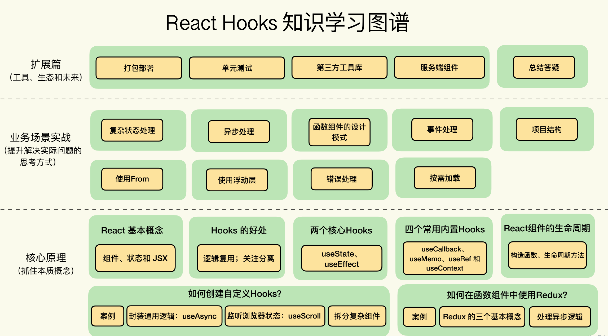
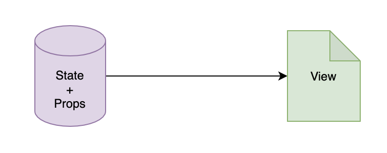

### 1. 简单认识react hooks

react引入了hooks之后，函数式组件就具备了状态管理、生命周期管理等能力，几乎可以实现原来class式组件等所有能力。

函数式组件结合hooks带来的简洁的写法，以及直观的逻辑重用能力，让函数式组件称为了react中的一等公民。目前，在整个react生态中，几乎所有项目的开发都已经在围绕hooks开展了。

从class式组件模式开发，到函数式组件模式开发转变，可能会遇到各种各样的问题，但是这也都是正常的。因为从class式组件的开发到函数式组件模式的开发，转换的不仅仅是写法的区别，而是整个开发思路的转变。这就需要我们开发者都要投入到当前使用的技术思路中去思考问题，才能把技术的道路走通。

**应该怎么去学React Hooks？**

1. 最重要的是要准确的知道Hooks的功能边界，也就是知道它能做什么。

否则就有可能会陷入一个误区，就是既然Hooks那么好，那我所有的问题都使用Hooks去做，也或者是使用Hooks是最优秀的解决方案，但是却没有想到它。

2. 掌握核心概念和原理



### 2. 了解React

React，其实就是一个很简单的UI库，它的用法，主要就是3个概念：组件、状态和JSX。

React中，任何一个state发生变化时，整个函数组件都会被重新执行一遍，而且除了state，多次执行之间没有任何的关系。所以在React中考虑一个组件的实现时，我们要首先考虑这个组件中都有哪些组件（state），这些状态的变化都是由什么触发的，从而将整个组件的功能串起来。

**思考** React最打动你的特性是什么？或者说它的最大的优点有哪些？

#### 2.1 使用组件的方式描述UI

React中，所有的UI都是通过组件去描述和组织的。也可以简单的理解，React中所有的元素都是组件，具体来讲又可以分为两种组件：

1. 内置组件：内置组件其实就是映射的HTML组件，如div、p、table、img等，作为约定，内置组件，都使用小写方式。

2. 自定义组件：自定义组件就是自己定义的组件，是一些内置组件的集合，形成了一个新的模块功能。作为约定，自定义组件使用大驼峰的命名规范，就是首字母大写，多个单词拼接时，每个单词的首字母都大写，如Header、NewsList等。

React和DOM节点定义的方式类似，React组件也是树状结构的，且React应用只有一个根组件。

#### 2.2 React组件的本质是什么？

React组件的模型，其实就是Model到View的映射，这里的model对应到React中，就是state+props：



**什么是数据绑定？**

当Model(state、props)中的数据发生变化时，UI会自动发生变化，即所谓的数据绑定。

所以从这个角度来讲，我们可以把UI的展现看成一个函数的执行过程。其中，model是输入参数，函数的执行结果是DOM树，也就是View。而react要保证的，就是每当Model发生变化时，函数会重新执行，且生成新的DOM树，然后React再把新的DOM树以最优的方式更新到浏览器。

### 2.3 Hooks

Hooks，就是钩子的意思。React中，Hooks就是把某个目标结果钩到某个可能会变化的数据源或者事件源上，当被钩到的数据源或者事件源发生变化时，产生这个目标结果的代码就会重新执行，产生更新后的结果。对于函数式组件，这个结果就是最终的DOM树。

Hooks的思想，不光是在React中可用，其他的应用场景也可用。

Hooks的最大的好处，就是逻辑的复用。

**Hooks的最大的好处，就是逻辑的复用**

在Hooks之前的React使用中，经常被大家诟病的一点就是非常难以实现逻辑的复用，必须借助告诫组件等复杂的设计模式。但是告诫组件会产生荣誉的组件节点，让调试变的困难。这些问题在Hooks中得到了很好的解决，所以说Hooks的最大好处，就是简化了逻辑的复用。

**Hooks的另一个好处，就是有助于关注分离**

有助于关注分离，意识是说Hooks能够让针对同一个业务逻辑的代码尽可能的聚合在一起。

这一点在类式组件中很难实现的，因为在类式组件中，我们不的不把同一个业务逻辑的代码分散在不同的生命周期方法中。

所以说，通过Hooks的方式，可以让代码更加容易理解和维护。

**类式组件和函数式组件的区别**

类式组件和函数组件的一个区别，就是类式组件是通过技术角度组织到一起的，例如在不同的生命周期阶段做一些特定的事情，而函数式组件式通过业务角度组织到一起的，相同业务逻辑的代码组织在一起，从而更加的容易理解和维护。

Hooks称为了React开发的主流方式，它在一定程度上体现了React的开发思想，即从State =》View的函数映射。

### 3. Hooks基础

#### 3.1 内置Hooks

如果我们过去是基于类式组件做开发，或者刚开始学习的时候学习的是类式组件，那么就会很熟悉类式组件中的生命周期，如componentDidMount、componentWillUnmount等等，需要考虑每个生命周期的钩子中可以做什么事情，什么事情需要放在哪个周期钩子函数中合适。但是我们现在要学习的是基于Hooks的函数式组件编程，这是一个完全不同的思路，在学习和开发中，我们不用去关心组件的生命周期。

但是如果我们以前已经熟悉了类式开发，那么就可以彻底的忘掉类式组件中的生命周期方法；如果以前没有接触过React，那么恭喜你，没有了类式组件思维模式的包袱，可以轻装上阵。

当遇到需求时，**直接考虑怎么使用Hooks去实现**

React内置的Hooks其实非常少，一共只有10个，如useState、useEffect、useContext、useCallback、useMemo、useRef、useReducer、useDebugValue、useImperativeHandle、useLayoutEffect。

##### 3.1.1 useState，让函数式组件具备维持状态的能力

useState这个Hook是用来管理状态的，它可以让函数组件具备维持状态的能力。也就是说，在一个函数组件多次渲染之间，这个state是共享的。

```jsx
import React from 'react';

export default function Count() {
    // 创建一个保存count的state，且初始化为8
    const [count, setCount] = React.useState(8);
    const increment = () => {
        setCount(count + 1);
    }
    return <div>
        <p>{count}</p>
        <button onClick={increment}>+</button>
    </div>;
}
```

根据上面的案例，我们可以大概看出来useState这个hook的用法：

1. useState(initialState)的参数initialState是创建state的初始值，这个值可以是任意类型，如Number、Object、Array等；

2. useState()的返回值是一个有着2个元素的数组：第1个元素是用来读取state的值，第2个元素是用来设置state值的方法。

需要注意的是，state的变量是只读的，如果要修改state的值，必须且是只能通过第2个元素，就是修改这个state值的方法去修改。

3. 如果要创建多个state，那么就需要多次调用useState()

```jsx
    // 创建一个保存count的state，且初始化为8
    const [count, setCount] = React.useState(8);
    // 创建用于保存用户列表的state，类型为Array
    const [users, setUSers] = React.useState([]);
    // 创建用于保存个人档案的state
    const [profile, setProfile] = React.useState({
        name: "Nicholas Zakas",
        age: 18,
        gender: "sex"
    });
```

**什么值需要且可以保存在state中呢？**

state是React中一个非常重要的机制，那么什么样的值需要或者可以保存在state中呢？

原则就是：<font color="#f20">state中永远不要保存可以通过计算得到的值</font>。如

1. 从props传递过来的值。有些场景从props传递过来的值无法直接使用，而是需要经过一定的处理之后才会在UI上展示，比如排序。可以通过props的方式传递过来排序的方式、规则，每次调用排序的时候，都重新计算一次排序算法、过程，而不是直接把排序的结果保存在state中。

2. 从URL中获取到的值。有的场景需要从RL中获取参数，并把它作为组件的一部分状态。那么这个时候，我们可以在需要的时候直接从URL中获取这个参数，而不是直接从URL中读取出来保存在state中。

3. 从cookie、localStorage中读取的值。像这些保存在缓存中的数据，需要的时候，直接从缓存中读取，而不是先读取出来再保存在state中。

**useState的弊端**

虽然useState这个Hook便于维护state状态，但是也有自己的弊端。一旦组件有自己的状态，那么就意味着如果如果组件重新渲染了，那么组件就需要有恢复状态的过程，就会让组件变得复杂。