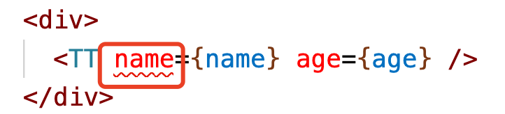
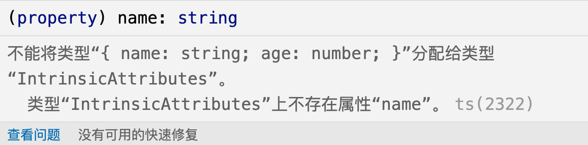
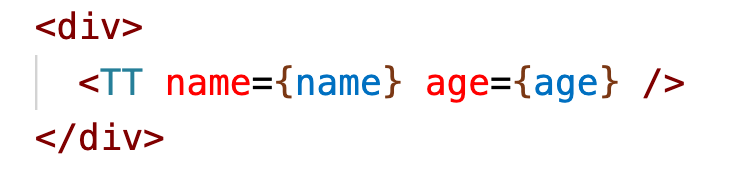

### react中创建tsx子组件

现在的react项目中，应该说已经有一部分已经使用ts作为开发语言了。我最近的一个项目中使用ts作为开发语言的一个项目，在一个使用子组件的场景中，引用自组件的地方标红了：



看了下错误信息，是类型赋值的信息，主要就是说给自组件赋的值name和age分别为string和number类型，但是子组件IntrinsicAttributes类型的name和age属性。



我在子组件中也从props中接收了name和age属性：

```tsx
import { FC } from "react";

const TT:FC = (props:any) => {
 const {name,age} = props;
 return (
    <>
        <h3>自定义组件，props传递</h3>
        <h4>姓名:{name}</h4>
        <p>年龄:{age}</p>
    </>
 );
}

export default TT;
```

然后我看页面的运行效果，也是正常的，传递的props属性也都正常的展示了出来：


细想了下，原来这是TS语法给出的异常提示，那么问题就好解了。知道了跟题的根源，问题就有解决的方向了。看代码：

```tsx
// 父组件中
<div>
    <TT name={name} age={age} />
</div>

// 子组件
import { FC } from "react";

const TT:FC = (props:any) => {
 const {name,age} = props;
 return (
    <>
        <h3>自定义组件，props传递</h3>
        <h4>姓名:{name}</h4>
        <p>年龄:{age}</p>
    </>
 );
}

export default TT;
```

我在组件中使用了自组件的属性，但是我没有在子组件声明name、age属性的属性，那么我给这些可能潜在的属性声明了属性，就不会有问题了。

```tsx
// 子组件
import { FC } from 'react';

interface ITT {
    name: string;
    age: number;
}

const TT: FC<ITT> = (props: any) => {
    const { name, age } = props;
    return (
        <>
            <h3>自定义组件，props传递</h3>
            <h4>姓名:{name}</h4>
            <p>年龄:{age}</p>
        </>
    );
};

export default TT;
```

在定义子组件的时候，加了一些类型约束，约束了string类型的name好number类型的age，这个时候，页面中在调用子组件的时候，语法的异常信息提示没有了。



在使用ts作为开发语言的时候，需要多注意类型约束。

在ts给我们带来良好开发体验的同时，对于编码也提出了更高的要求。

### 那么为什么有类型的异常信息提示的时候，页面也正常的运行了呢？

有这么一个常识，就是浏览器最终运行的还是js，ts是不能够直接运行在浏览器中的(现在是这样的，过些时间浏览器是否会直接支持运行ts，现在还不能确定，也需会吧)，在使用ts的时候注意一切都需要添加类型，都要有类型约束。

那为什么有了类型异常提示的也能够正常的运行呢？这是因为信息的提示是发生在编译阶段，并不影响运行时，所以即使有了一些地方有了异常的类型信息提示时，也是能够正常的展示到页面中的。