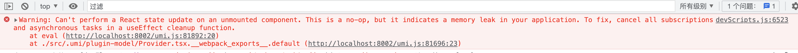

### react中慎用ref和effect

为什么这么说呢？因为ref和effect操作的都是脱离react控制的因素。

effect中处理的是副作用，比如在effect中发起了一个异步的ajax请求。一般情况下，一个页面中的列表数据都会放到一个effect中去异步的请求数据，还可以设置一些依赖，依赖变化后重新请求数据。

为什么说effect中的异步请求是副作用呢，因为异步请求的数据不是react能够控制的状态，返回的数据react没有办法去控制，也没有办法提前感知，只能异步的请求返回了数据了，才能知道异步请求的数据是什么。

还有一个典型的案例，就是输入框获取焦点的操作。DOM操作，可能直接使用element.focus()方法就可以了，但是这种DOM操作、直接执行DOM API的方式也是不受react控制的。

很多脱离React控制的操作，react的新的文档上，被称作ESCAPE HATCHES(逃生舱)。虽然有些操作会脱离React对其状态的控制，但是react还是要尽可能的防止一些操作失控。

### effect中有什么样的副作用呢？

副作用可能是从远程服务器拉取数据、读取或者写入本地缓存、设置事件侦听器或者设置订阅。当单击按钮、提交表单或安装和卸载组件时，可能会出现这些副作用。

React的useEffect钩子允许功能组件在组件被挂载或某些属性或某些状态发生变化时执行操作，这个钩子函数允许函数允许在组件卸载时进行清理。

**为什么要清理副作用？**

在react中清理副作用是一项相对复杂的任务，有的时候，我们会在组件的生命周期和副作用的生命周期交汇时遇到一些问题，如一个问题是一个副作用完成并尝试改变、更新已经卸载的组件的状态时，React会给我们一个警告：

```bash
devScripts.js:6523 Warning: Can't perform a React state update on an unmounted component. This is a no-op, but it indicates a memory leak in your application. To fix, cancel all subscriptions and asynchronous tasks in a useEffect cleanup function.
    at eval (http://localhost:8002/umi.js:81892:20)
    at ./src/.umi/plugin-model/Provider.tsx.__webpack_exports__.default (http://localhost:8002/umi.js:81696:23)
```

直接的提示如图所示：



提示信息为不能执行更新一个已经卸载的组件的状态，它会导致内存泄漏，去解决这个问题，可以尝试在useEffect中取消所有的订阅任务、异步处理事件、清理函数。

如果我们不解决这个问题，将会带来一些问题，如：

1. 内存泄漏可能导致设备使用；

2. 影响应用性能；

3. 系统崩溃；

总之，就是影响内存，进而影响系统。