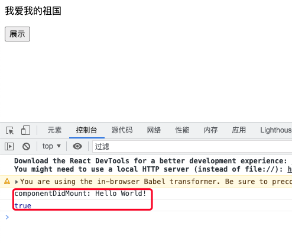
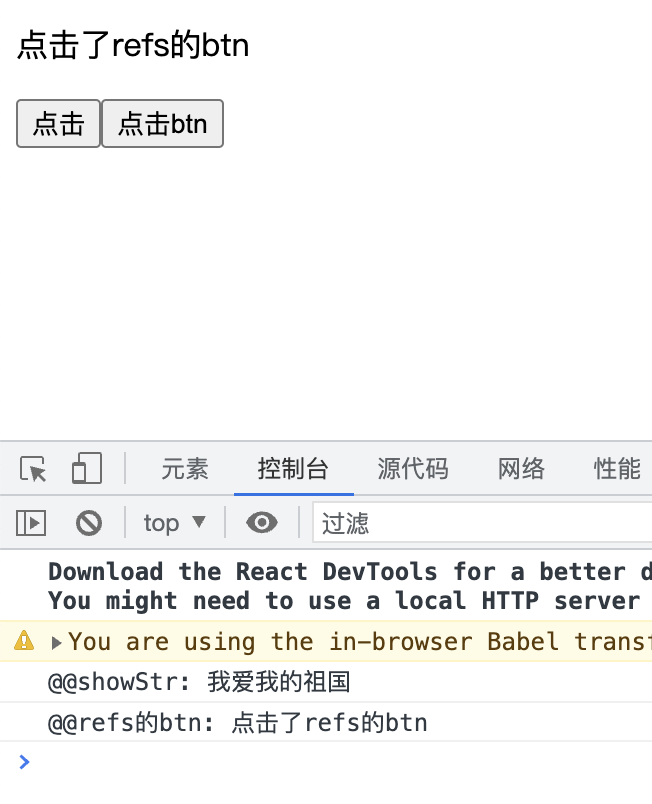
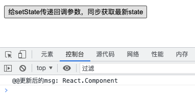

### react创建组件的两种方式

1. 类组件

有的时候，也称为复杂组件，因为在react发展的早期，react中可以设置状态，组件的生命周期表现的比较完善，很多操作，都可以在固定的生命周期的钩子里去做。类组件的三大核心属性：state、props和refs。

```jsx
class Welcome extends React.Component {
    render() {
        return <h2>Hello,{this.props.name}</h2>
    }
}

ReactDOM.render(<Welcome name="Nicholas Zakas" />, document.getElementById("app"));
```


2. 函数组件

也被称为简单组件。在react早期的时候，函数式组件，不能保存状态，因此只能做一些简单的组件承载。因为说它简单，还因为它只接收唯一带有数据的props对象并返回一个react元素。这样的组件被称之为函数式组件，其本质上就是一个js函数。

接触、学习过react的同学都知道，react是一个<font color="#f20">专注于用户界面</font>的Javascript库

```jsx
function Welcome(props) {
    return (
        <h1>Hello, {props.name}!</h1>
    )
}
```

这就是一个简单的函数式组件，可以接收props对象，然后在组件中使用

### 自定义组件名称

自定义组件名称，统一为大写字母开头，如<Welcome />。React会将以小写字母开头的组件视为原生的DOM组件，如<div>、<p>、。

### React组件的三大核心属性：state、props和refs

1. state

* state是组件对象最重要的属性，值是对象(也可以包含多个key、value的组合)

* 组件被称为状态机，通过setState更新组件的state从而来更新对应的页面显示，即重新渲染组件

* 组件每调用一次setState,就会重新执行一次render函数，根据最新的state来创建ReactElement对象，然后再根据最新的ReactElement对象，对DOM进行修改

```jsx
class ShowAndHidden extends React.Component {
    constructor(props) {
        super(props);

        this.state = {
            isShow: true,
            showStr: "Hello World!"
        };
    }

    triggle = () => {
        this.setState({
            isShow: !this.state.isShow
        });
    }
    render() {
        return (
            <div>
                {this.state.isShow && <p>{this.state.showStr}</p>}
                <button onClick={this.triggle}>{this.state.isShow ? "隐藏" : "展示"}</button>
            </div>
        )
    }
}

ReactDOM.render(<ShowAndHidden />, document.getElementById("app"));
```

在类组件中，如果想要通过事件来修改状态(state)时，只能通过setState方法。

**那么setState是同步还是异步的呢？**

* 在组件生命周期或者React事件中，setState是异步

```jsx
class ShowAndHidden extends React.Component {
    constructor(props) {
        super(props);

        this.state = {
            isShow: true,
            showStr: "Hello World!"
        }
    }

    trigger = () => {
        this.setState({
            isShow: !this.state.isShow
        });
        console.log(this.state.isShow);
    }

    componentDidMount(){
        this.setState({
            showStr: "我爱我的祖国"
        });
        console.log("componentDidMount:", this.state.showStr);
    }

    render() {
        return (
            <div>
                <p>{this.state.showStr}</p>
                <button onClick={this.trigger}>{this.state.isShow ? "隐藏" : "展示"}</button>
            </div>
        )
    }
}
ReactDOM.render(<ShowAndHidden />, document.getElementById("app"));
```



从效果上来看，当页面加载完成或者点击了按钮之后，都触发了setState，但是触发了setState之后isShow和showStr的值并没有改变，由此我们可以推断，这里的setState是异步操作，在执行完setState之后不能立刻拿到新的state的值。

* 在setTimeout或者dom原生事件中，setState是同步

```jsx
class ShowAndHidden extends React.Component {
    constructor(props) {
        super(props);

        this.state = {
            isShow: true,
            showStr: "Hello world!"
        };
    }

    triggle = () => {
        setTimeout(() => {
            this.setState({
                showStr: "我爱我的祖国"
            });
            console.log("@@showStr:", this.state.showStr);
        }, 0);
    }

    componentDidMount() {
        const btn = this.refs.btn;
        btn.addEventListener("click", () => {
            this.setState({
                showStr: "点击了refs的btn"
            });
            console.log("@@refs的btn:", this.state.showStr);
        });
    }

    render() {
        return (
            <div>
                <p>{this.state.showStr}</p>
                {/* 这是react事件 */}
                <button onClick={this.triggle}>点击</button>
                {/* 这里通过refs获取了dom元素，然后给这个dom元素绑定addEventListener，为原生DOM事件 */}
                <button ref="btn">点击btn</button>
            </div>
        )
    }
    }
    ReactDOM.render(<ShowAndHidden />, document.getElementById("app"));
```



**怎么获取到更新后的最新的state值？**

从上面我们可以了解到，当在React组件的生命周期函数中，或者在React事件中，setState是异步的，那么我们在这些场景中设置了setState，怎么获取到最新的state值呢？

* 在setTimeout中触发setState或者在原生DOM事件中触发setState；

* setState接收2个参数，第2个参数为一个回调函数，该回调函数会在setState更新后执行

```jsx
getNewState = () => {
    this.setState({
        msg: "React.Component"
    }, () => {
        console.log("@@更新后的msg:", this.state.msg);
    });
}
<div className="newState">
    <p>{this.state.msg}</p>
    <button onClick={this.getNewState}>给setState传递回调参数，同步获取最新state</button>
</div>
```



2. props

3. refs
