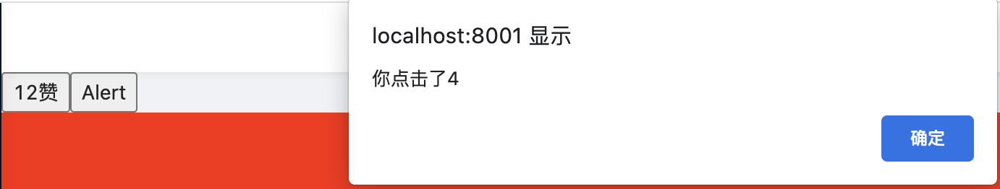

### react创建组件的两种方式

1. 类组件

有的时候，也称为复杂组件，因为在react发展的早期，react中可以设置状态，组件的生命周期表现的比较完善，很多操作，都可以在固定的生命周期的钩子里去做。类组件的三大核心属性：state、props和refs。

```jsx
class Welcome extends React.Component {
    render() {
        return <h2>Hello,{this.props.name}</h2>
    }
}

ReactDOM.render(<Welcome name="Nicholas Zakas" />, document.getElementById("app"));
```


2. 函数组件

也被称为简单组件。在react早期的时候，函数式组件，不能保存状态，因此只能做一些简单的组件承载。因为说它简单，还因为它只接收唯一带有数据的props对象并返回一个react元素。这样的组件被称之为函数式组件，其本质上就是一个js函数。

接触、学习过react的同学都知道，react是一个<font color="#f20">专注于用户界面</font>的Javascript库

```jsx
function Welcome(props) {
    return (
        <h1>Hello, {props.name}!</h1>
    )
}
```

这就是一个简单的函数式组件，可以接收props对象，然后在组件中使用

### 自定义组件名称

自定义组件名称，统一为大写字母开头，如<Welcome />。React会将以小写字母开头的组件视为原生的DOM组件，如<div>、<p>、。

### React组件的三大核心属性：state、props和refs

1. state

* state是组件对象最重要的属性，值是对象(也可以包含多个key、value的组合)

* 组件被称为状态机，通过setState更新组件的state从而来更新对应的页面显示，即重新渲染组件

* 组件每调用一次setState,就会重新执行一次render函数，根据最新的state来创建ReactElement对象，然后再根据最新的ReactElement对象，对DOM进行修改

```jsx
class ShowAndHidden extends React.Component {
    constructor(props) {
        super(props);

        this.state = {
            isShow: true,
            showStr: "Hello World!"
        };
    }

    triggle = () => {
        this.setState({
            isShow: !this.state.isShow
        });
    }
    render() {
        return (
            <div>
                {this.state.isShow && <p>{this.state.showStr}</p>}
                <button onClick={this.triggle}>{this.state.isShow ? "隐藏" : "展示"}</button>
            </div>
        )
    }
}

ReactDOM.render(<ShowAndHidden />, document.getElementById("app"));
```

在类组件中，如果想要通过事件来修改状态(state)时，只能通过setState方法。

**那么setState是同步还是异步的呢？**

* 在组件生命周期或者React事件中，setState是异步

```jsx
class ShowAndHidden extends React.Component {
    constructor(props) {
        super(props);

        this.state = {
            isShow: true,
            showStr: "Hello World!"
        }
    }

    trigger = () => {
        this.setState({
            isShow: !this.state.isShow
        });
        console.log(this.state.isShow);
    }

    componentDidMount(){
        this.setState({
            showStr: "我爱我的祖国"
        });
        console.log("componentDidMount:", this.state.showStr);
    }

    render() {
        return (
            <div>
                <p>{this.state.showStr}</p>
                <button onClick={this.trigger}>{this.state.isShow ? "隐藏" : "展示"}</button>
            </div>
        )
    }
}
ReactDOM.render(<ShowAndHidden />, document.getElementById("app"));
```


从效果上来看，当页面加载完成或者点击了按钮之后，都触发了setState，但是触发了setState之后isShow和showStr的值并没有改变，由此我们可以推断，这里的setState是异步操作，在执行完setState之后不能立刻拿到新的state的值。

* 在setTimeout或者dom原生事件中，setState是同步

```jsx
class ShowAndHidden extends React.Component {
    constructor(props) {
        super(props);

        this.state = {
            isShow: true,
            showStr: "Hello world!"
        };
    }

    triggle = () => {
        setTimeout(() => {
            this.setState({
                showStr: "我爱我的祖国"
            });
            console.log("@@showStr:", this.state.showStr);
        }, 0);
    }

    componentDidMount() {
        const btn = this.refs.btn;
        btn.addEventListener("click", () => {
            this.setState({
                showStr: "点击了refs的btn"
            });
            console.log("@@refs的btn:", this.state.showStr);
        });
    }

    render() {
        return (
            <div>
                <p>{this.state.showStr}</p>
                {/* 这是react事件 */}
                <button onClick={this.triggle}>点击</button>
                {/* 这里通过refs获取了dom元素，然后给这个dom元素绑定addEventListener，为原生DOM事件 */}
                <button ref="btn">点击btn</button>
            </div>
        )
    }
    }
    ReactDOM.render(<ShowAndHidden />, document.getElementById("app"));
```


**怎么获取到更新后的最新的state值？**

从上面我们可以了解到，当在React组件的生命周期函数中，或者在React事件中，setState是异步的，那么我们在这些场景中设置了setState，怎么获取到最新的state值呢？

* 在setTimeout中触发setState或者在原生DOM事件中触发setState；

* setState接收2个参数，第2个参数为一个回调函数，该回调函数会在setState更新后执行

```jsx
getNewState = () => {
    this.setState({
        msg: "React.Component"
    }, () => {
        console.log("@@更新后的msg:", this.state.msg);
    });
}
<div className="newState">
    <p>{this.state.msg}</p>
    <button onClick={this.getNewState}>给setState传递回调参数，同步获取最新state</button>
</div>
```


**setState为什么要异步更新呢？**

* 性能：如果每次setState都进行一次更新，那么render函数就会被频繁的调用，界面重新渲染，就会严重影响页面的渲染效率，所以最终的机制是获取到多个更新然后进行批量更新。

* 如果同步更新了state，但是如果render函数还没有执行，那么state和props将不能保持同步；

2. props

* 每个组件都会有props属性

* 组件标签的所有属性都保存在props属性中

```jsx
class Person extends React.Component {
    constructor(props) {
        super(props);
        console.log(this.props);
        console.log(this.props.name);
    }

    fetchData = () => {
        console.log(this.props.gender);
    }

    componentDidMount(){
        this.fetchData();
    }

    render() {
        return (
            <div>
                <h2>props</h2>
            </div>
        )
    }
}

ReactDOM.render(<Person name="Nicholas Zakas" age="18" gender="男" />, document.getElementById("app"));
```

**props的设置和读取方式**

- 通过组件标签属性从组件外向组件内传递变化的数据或使用扩展属性：将对象的所有属性通过props传递

```jsx
const personProps = {
    name: 'Nicholas Zakas',
    id: '10',
    sex: 'male'
};
// ReactDOM.render(<Person name="Nicholas Zakas" age="18" gender="男" />, document.getElementById("app")); // 通过标签属性向组件内部传递数据
ReactDOM.render(<Person {...personProps} />, document.getElementById("app")); // 通过扩展属性向组件内部传递props数据
```

- 组件内部读取props属性：this.props.如果要访问某个指定的props，则可以this.props.name

```jsx
class Person extends React.Component {
    constructor(props) {
        super(props);
        // 通过this.props来获取props数据
        console.log(this.props);
        // 可以获取具体的某个props属性
        console.log(this.props.name);
    }

    fetchData = () => {
        // 自定义方法中也可以通过this.props获取props值
        console.log(this.props.gender);
    }

    componentDidMount() {
        this.fetchData();
    }

    render() {
        return (
            <div>
                <h2>props</h2>
            </div>
        )
    }
}

const personProps = {
    name: 'Nicholas Zakas',
    id: '10',
    sex: 'male'
};
// ReactDOM.render(<Person name="Nicholas Zakas" age="18" gender="男" />, document.getElementById("app")); // 通过标签属性向组件内部传递数据
ReactDOM.render(<Person {...personProps} />, document.getElementById("app")); // 通过扩展属性向组件内部传递props数据
```

- 对props中的属性值进行类型限制和必要性限制

在组件内部不要修改props的数据

使用prop-types库进行必要性限制

- 默认属性值

3. refs


**refs**

React推崇状态决定视图，页面的展示逻辑由状态去控制。但是有一些实际的场景这么操作不是很方便，甚至是实现起来成本过高，所以这些场景还是需要去获取DOM。

React提供了refs来帮助开发者直接获取和操作DOM节点，就像以前使用jquery一样，可以方便的操作DOM。虽然React提供了操作DOM的能力，但是一定不要过度使用refs。意思就是能不用refs就不要用了。

**创建、使用refs的3种方式**

1. string方式 ---- 不推荐，了解即可

```jsx
class Person extends React.Component {
    constructor(props) {
        super(props);
        this.state = {
            isShow: true,
            showStr: "Nicholas Zakas"
        };
    }

    trigger = () => {
        // console.log('@@ref的btn:', this.refs.btn)
        console.log('@@btn2:', this.refs.btn2);
        console.log("@@input:", this.refs.msg.value);
        
        // 下面的代码不会被执行，
        this.refs.btn2.addEventListener('click', function () {
            console.log("11111");
        })
    }

    componentDidMount(){
        this.refs.btn2.addEventListener("click", () => {
            console.log("按钮2被点击了");
        })
    }

    render() {
        return (
            <div>
                <p>{this.state.showStr}</p>
                {/* string方式refs，不推荐使用了，了解即可 */}
                <input type="text" ref="msg" />
                <button onClick={this.trigger}>点击</button>
                <button ref="btn2">点击2</button>
            </div>
        )
    }
}

ReactDOM.render(<Person />, document.getElementById("app"));
```

2. 回调函数方式

回调函数方式，先声明一个空的ref对象，然后在组件中通过回调函数的方式为该ref对象赋值，在使用时通过this来调用该ref对象。

```jsx
class Person extends React.Component {
    constructor(props) {
        super(props);
        this.state = {
            showStr: "Hello world!"
        };
        // 声明一个空的ref元素
        this.btnRef = null;
    }

    componentDidMount() {
        // 注意这里直接通过this.btnRef获取到ref元素，和string形式的ref不同，需要通过this.refs.refname去获取dom元素
        this.btnRef.addEventListener("click", () => {
            console.log("回调函数");
        })
    }
    render() {
        return (
            <div>
                <p>{this.state.showStr}</p>
                {/* 将当前元素在回调函数中赋值给在构造函数中声明的空ref对象 */}
                <button ref={ref => { this.btnRef = ref }}>点击</button>
            </div>
        )
    }

}
ReactDOM.render(<Person />, document.getElementById("app"));
```

3. React.createRef方式----这是推荐的方式

```jsx
class Person extends React.Component{
    constructor(props){
        super(props);
        this.state= {
            showStr: "Hello World!"
        };

        // 通过React.createRef创建一个ref
        this.btnRef = React.createRef();
    }

    componentDidMount(){
        // 通过createRef创建的ref，在使用时需要通过当前ref对象的current属性获取当前对象
        this.btnRef.current.addEventListener("click", () => {
            console.log("ref按钮被点击了");
        });
    }

    render(){
        return (
            <div>
                <p>{this.state.showStr}</p>
                {/* 通过createRef声明的ref对象为当前对象赋值 */}
                <button ref={this.btnRef}>点击</button>
            </div>
        )
    }
}

ReactDOM.render(<Person />, document.getElementById('app'));
```

**React中的两个常用术语：DOM节点、元素和react元素**

1. DOM节点、元素

DOM节点、元素，就是React代码中的原生的div、image、p等原生dom标签

2. React元素

React元素，就是我们创建的React组件，包括类组件和函数式组件

**useRef**

上面主要介绍了些类组件中使用ref的方式，在函数式组件中，主要是通过useRef这个钩子函数来实现。

```tsx
import { useEffect, useRef } from "react";

const State = () => {
    const refBtn = useRef(null);

    useEffect(() => {
        refBtn.current.addEventListener("click", () => {
            console.log("ref按钮被点击了");
        })
    },[]);

    return (
        <>
            <div>useRef</div>
            <button ref={refBtn}>ref按钮</button>
        </>
    )
}

export default State;
```

这是一个简单的useRef案例。

useRef

const refContainer = useRef(initialVlaue);

1. 返回一个可变的ref对象，该对象只有一个current属性，初始值为传入的initialVlaue;

2. 返回的ref对象在组件的生命周期中保持不变；

3. 当更新current值时不会re-render,这是useRef和useState的区别；

4. 更新useRef是副作用，一般写在useEffect或者eventHandler里面

5. useRef类似于组件的this

```tsx
import { useRef,MutableRefObject } from "react";

const FocusInput = () => {
    const inputRef:MutableRefObject<any> = useRef(null);

    const focusInput = () => {
        inputRef.current.focus();
    }
    return (
        <div>
            <input type="text" ref={inputRef} />
            <button onClick={focusInput}>聚焦input</button>
        </div>
    )
}

export default FocusInput;
```

useRef使用的小案例，点击按钮时input获取焦点

下面来看一个案例：

```tsx
import { FC, useState } from "react";

const LinkeButton: FC = () => {
    const [like, setLike] = useState(0);
    const handleAlertClick = () => {
        setTimeout(() => {
            alert(`你点击了${like}`);
        }, 3000);
    }
    return (
        <>
            <button onClick={() => setLike(like + 1)}>{like}赞</button>
            <button onClick={handleAlertClick}>Alert</button>
        </>
    )
}

export default LinkeButton;
```



当我们点击赞按钮的时候，当like值为4的时候，点击下alert按钮，然后再继续点击赞按钮，等会会alert出来一个弹窗，其值为4，不是我后来点击到的最新的state值。

**那么为什么alert出来的值，不是界面上最新的like的值呢？**

这是因为在react中，state更新，都会重新渲染组件，组件每次渲染都会拿到独立的like值，且会重新定义、声明handleAlertClick函数，每个handleAlertClick函数中的like值也是该函数中自己保存的值，所以当我点击赞按钮到like值为4时，点击alert按钮，触发了handleAlertClick函数，这个时候like的值是4，所以后来alert出来的值是4，而不是后来我继续点击赞按钮的到的最新的like值。

> 不同渲染之间没有办法共享state状态值。

实际场景中，我希望我点击alert按钮的时候，弹出的是最新的like值，怎么办呢？

